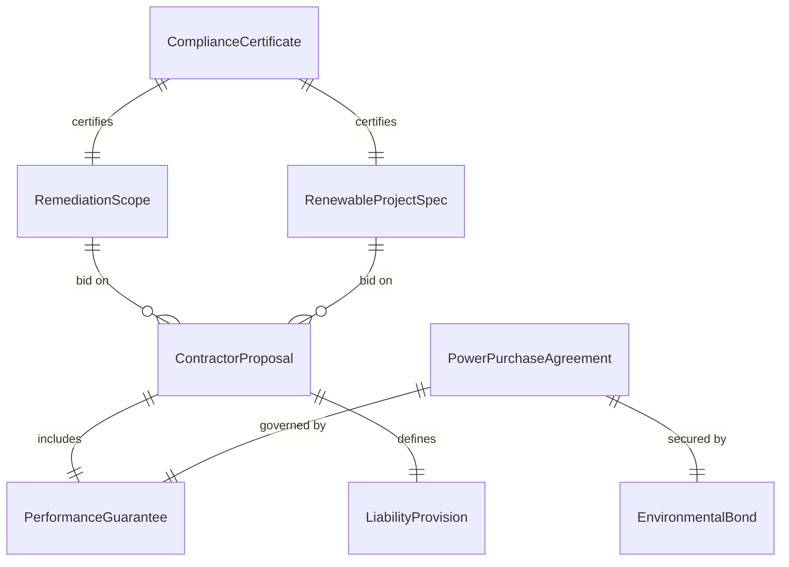
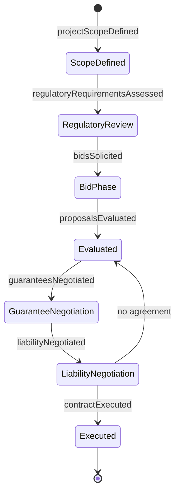
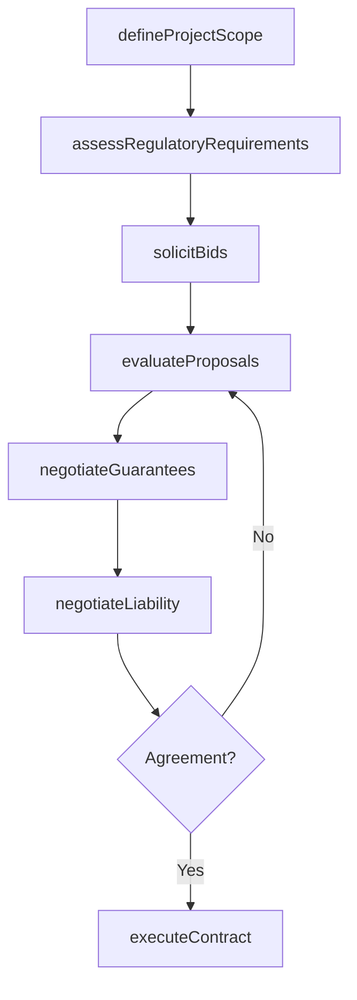
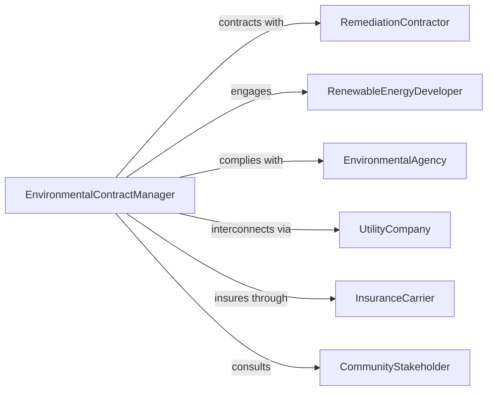

# Negotiate Contracts for Environmental Remediation, Green Energy, or Renewable Resources

> Business-as-Code definition for environmental and green energy contract negotiation. Models the process of scoping remediation or renewable energy projects, evaluating contractor capabilities, negotiating compliance requirements and performance guarantees, and executing environmental service agreements.

## Overview

Negotiating environmental remediation and green energy contracts involves defining project scope and regulatory requirements, soliciting qualified contractor bids, evaluating proposals against environmental standards, negotiating performance guarantees, liability provisions, and pricing, and executing contracts that ensure compliance with environmental regulations. This definition exposes actions for green contract procurement management, event triggers for regulatory and deal milestones, and searches for contractor qualifications and project records.

## Actors

| Actor | Description |
|-------|-------------|
| RemediationContractor | Firm providing site cleanup, soil treatment, or groundwater restoration |
| RenewableEnergyDeveloper | Company designing and building solar, wind, or other clean energy systems |
| EnvironmentalAgency | Government body enforcing environmental regulations and permitting |
| UtilityCompany | Electric or gas provider involved in power purchase or grid interconnection |
| InsuranceCarrier | Underwriter of environmental liability and project performance coverage |
| CommunityStakeholder | Local residents or organizations affected by environmental projects |

## Roles

| Role | Description |
|------|-------------|
| EnvironmentalContractManager | Leads procurement and negotiation for remediation or green projects |
| SustainabilityOfficer | Sets strategic direction for environmental compliance and renewable goals |
| RegulatoryComplianceAnalyst | Ensures contract terms meet environmental laws and permit conditions |
| ProjectEngineer | Evaluates technical feasibility and contractor qualifications |

## Entities

| Entity | Description |
|--------|-------------|
| RemediationScope | Defined boundaries, contaminants, and cleanup standards for a site |
| RenewableProjectSpec | Technical specifications for solar, wind, or other green energy installations |
| ContractorProposal | Bid including approach, timeline, pricing, and performance commitments |
| PerformanceGuarantee | Contractual assurance of energy output or remediation completion metrics |
| LiabilityProvision | Terms defining responsibility for environmental damage or project failure |
| ComplianceCertificate | Documentation confirming adherence to environmental regulations |
| PowerPurchaseAgreement | Long-term contract for buying electricity from a renewable source |
| EnvironmentalBond | Financial instrument securing contractor performance obligations |

## Actions

| Action | Description |
|--------|-------------|
| defineProjectScope | Establish remediation boundaries or renewable energy specifications |
| assessRegulatoryRequirements | Identify applicable environmental laws, permits, and compliance standards |
| solicitBids | Request proposals from qualified environmental or energy contractors |
| evaluateProposals | Compare contractor bids on technical merit, pricing, and track record |
| negotiateGuarantees | Define performance metrics, milestones, and penalty provisions |
| negotiateLiability | Establish environmental liability allocation and indemnification terms |
| executeContract | Finalize and sign the environmental service or energy agreement |

## Events

| Event | Description |
|-------|-------------|
| projectScopeDefined | Remediation or renewable project boundaries have been established |
| regulatoryRequirementsAssessed | Applicable environmental standards have been identified |
| bidsSolicited | Contractor proposals have been requested |
| proposalsEvaluated | Bids have been compared and ranked |
| guaranteesNegotiated | Performance metrics and penalties have been defined |
| liabilityNegotiated | Environmental liability terms have been established |
| contractExecuted | The environmental or energy agreement has been signed |

## Searches

| Search | Description |
|--------|-------------|
| findContracts | List environmental or energy contracts by type, site, or contractor |
| getProposals | Retrieve contractor bids by project, price, or technical score |
| getCompliance | Search compliance records by regulation, permit, or project status |
| getGuarantees | Query performance guarantees by metric, contractor, or threshold |

## Entity Relationships



## State Diagram



## Workflow



## Actor Relationships



## Usage

### Calling Actions

```typescript
import { negotiateContractsEnvironmentalRemediationGreen } from '@headlessly/negotiate-contracts-environmental-remediation-green'

const envContracts = negotiateContractsEnvironmentalRemediationGreen()

// Define a solar installation project scope
const scope = await envContracts.defineProjectScope({
  type: 'solar-installation',
  site: 'corporate-campus-west',
  capacity: { amount: 2.5, unit: 'MW' },
  targetCommissioning: '2027-Q2',
  interconnection: 'regional-grid-operator'
})

// Solicit and evaluate contractor bids
const bids = await envContracts.solicitBids({
  scopeId: scope.id,
  qualifications: ['nabcep-certified', 'utility-scale-experience'],
  responseDeadline: '2026-05-01'
})

// Negotiate performance guarantees and execute
await envContracts.negotiateGuarantees({
  proposalId: bids.preferred.id,
  minimumOutput: { amount: 4200, unit: 'MWh-per-year' },
  degradationCap: '0.5-percent-annually',
  warrantyPeriod: '25-years'
})

await envContracts.executeContract({
  proposalId: bids.preferred.id,
  contractType: 'power-purchase-agreement',
  term: '20-years',
  priceEscalation: '2-percent-annually'
})
```

### Event-Driven Automation

```typescript
// Track regulatory compliance after contract execution
envContracts.contractExecuted(async ({ contractId, regulatoryRequirements }) => {
  await scheduleRecurring({
    action: 'assessRegulatoryRequirements',
    contractId,
    checkpoints: regulatoryRequirements.map(r => r.permitId),
    frequency: 'semi-annually'
  })
})

// Alert on guarantee threshold breaches
envContracts.guaranteesNegotiated(async ({ contractId, metrics }) => {
  for (const metric of metrics) {
    await createMonitor({
      contractId,
      metric: metric.name,
      threshold: metric.minimumValue,
      alertRecipient: 'sustainability-officer'
    })
  }
})
```
