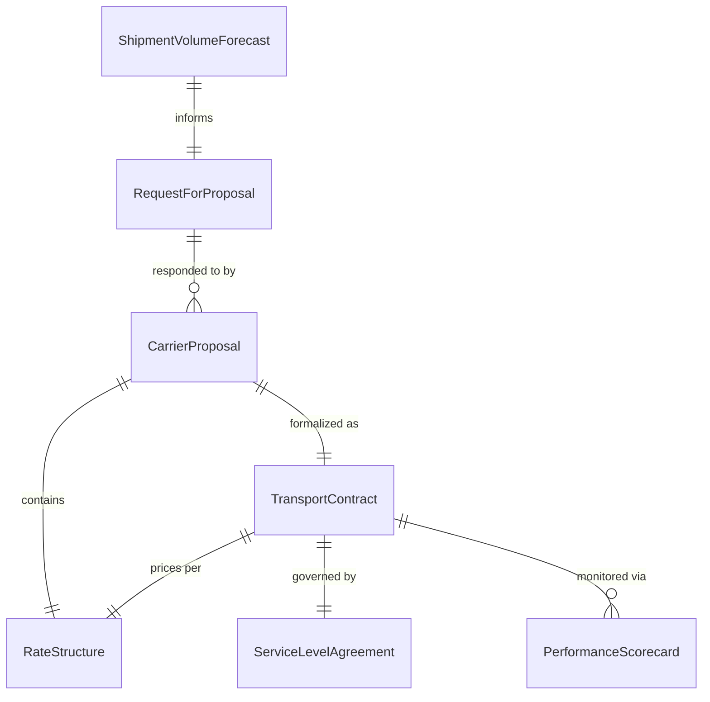
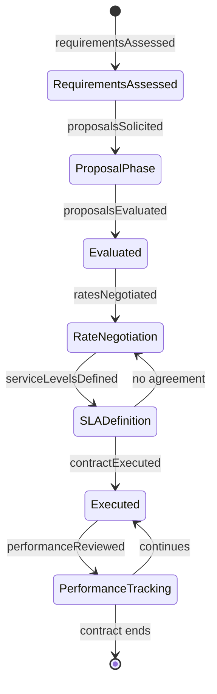
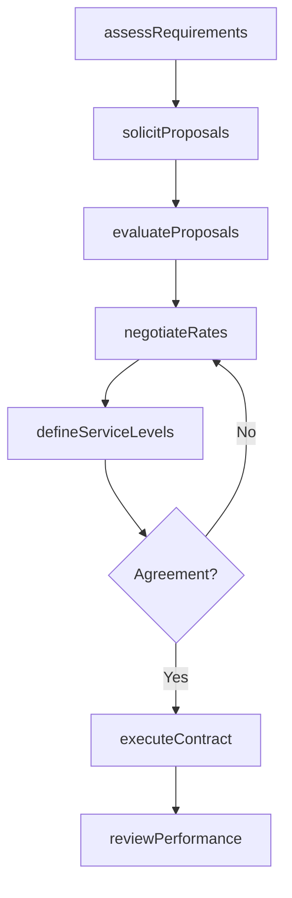
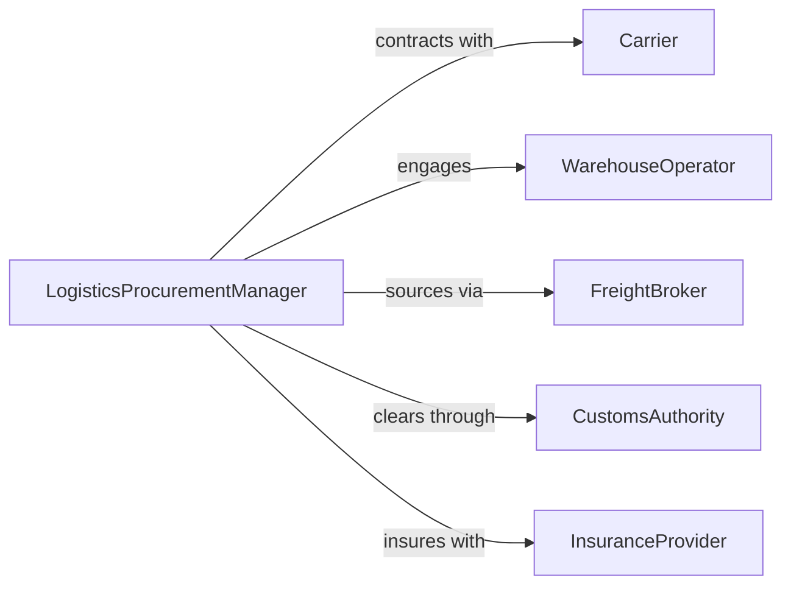

# Negotiate Contracts for Transportation, Distribution, or Logistics Services

> Business-as-Code definition for transportation and logistics contract negotiation. Models the process of evaluating carrier capabilities, developing rate structures, negotiating service level agreements, and executing freight and distribution contracts.

## Overview

Negotiating transportation and logistics contracts involves assessing shipping volumes and requirements, soliciting carrier proposals, evaluating rate structures and service levels, negotiating terms for freight, warehousing, and distribution services, and executing binding agreements. This definition exposes actions for logistics procurement management, event triggers for contract milestones, and searches for carrier performance and rate comparison records.

## Actors

| Actor | Description |
|-------|-------------|
| Carrier | Transportation company providing freight or delivery services |
| WarehouseOperator | Facility provider offering storage and distribution services |
| FreightBroker | Intermediary matching shippers with carrier capacity |
| CustomsAuthority | Government body regulating cross-border shipments |
| InsuranceProvider | Underwriter of cargo and liability coverage |

## Roles

| Role | Description |
|------|-------------|
| LogisticsProcurementManager | Leads contract negotiations with carriers and service providers |
| RateAnalyst | Evaluates pricing proposals and benchmarks against market rates |
| ContractAdministrator | Manages contract documentation, amendments, and compliance |
| SupplyChainDirector | Sets strategic direction for transportation and distribution |

## Entities

| Entity | Description |
|--------|-------------|
| RequestForProposal | Formal solicitation of carrier or logistics provider bids |
| CarrierProposal | Provider response with rates, capacity, and service terms |
| RateStructure | Pricing framework for freight, storage, or distribution services |
| ServiceLevelAgreement | Documented performance standards and penalty provisions |
| TransportContract | Executed agreement governing transportation services |
| PerformanceScorecard | Carrier service quality metrics tracked over the contract period |
| ShipmentVolumeForecast | Projected freight or distribution volumes for contract planning |

## Actions

| Action | Description |
|--------|-------------|
| assessRequirements | Evaluate shipping volumes, routes, and service needs |
| solicitProposals | Issue requests for pricing and service proposals from carriers |
| evaluateProposals | Compare carrier bids on rate, capacity, and service quality |
| negotiateRates | Discuss pricing and volume discount structures with providers |
| defineServiceLevels | Establish performance standards, transit times, and penalties |
| executeContract | Finalize and sign the transportation or logistics agreement |
| reviewPerformance | Monitor carrier adherence to contractual service levels |

## Events

| Event | Description |
|-------|-------------|
| requirementsAssessed | Shipping volumes and service needs have been evaluated |
| proposalsSolicited | Carrier bid requests have been issued |
| proposalsEvaluated | Provider responses have been compared and ranked |
| ratesNegotiated | Pricing and discount structures have been discussed |
| serviceLevelsDefined | Performance standards and penalties have been established |
| contractExecuted | The logistics agreement has been signed |
| performanceReviewed | Carrier service quality has been assessed |

## Searches

| Search | Description |
|--------|-------------|
| findContracts | List logistics contracts by carrier, route, or expiration date |
| getProposals | Retrieve carrier bids by service type, rate, or region |
| getPerformance | Query carrier scorecards by metric, period, or contract |
| getRates | Search rate structures by lane, mode, or volume tier |

## Entity Relationships



## State Diagram



## Workflow



## Actor Relationships



## Usage

### Calling Actions

```typescript
import { negotiateContractsTransportationDistributionLogist } from '@headlessly/negotiate-contracts-transportation-distribution-logistics'

const logistics = negotiateContractsTransportationDistributionLogist()

// Assess transportation requirements
const requirements = await logistics.assessRequirements({
  annualVolume: { amount: 15000, unit: 'shipments' },
  primaryLanes: ['chicago-to-dallas', 'la-to-seattle', 'nyc-to-miami'],
  modes: ['ftl', 'ltl', 'intermodal'],
  specialRequirements: ['temperature-controlled', 'hazmat-certified']
})

// Solicit and evaluate carrier proposals
const rfp = await logistics.solicitProposals({
  requirementsId: requirements.id,
  carriers: ['carrier-a', 'carrier-b', 'carrier-c'],
  responseDeadline: '2026-03-15'
})

// Negotiate and execute the contract
await logistics.negotiateRates({
  rfpId: rfp.id,
  preferredCarrier: 'carrier-b',
  targetRate: { perMile: 2.45, fuelSurcharge: 'index-based' },
  volumeDiscount: '10-percent-above-12000-shipments'
})
```

### Event-Driven Automation

```typescript
// Auto-review performance quarterly
logistics.contractExecuted(async ({ contractId, carrierId }) => {
  await scheduleRecurring({
    action: 'reviewPerformance',
    contractId,
    carrierId,
    frequency: 'quarterly'
  })
})

// Alert on service level violations
logistics.performanceReviewed(async ({ contractId, carrierId, onTimeRate }) => {
  if (onTimeRate < 0.95) {
    await notify({
      to: 'supply-chain-director',
      message: `Carrier ${carrierId} on-time rate ${Math.round(onTimeRate * 100)}% below 95% SLA threshold`
    })
  }
})
```
