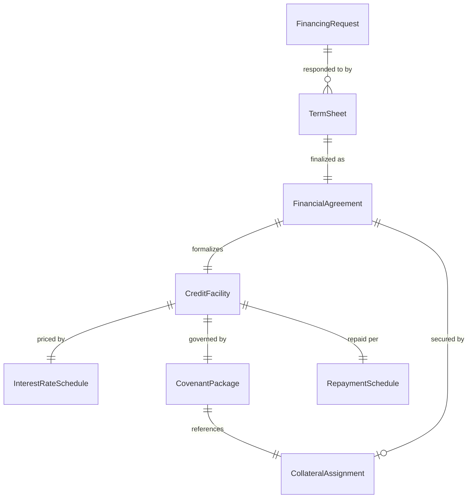
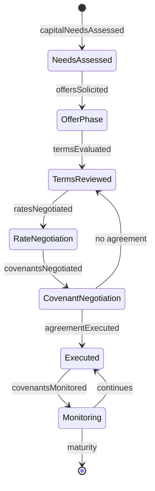
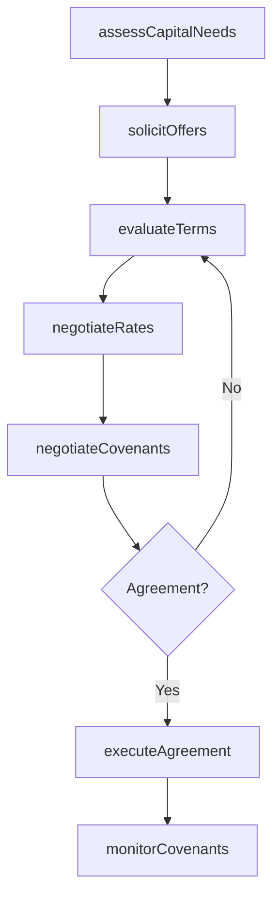
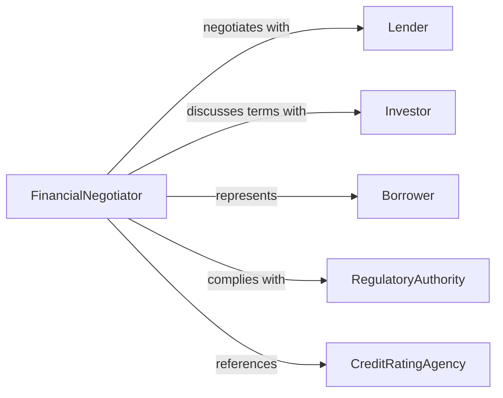

# Negotiate Financial Arrangements

> Business-as-Code definition for financial arrangement negotiation. Models the process of assessing financing needs, evaluating options from lenders or investors, negotiating terms, and executing financial agreements for loans, credit facilities, or investment structures.

## Overview

Negotiating financial arrangements involves determining capital requirements, soliciting proposals from financial institutions or investors, analyzing term sheets, negotiating interest rates, covenants, and repayment structures, and executing binding financial agreements. This definition exposes actions for financial negotiation lifecycle management, event triggers for deal milestones, and searches for financing options and agreement records.

## Actors

| Actor | Description |
|-------|-------------|
| Lender | Bank or financial institution providing debt financing |
| Investor | Individual or fund providing equity or venture capital |
| Borrower | Organization or individual seeking financial arrangements |
| RegulatoryAuthority | Government body overseeing financial transactions and compliance |
| CreditRatingAgency | Organization assessing creditworthiness of borrowers |

## Roles

| Role | Description |
|------|-------------|
| FinancialNegotiator | Leads discussions with lenders or investors on terms |
| TreasuryManager | Assesses capital needs and manages financing relationships |
| CreditAnalyst | Evaluates borrower risk and financing structure viability |
| LegalCounsel | Reviews and advises on financial agreement documentation |

## Entities

| Entity | Description |
|--------|-------------|
| FinancingRequest | Formal statement of capital needs and preferred structure |
| TermSheet | Preliminary outline of proposed financial arrangement terms |
| CreditFacility | Approved line of credit or loan with defined terms |
| InterestRateSchedule | Rate structure including fixed, variable, or stepped pricing |
| CovenantPackage | Financial and operational conditions the borrower must maintain |
| FinancialAgreement | Executed contract governing the financial arrangement |
| RepaymentSchedule | Timeline and amounts for principal and interest payments |
| CollateralAssignment | Assets pledged as security for the financing |

## Actions

| Action | Description |
|--------|-------------|
| assessCapitalNeeds | Determine the amount, timing, and structure of financing required |
| solicitOffers | Request term sheets from lenders, banks, or investors |
| evaluateTerms | Compare proposed rates, covenants, and repayment structures |
| negotiateRates | Discuss interest rates, fees, and pricing structures |
| negotiateCovenants | Define financial and operational conditions for the arrangement |
| executeAgreement | Finalize and sign the financial arrangement documentation |
| monitorCovenants | Track compliance with agreed financial conditions |

## Events

| Event | Description |
|-------|-------------|
| capitalNeedsAssessed | Financing requirements have been determined |
| offersSolicited | Term sheet requests have been issued to financial institutions |
| termsEvaluated | Proposed financial terms have been compared |
| ratesNegotiated | Interest rates and fee structures have been discussed |
| covenantsNegotiated | Financial conditions have been defined |
| agreementExecuted | The financial arrangement has been signed |
| covenantsMonitored | Compliance with financial conditions has been tracked |

## Searches

| Search | Description |
|--------|-------------|
| findAgreements | List financial arrangements by type, lender, or maturity date |
| getTermSheets | Retrieve proposals by lender, rate, or structure |
| getCovenants | Search covenant conditions by agreement, status, or threshold |
| getRepayments | Query payment schedules by agreement, period, or amount |

## Entity Relationships



## State Diagram



## Workflow



## Actor Relationships



## Usage

### Calling Actions

```typescript
import { negotiateFinancialArrangements } from '@headlessly/negotiate-financial-arrangements'

const finance = negotiateFinancialArrangements()

// Assess capital needs for expansion
const needs = await finance.assessCapitalNeeds({
  purpose: 'facility-expansion',
  amount: 5000000,
  timing: 'Q2-2026',
  preferredStructure: 'term-loan',
  collateral: ['commercial-property', 'equipment']
})

// Solicit and evaluate offers
const offers = await finance.solicitOffers({
  requestId: needs.id,
  lenders: ['first-national-bank', 'regional-credit-union', 'capital-one-commercial'],
  responseDeadline: '2026-03-20'
})

// Negotiate and execute
await finance.negotiateRates({
  offerId: offers.preferred.id,
  targetRate: 5.25,
  feeWaivers: ['origination-fee'],
  term: '7-years'
})

await finance.executeAgreement({
  offerId: offers.preferred.id,
  signatories: ['cfo', 'board-chair'],
  closingDate: '2026-04-01'
})
```

### Event-Driven Automation

```typescript
// Auto-monitor covenants after agreement execution
finance.agreementExecuted(async ({ agreementId, covenants }) => {
  await scheduleRecurring({
    action: 'monitorCovenants',
    agreementId,
    metrics: covenants.map(c => c.metric),
    frequency: 'quarterly'
  })
})

// Alert treasury on approaching covenant thresholds
finance.covenantsMonitored(async ({ agreementId, metric, current, threshold }) => {
  if (current / threshold > 0.9) {
    await notify({
      to: 'treasury-manager',
      message: `Covenant ${metric} at ${Math.round(current / threshold * 100)}% of threshold on agreement ${agreementId}`
    })
  }
})
```
