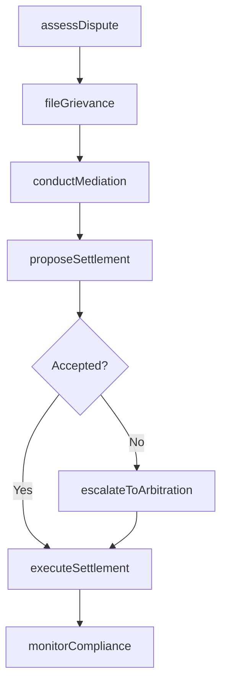
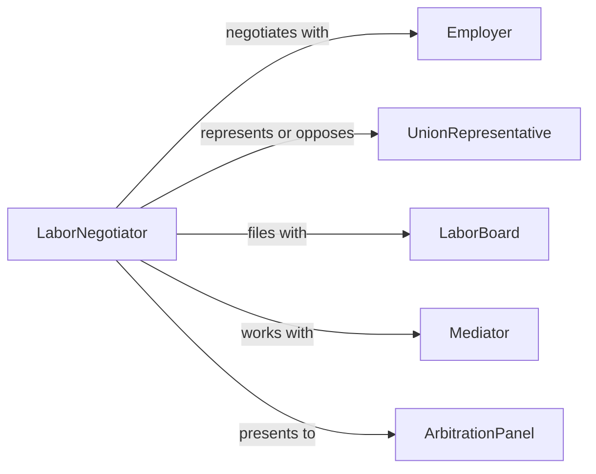

# Negotiate Labor Disputes

> Business-as-Code definition for labor dispute negotiation. Models the process of identifying grievances, conducting mediation sessions, proposing settlements, and reaching binding resolutions between employers and employee representatives.

## Overview

Negotiating labor disputes involves assessing the nature of workplace grievances or contract violations, facilitating dialogue between management and labor representatives, exploring settlement options, and reaching enforceable resolutions that restore productive working relationships. This definition exposes actions for dispute resolution management, event triggers for negotiation milestones, and searches for grievance history and settlement records.

## Actors

| Actor | Description |
|-------|-------------|
| Employer | Organization involved in the labor dispute |
| UnionRepresentative | Labor organization advocate for affected employees |
| LaborBoard | Government agency adjudicating unfair labor practice complaints |
| Mediator | Neutral third party facilitating dispute resolution |
| ArbitrationPanel | Decision-making body for binding dispute resolution |

## Roles

| Role | Description |
|------|-------------|
| LaborNegotiator | Leads dispute resolution efforts on behalf of one party |
| GrievanceOfficer | Investigates and documents the underlying dispute issues |
| LegalCounsel | Advises on labor law compliance and settlement risks |
| ComplianceAnalyst | Assesses regulatory implications of proposed settlements |

## Entities

| Entity | Description |
|--------|-------------|
| DisputeCase | Documented labor conflict with parties, issues, and timeline |
| GrievanceFiling | Formal complaint submitted by an employee or union |
| MediationSession | Facilitated meeting between parties to explore resolution |
| SettlementProposal | Written offer specifying terms to resolve the dispute |
| ArbitrationAward | Binding decision issued by an arbitration panel |
| ComplianceRecord | Documentation of adherence to settlement terms |
| BackPayCalculation | Financial computation of wages owed in settlement |

## Actions

| Action | Description |
|--------|-------------|
| assessDispute | Evaluate the nature, scope, and legal basis of the labor conflict |
| fileGrievance | Submit a formal complaint documenting the dispute |
| conductMediation | Facilitate dialogue between parties to explore settlement |
| proposeSettlement | Present terms for resolving the dispute |
| escalateToArbitration | Submit unresolved issues to a binding arbitration panel |
| executeSettlement | Implement agreed-upon resolution terms |
| monitorCompliance | Track adherence to settlement or arbitration terms |

## Events

| Event | Description |
|-------|-------------|
| disputeAssessed | The labor conflict has been evaluated |
| grievanceFiled | A formal complaint has been submitted |
| mediationConducted | A facilitated dialogue session has occurred |
| settlementProposed | Resolution terms have been presented |
| arbitrationEscalated | Unresolved issues have been submitted for binding decision |
| settlementExecuted | Agreed resolution terms have been implemented |
| complianceMonitored | Adherence to resolution terms has been tracked |

## Searches

| Search | Description |
|--------|-------------|
| findDisputes | List labor disputes by type, status, or party |
| getGrievances | Retrieve grievance filings by employee, issue, or date |
| getSettlements | Search settlement agreements by dispute, terms, or date |
| getArbitrationAwards | Query binding decisions by panel, issue, or outcome |

## Workflow



## Actor Relationships



## Usage

### Calling Actions

```typescript
import { negotiateLaborDisputes } from '@headlessly/negotiate-labor-disputes'

const labor = negotiateLaborDisputes()

// Assess an ongoing labor dispute
const dispute = await labor.assessDispute({
  employer: 'metro-transit-authority',
  union: 'transit-workers-local-100',
  issues: ['overtime-pay-violations', 'unsafe-working-conditions'],
  affectedEmployees: 340
})

// Conduct mediation
await labor.conductMediation({
  disputeId: dispute.id,
  mediator: 'federal-mediation-service',
  date: '2026-03-10',
  agenda: ['overtime-calculation-method', 'safety-equipment-upgrades']
})

// Propose a settlement
await labor.proposeSettlement({
  disputeId: dispute.id,
  terms: {
    backPay: 450000,
    policyChanges: ['revised-overtime-calculation', 'monthly-safety-inspections'],
    implementationDate: '2026-04-01'
  }
})
```

### Event-Driven Automation

```typescript
// Auto-escalate to arbitration after failed mediation attempts
labor.mediationConducted(async ({ disputeId, outcome, attemptCount }) => {
  if (outcome === 'no-agreement' && attemptCount >= 3) {
    await labor.escalateToArbitration({
      disputeId,
      panel: 'regional-arbitration-board',
      unresolvedIssues: 'all'
    })
  }
})

// Monitor compliance after settlement
labor.settlementExecuted(async ({ disputeId, terms, implementationDate }) => {
  await scheduleRecurring({
    action: 'monitorCompliance',
    disputeId,
    startDate: implementationDate,
    frequency: 'monthly',
    duration: '12-months'
  })
})
```
