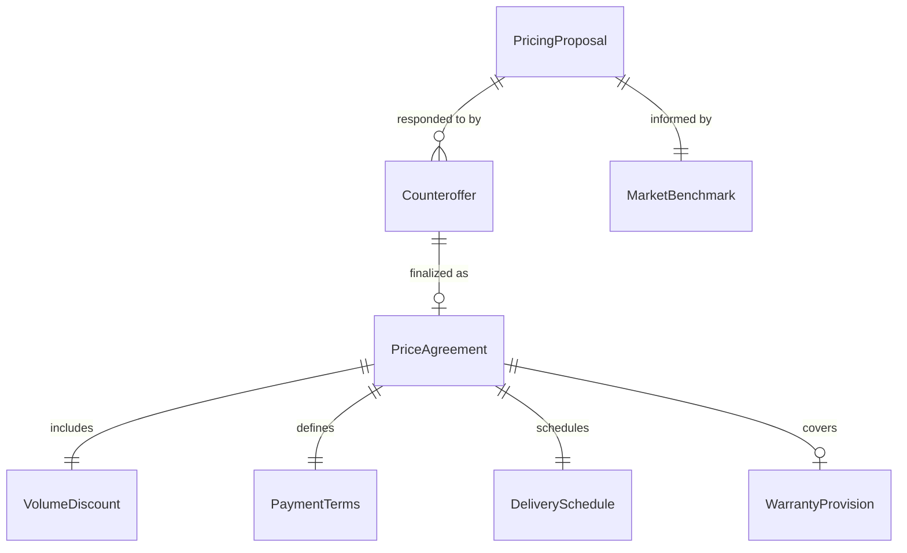
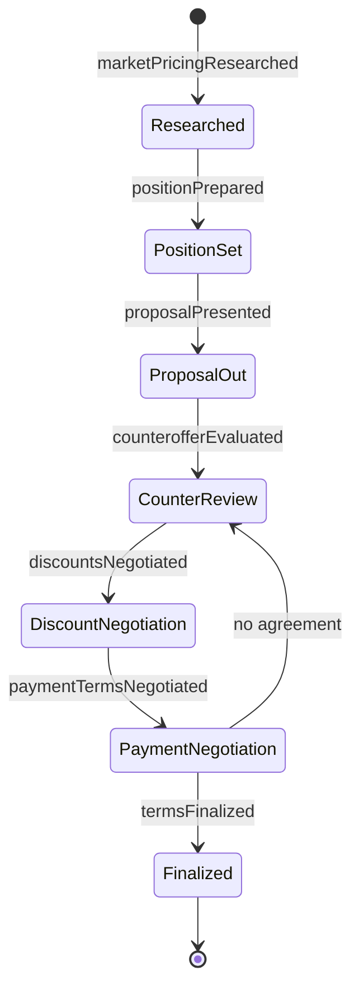
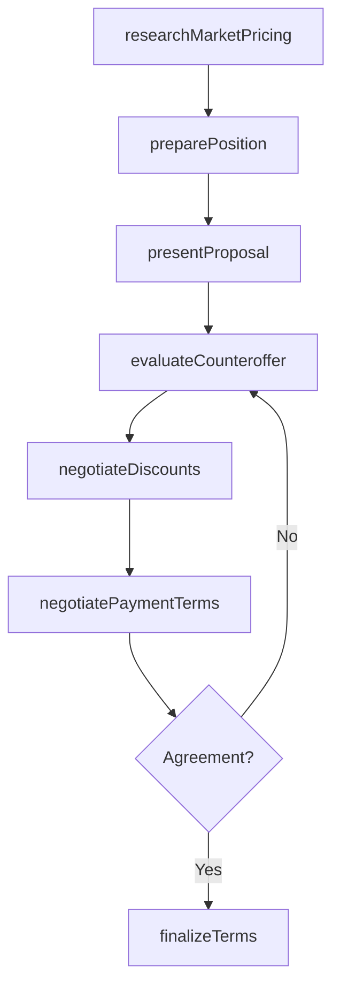
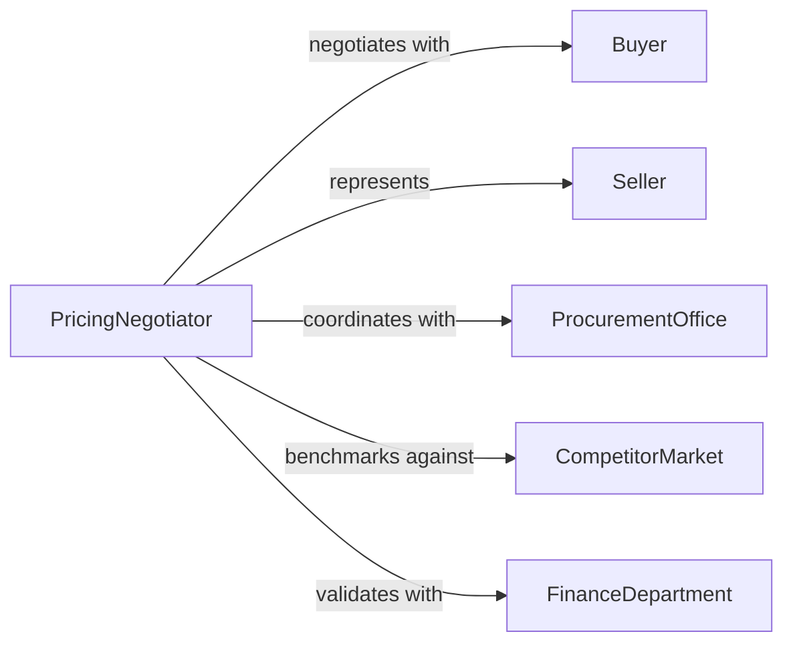

# Negotiate Prices or Other Sales Terms

> Business-as-Code definition for price and sales term negotiation. Models the process of establishing pricing positions, conducting counteroffers, negotiating volume discounts, payment terms, and warranty provisions, and finalizing binding commercial terms.

## Overview

Negotiating prices and sales terms involves researching market pricing, preparing opening positions, exchanging proposals and counteroffers on unit costs, volume discounts, payment schedules, delivery terms, and warranty coverage, and reaching mutually acceptable commercial agreements. This definition exposes actions for pricing negotiation lifecycle management, event triggers for deal milestones, and searches for pricing history and term comparison records.

## Actors

| Actor | Description |
|-------|-------------|
| Buyer | Organization or individual purchasing goods or services |
| Seller | Company or representative offering products at negotiated terms |
| ProcurementOffice | Centralized purchasing department managing vendor negotiations |
| CompetitorMarket | External pricing landscape influencing negotiation leverage |
| FinanceDepartment | Internal team validating margin and payment term feasibility |

## Roles

| Role | Description |
|------|-------------|
| PricingNegotiator | Leads discussions on price points, discounts, and terms |
| SalesRepresentative | Presents pricing proposals and manages seller-side negotiations |
| ProcurementAnalyst | Researches market rates and benchmarks vendor offers |
| ContractAdministrator | Documents agreed terms and manages execution |

## Entities

| Entity | Description |
|--------|-------------|
| PricingProposal | Formal offer specifying unit prices, tiers, and conditions |
| Counteroffer | Revised pricing or terms submitted in response to a proposal |
| VolumeDiscount | Reduced pricing based on quantity commitment thresholds |
| PaymentTerms | Conditions for invoicing, payment timing, and credit terms |
| DeliverySchedule | Agreed timeline and logistics for product or service delivery |
| WarrantyProvision | Coverage terms for defects, replacements, and service guarantees |
| PriceAgreement | Finalized document capturing all negotiated commercial terms |
| MarketBenchmark | Reference pricing data from industry sources or competitors |

## Actions

| Action | Description |
|--------|-------------|
| researchMarketPricing | Gather competitive pricing data and industry benchmarks |
| preparePosition | Develop opening price points, targets, and walk-away thresholds |
| presentProposal | Submit initial pricing and terms to the counterparty |
| evaluateCounteroffer | Analyze revised terms against internal targets and constraints |
| negotiateDiscounts | Discuss volume breaks, loyalty incentives, and bundled pricing |
| negotiatePaymentTerms | Define invoicing cycles, net terms, and early payment discounts |
| finalizeTerms | Lock in agreed prices, terms, and execute the agreement |

## Events

| Event | Description |
|-------|-------------|
| marketPricingResearched | Competitive pricing data has been gathered |
| positionPrepared | Opening negotiation targets have been established |
| proposalPresented | Initial pricing has been submitted to the counterparty |
| counterofferEvaluated | Revised terms have been analyzed against targets |
| discountsNegotiated | Volume and loyalty pricing has been discussed |
| paymentTermsNegotiated | Invoicing and credit conditions have been defined |
| termsFinalized | All commercial terms have been locked and executed |

## Searches

| Search | Description |
|--------|-------------|
| findAgreements | List price agreements by vendor, product, or effective date |
| getProposals | Retrieve pricing proposals by counterparty, amount, or status |
| getBenchmarks | Search market pricing data by product category or region |
| getDiscounts | Query volume discount structures by tier, vendor, or agreement |

## Entity Relationships



## State Diagram



## Workflow



## Actor Relationships



## Usage

### Calling Actions

```typescript
import { negotiatePricesSalesTerms } from '@headlessly/negotiate-prices-sales-terms'

const pricing = negotiatePricesSalesTerms()

// Research market pricing for raw materials
const benchmarks = await pricing.researchMarketPricing({
  productCategory: 'industrial-steel-coils',
  region: 'midwest-us',
  sources: ['metals-weekly', 'industry-price-index', 'recent-rfq-responses']
})

// Prepare and present a pricing proposal
const position = await pricing.preparePosition({
  benchmarkId: benchmarks.id,
  targetPrice: 1850,
  walkAwayPrice: 2100,
  volumeCommitment: { quantity: 500, unit: 'tons', period: 'quarterly' }
})

await pricing.presentProposal({
  positionId: position.id,
  counterparty: 'midwest-steel-supply',
  validUntil: '2026-04-15'
})

// Finalize after successful negotiation
await pricing.finalizeTerms({
  proposalId: position.proposalId,
  agreedPrice: 1925,
  paymentTerms: 'net-45',
  effectiveDate: '2026-05-01',
  duration: '12-months'
})
```

### Event-Driven Automation

```typescript
// Alert when counteroffers deviate significantly from targets
pricing.counterofferEvaluated(async ({ proposalId, offeredPrice, targetPrice }) => {
  const deviation = Math.abs((offeredPrice - targetPrice) / targetPrice) * 100
  if (deviation > 20) {
    await notify({
      to: 'procurement-manager',
      message: `Counteroffer on ${proposalId} deviates ${Math.round(deviation)}% from target price`
    })
  }
})

// Auto-renew expiring agreements at favorable terms
pricing.termsFinalized(async ({ agreementId, expirationDate, agreedPrice }) => {
  await scheduleReminder({
    action: 'researchMarketPricing',
    agreementId,
    triggerDate: subtractDays(expirationDate, 90),
    note: `Renewal negotiation needed. Current price: ${agreedPrice}`
  })
})
```
