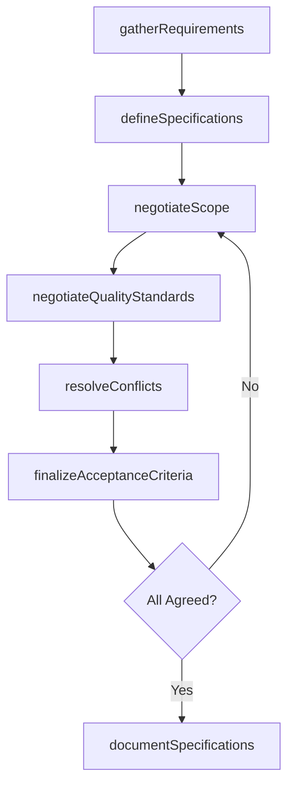
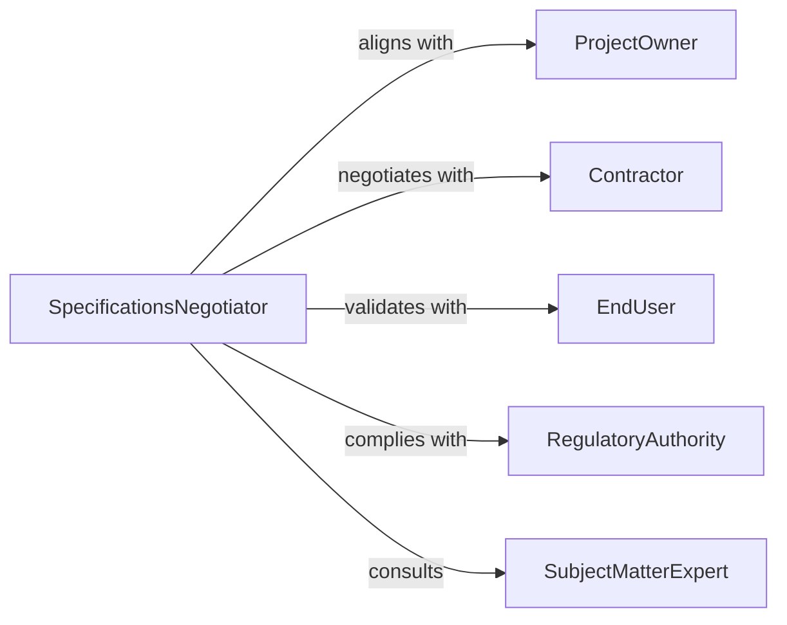

# Negotiate Project Specifications

> Business-as-Code definition for project specification negotiation. Models the process of defining technical and functional requirements, aligning stakeholder expectations, negotiating scope boundaries, quality standards, and acceptance criteria, and formalizing agreed specifications.

## Overview

Negotiating project specifications involves gathering stakeholder requirements, defining technical parameters and quality standards, resolving competing priorities among project parties, negotiating scope boundaries and acceptance criteria, and documenting agreed specifications that guide project execution. This definition exposes actions for specification negotiation management, event triggers for agreement milestones, and searches for requirements and specification records.

## Actors

| Actor | Description |
|-------|-------------|
| ProjectOwner | Sponsor or client defining business objectives and funding the project |
| Contractor | Firm or team responsible for delivering the specified project work |
| EndUser | Individual or group who will use the project deliverables |
| RegulatoryAuthority | Government body imposing standards the project must meet |
| SubjectMatterExpert | Technical specialist providing domain expertise on specifications |

## Roles

| Role | Description |
|------|-------------|
| SpecificationsNegotiator | Leads discussions on technical requirements and acceptance criteria |
| ProjectManager | Coordinates specification alignment across all stakeholder groups |
| QualityEngineer | Defines inspection and testing standards for deliverables |
| RequirementsAnalyst | Documents and prioritizes functional and technical requirements |

## Entities

| Entity | Description |
|--------|-------------|
| RequirementsDocument | Compiled list of functional, technical, and business requirements |
| TechnicalSpecification | Detailed engineering or design parameters for deliverables |
| ScopeBoundary | Defined limits of what is included and excluded from the project |
| AcceptanceCriteria | Measurable conditions that deliverables must satisfy |
| QualityStandard | Performance benchmarks and testing protocols for project outputs |
| ChangeRequest | Formal proposal to modify agreed specifications during the project |
| SpecificationAgreement | Signed document capturing all negotiated project specifications |
| TradeoffMatrix | Decision framework balancing scope, cost, timeline, and quality |

## Actions

| Action | Description |
|--------|-------------|
| gatherRequirements | Collect functional and technical needs from all stakeholders |
| defineSpecifications | Draft technical parameters, standards, and design criteria |
| negotiateScope | Align parties on what is included, excluded, and deferred |
| negotiateQualityStandards | Establish testing protocols and performance benchmarks |
| resolveConflicts | Address competing priorities between stakeholder requirements |
| finalizeAcceptanceCriteria | Lock in measurable conditions for deliverable approval |
| documentSpecifications | Formalize and sign the complete specification agreement |

## Events

| Event | Description |
|-------|-------------|
| requirementsGathered | Stakeholder needs have been collected and compiled |
| specificationsDefined | Technical parameters and design criteria have been drafted |
| scopeNegotiated | Inclusion and exclusion boundaries have been agreed |
| qualityStandardsNegotiated | Testing and performance benchmarks have been established |
| conflictsResolved | Competing stakeholder priorities have been addressed |
| acceptanceCriteriaFinalized | Deliverable approval conditions have been locked |
| specificationsDocumented | The complete specification agreement has been signed |

## Searches

| Search | Description |
|--------|-------------|
| findSpecifications | List specification agreements by project, status, or date |
| getRequirements | Retrieve requirements by stakeholder, priority, or category |
| getChangeRequests | Search specification modifications by project, impact, or status |
| getTradeoffs | Query scope-cost-timeline tradeoff analyses by project or decision |

## Workflow



## Actor Relationships



## Usage

### Calling Actions

```typescript
import { negotiateProjectSpecifications } from '@headlessly/negotiate-project-specifications'

const specs = negotiateProjectSpecifications()

// Gather requirements for a manufacturing facility upgrade
const requirements = await specs.gatherRequirements({
  project: 'assembly-line-modernization',
  stakeholders: ['operations-director', 'safety-officer', 'maintenance-lead', 'production-manager'],
  categories: ['throughput', 'safety-compliance', 'equipment-compatibility', 'energy-efficiency']
})

// Define and negotiate specifications
const draft = await specs.defineSpecifications({
  requirementsId: requirements.id,
  parameters: [
    { name: 'throughput', target: '1200-units-per-hour', tolerance: '5-percent' },
    { name: 'safety-rating', target: 'iso-13849-pl-d', tolerance: 'none' },
    { name: 'energy-consumption', target: '15-percent-reduction', baseline: 'current-facility' }
  ]
})

await specs.negotiateScope({
  specId: draft.id,
  included: ['conveyor-replacement', 'robotic-arm-installation', 'plc-upgrade'],
  excluded: ['building-hvac', 'office-renovation'],
  deferred: ['warehouse-automation']
})

await specs.documentSpecifications({
  specId: draft.id,
  signatories: ['project-owner', 'general-contractor', 'safety-officer'],
  effectiveDate: '2026-06-01'
})
```

### Event-Driven Automation

```typescript
// Notify stakeholders on scope changes
specs.scopeNegotiated(async ({ projectId, included, excluded, deferred }) => {
  await notify({
    to: 'project-stakeholders',
    message: `Scope finalized for ${projectId}: ${included.length} items included, ${deferred.length} deferred`
  })
})

// Trigger re-negotiation on change requests
specs.requirementsGathered(async ({ projectId, newRequirements, specId }) => {
  if (newRequirements.length > 0 && specId) {
    await notify({
      to: 'specifications-negotiator',
      message: `${newRequirements.length} new requirements added to ${projectId}. Specification re-negotiation may be needed.`
    })
  }
})
```
