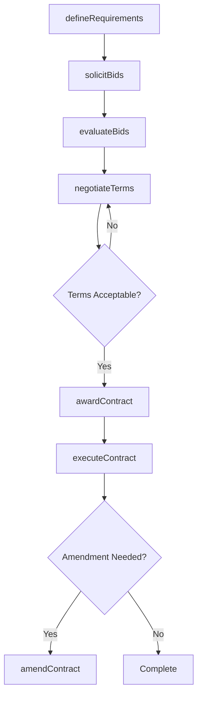
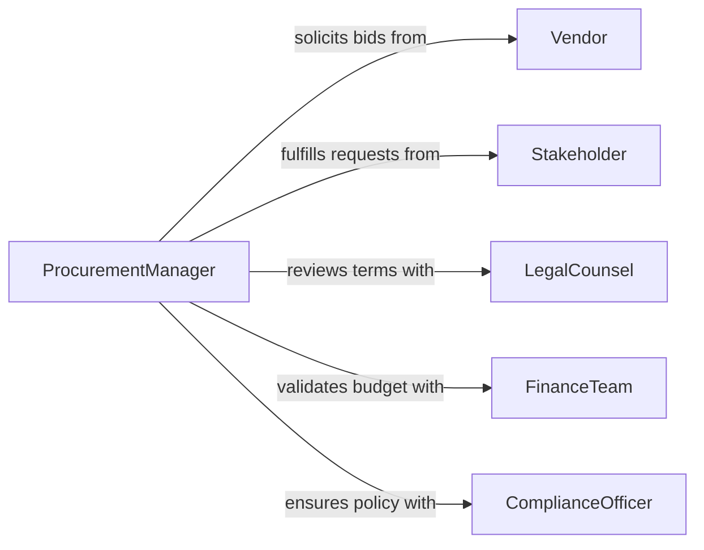

# Negotiate Purchases or Contracts

> Business-as-Code definition for procurement negotiation. Models the buyer-side process of soliciting bids, evaluating proposals, negotiating terms, and awarding contracts for goods and services.

## Overview

Purchase and contract negotiation involves defining procurement requirements, soliciting vendor proposals, comparing bids, negotiating pricing and delivery terms, and executing purchase agreements. This definition exposes actions for procurement workflow management, event triggers for bid and award status, and searches for vendor proposals and contract records.

## Actors

| Actor | Description |
|-------|-------------|
| Vendor | Supplier submitting bids and fulfilling contracts |
| Stakeholder | Internal department requesting the procurement |
| LegalCounsel | Reviews contract language and risk provisions |
| FinanceTeam | Validates budget availability and payment terms |
| ComplianceOfficer | Ensures procurement follows organizational policies |

## Roles

| Role | Description |
|------|-------------|
| ProcurementManager | Leads the negotiation and vendor selection process |
| BuyerAnalyst | Evaluates proposals and performs cost analysis |
| ContractAdministrator | Manages contract documentation and amendments |
| SourceSpecialist | Identifies and qualifies potential vendors |

## Entities

| Entity | Description |
|--------|-------------|
| PurchaseRequest | Internal demand for goods or services |
| RequestForProposal | Formal solicitation document sent to vendors |
| VendorBid | Supplier response with pricing and terms |
| Evaluation | Scored assessment of a vendor bid |
| PurchaseOrder | Authorized commitment to buy from a vendor |
| Contract | Signed agreement governing the purchase |
| Amendment | Modification to an existing contract |

## Actions

| Action | Description |
|--------|-------------|
| defineRequirements | Document the specifications and scope of the procurement |
| solicitBids | Issue a request for proposals to qualified vendors |
| evaluateBids | Score and rank vendor proposals against criteria |
| negotiateTerms | Discuss pricing, delivery, and contractual conditions |
| awardContract | Select the winning vendor and issue the purchase order |
| executeContract | Sign the formal agreement with the selected vendor |
| amendContract | Modify terms of an existing purchase agreement |

## Events

| Event | Description |
|-------|-------------|
| requirementsDefined | Procurement specifications have been documented |
| bidsSolicited | A request for proposals has been issued |
| bidsEvaluated | Vendor proposals have been scored and ranked |
| termsNegotiated | Pricing and conditions have been discussed |
| contractAwarded | A vendor has been selected and notified |
| contractExecuted | The purchase agreement has been signed |
| contractAmended | An existing agreement has been modified |

## Searches

| Search | Description |
|--------|-------------|
| findBids | List vendor proposals by solicitation, score, or status |
| getContracts | Retrieve purchase agreements by vendor, value, or date |
| getPurchaseOrders | List issued purchase orders by department or vendor |
| getAmendments | Find contract modifications by agreement or date |

## Workflow



## Actor Relationships



## Usage

### Calling Actions

```typescript
import { negotiatePurchasesContracts } from '@headlessly/negotiate-purchases-contracts'

const procurement = negotiatePurchasesContracts()

// Define requirements for office furniture
const req = await procurement.defineRequirements({
  category: 'office-furniture',
  items: ['standing-desks', 'ergonomic-chairs', 'conference-tables'],
  quantity: 150,
  budget: 75000,
  deliveryBy: '2026-04-30'
})

// Solicit and evaluate bids
await procurement.solicitBids({
  requirementId: req.id,
  vendors: ['furniture-co', 'office-supply-inc', 'ergo-works']
})

const evaluation = await procurement.evaluateBids({
  requirementId: req.id,
  criteria: ['price', 'quality', 'delivery-timeline', 'warranty']
})

// Award and execute
await procurement.awardContract({
  requirementId: req.id,
  vendorId: evaluation.topBid.vendorId
})
```

### Event-Driven Automation

```typescript
// Notify stakeholder when contract is awarded
procurement.contractAwarded(async ({ vendorId, requirementId, value }) => {
  await notify({
    to: 'requesting-department',
    message: `Contract awarded to ${vendorId} for $${value}`
  })
})

// Alert legal on high-value contracts
procurement.contractExecuted(async ({ contractId, value }) => {
  if (value > 50000) {
    await notify({
      to: 'legal-counsel',
      message: `High-value contract ${contractId} executed: $${value}`
    })
  }
})
```
