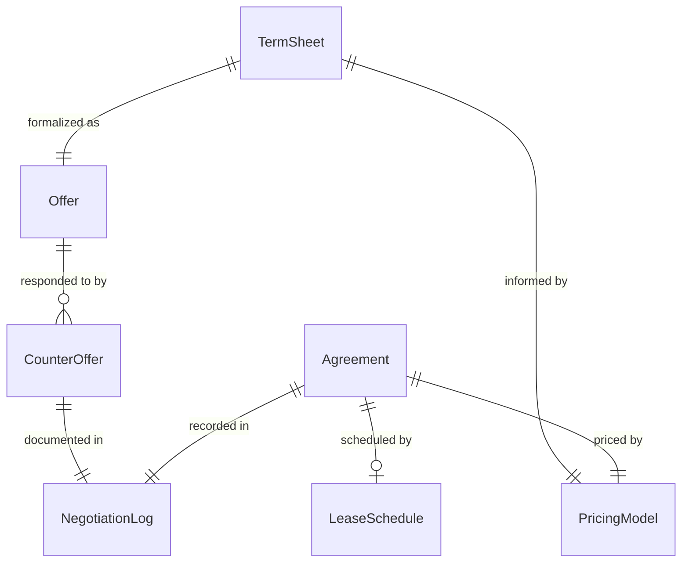
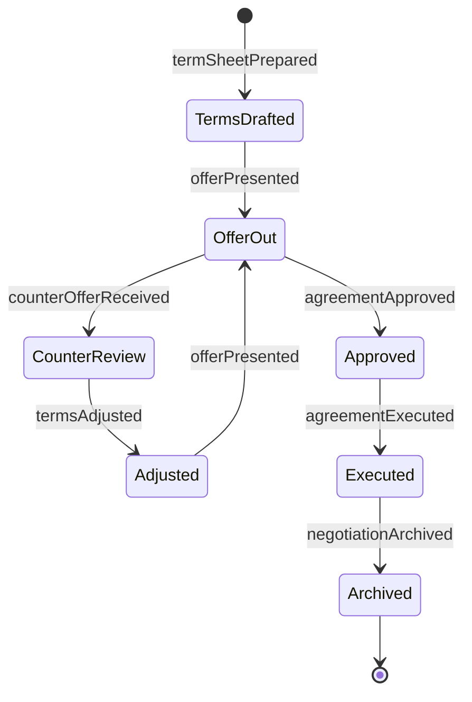
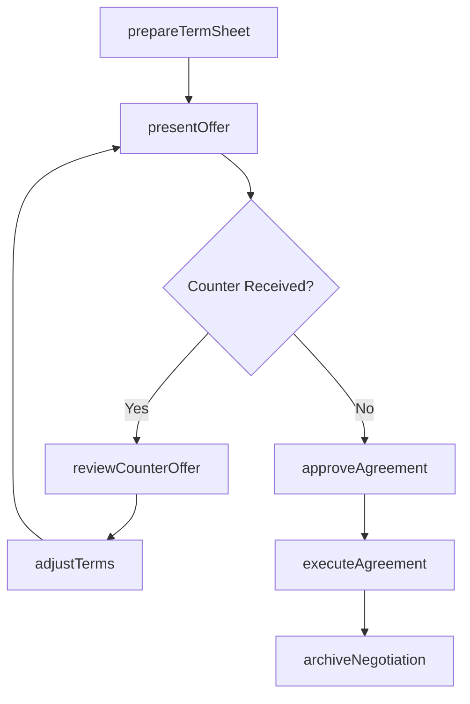
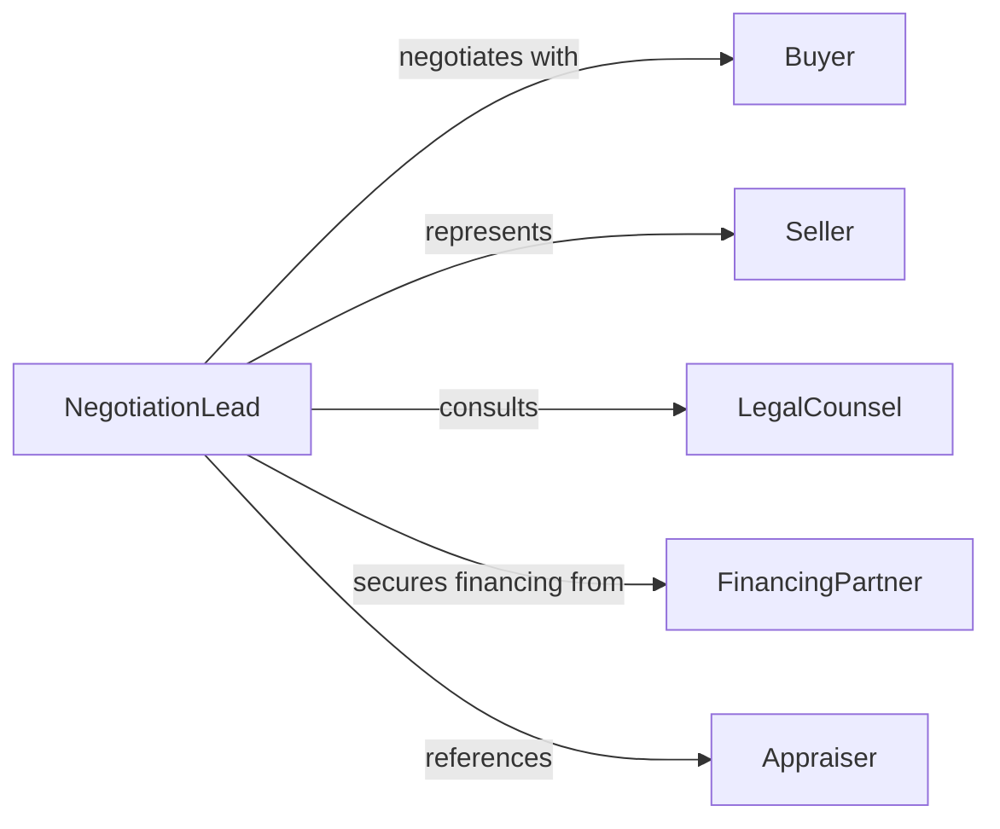

# Negotiate Sales or Lease Agreements for Products or Services

> Business-as-Code definition for sales and lease agreement negotiation. Models the end-to-end process of structuring, proposing, counter-offering, and finalizing purchase or lease terms.

## Overview

Sales and lease agreement negotiation involves preparing term sheets, presenting initial offers, managing counter-proposals, aligning on pricing and conditions, and executing final contracts for products or services. This definition exposes actions for negotiation management, event triggers for deal progression, and searches for agreement terms and negotiation history.

## Actors

| Actor | Description |
|-------|-------------|
| Buyer | Party acquiring the product or service |
| Seller | Party providing the product or service |
| Lessee | Party leasing equipment, property, or services |
| LegalCounsel | Reviews and drafts contract language |
| FinancingPartner | Provides lease financing or purchase credit |
| Appraiser | Assesses fair market value of goods or property |

## Roles

| Role | Description |
|------|-------------|
| NegotiationLead | Manages the deal and represents organizational interests |
| ContractSpecialist | Drafts and reviews agreement language |
| PricingAnalyst | Evaluates cost structures and margin targets |
| RelationshipManager | Maintains the ongoing commercial partnership |

## Entities

| Entity | Description |
|--------|-------------|
| TermSheet | Preliminary document outlining proposed deal terms |
| Offer | Formal pricing and conditions proposal |
| CounterOffer | Revised terms submitted in response to an offer |
| Agreement | Finalized contract signed by all parties |
| LeaseSchedule | Payment timeline and terms for a lease arrangement |
| PricingModel | Calculation of costs, margins, and discount structures |
| NegotiationLog | Chronological record of proposals, responses, and concessions |

## Actions

| Action | Description |
|--------|-------------|
| prepareTermSheet | Draft initial deal terms and pricing structure |
| presentOffer | Deliver the formal proposal to the counterparty |
| reviewCounterOffer | Evaluate revised terms from the other party |
| adjustTerms | Modify pricing, scope, or conditions based on feedback |
| approveAgreement | Obtain internal authorization for final terms |
| executeAgreement | Sign and formalize the contract |
| archiveNegotiation | Store the complete negotiation record |

## Events

| Event | Description |
|-------|-------------|
| termSheetPrepared | Initial deal terms have been drafted |
| offerPresented | A formal proposal has been delivered |
| counterOfferReceived | Revised terms have been submitted by the counterparty |
| termsAdjusted | Deal conditions have been modified |
| agreementApproved | Final terms have received internal authorization |
| agreementExecuted | The contract has been signed by all parties |
| negotiationArchived | The deal record has been stored |

## Searches

| Search | Description |
|--------|-------------|
| findAgreements | List executed agreements by type, party, or date |
| getNegotiationHistory | Retrieve the proposal and counter-proposal log for a deal |
| getTermSheets | Find draft term sheets by status or product category |
| getLeaseSchedules | View payment timelines for active lease agreements |

## Entity Relationships



## State Diagram



## Workflow



## Actor Relationships



## Usage

### Calling Actions

```typescript
import { negotiateSalesLeaseAgreementsProducts } from '@headlessly/negotiate-sales-lease-agreements-products'

const negotiation = negotiateSalesLeaseAgreementsProducts()

// Prepare initial terms for an equipment lease
const terms = await negotiation.prepareTermSheet({
  type: 'lease',
  product: 'Industrial CNC Machine',
  proposedRate: 4500,
  duration: 36,
  buyoutOption: true
})

// Present the offer
await negotiation.presentOffer({
  termSheetId: terms.id,
  recipient: 'manufacturing-co',
  validUntil: '2026-03-01'
})

// Execute after approval
await negotiation.executeAgreement({
  termSheetId: terms.id,
  signatories: ['leasing-corp', 'manufacturing-co'],
  effectiveDate: '2026-03-15'
})
```

### Event-Driven Automation

```typescript
// Alert pricing team on counter-offers
negotiation.counterOfferReceived(async ({ termSheetId, proposedChanges }) => {
  await notify({
    to: 'pricing-team',
    message: `Counter-offer received on ${termSheetId}: ${JSON.stringify(proposedChanges)}`
  })
})

// Auto-archive after execution
negotiation.agreementExecuted(async ({ termSheetId, agreementId }) => {
  await negotiation.archiveNegotiation({ termSheetId, agreementId })
})
```
