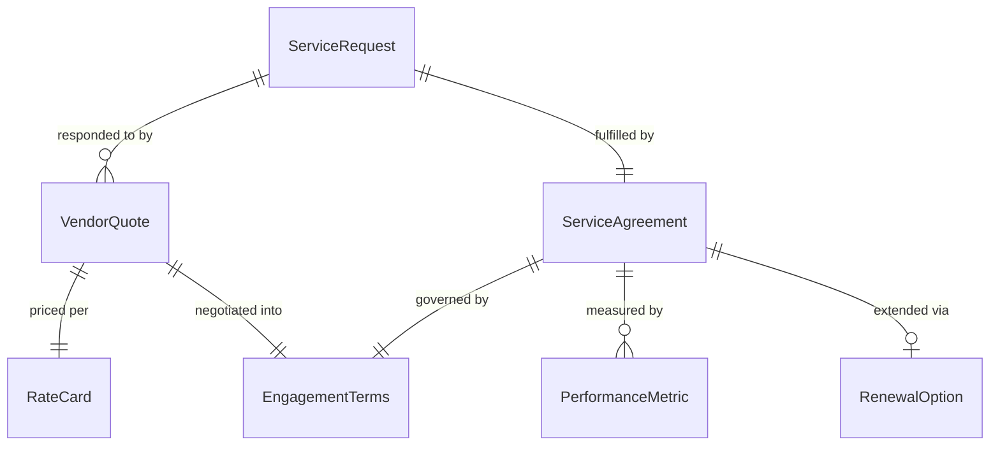
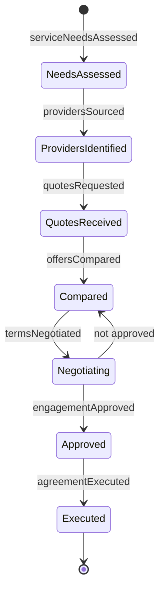
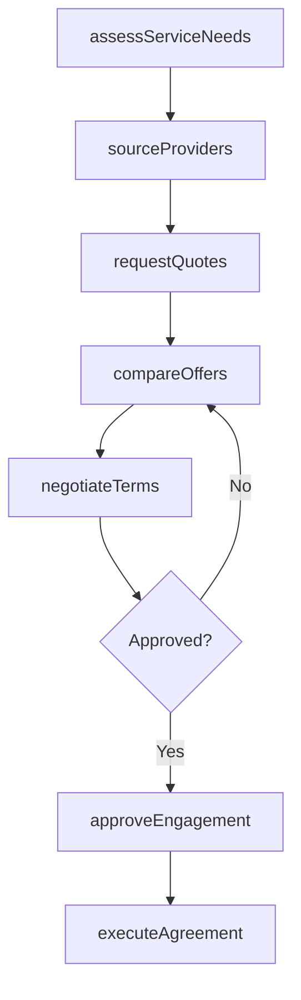
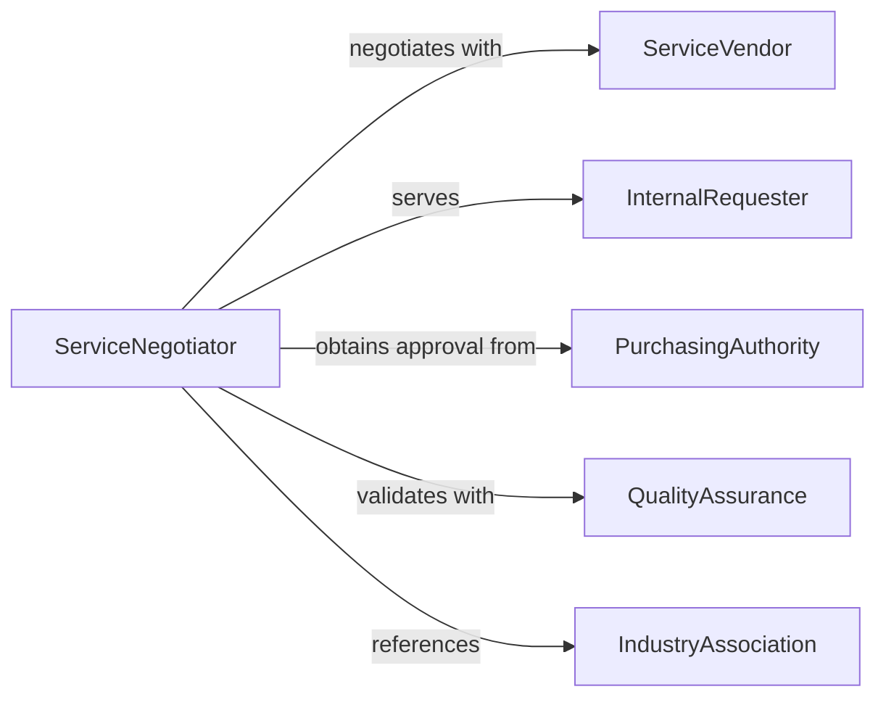

# Negotiate for Services

> Business-as-Code definition for general service negotiation. Models the process of identifying service needs, sourcing qualified providers, negotiating rates, terms, and deliverables, and executing service engagement agreements across professional, facilities, and operational domains.

## Overview

Negotiating for services involves assessing operational or professional service needs, identifying and vetting potential providers, negotiating pricing structures, delivery schedules, and quality expectations, and executing agreements that govern the service relationship. This definition exposes actions for service procurement negotiation, event triggers for engagement milestones, and searches for provider records and agreement history.

## Actors

| Actor | Description |
|-------|-------------|
| ServiceVendor | External firm or individual offering professional or operational services |
| InternalRequester | Department or team requesting the service engagement |
| PurchasingAuthority | Organizational unit authorized to approve service expenditures |
| QualityAssurance | Team verifying that delivered services meet agreed standards |
| IndustryAssociation | Professional body certifying vendor qualifications or standards |

## Roles

| Role | Description |
|------|-------------|
| ServiceNegotiator | Leads discussions on pricing, scope, and terms with providers |
| CategoryManager | Manages vendor relationships within a specific service category |
| BudgetApprover | Authorizes spending commitments for service engagements |
| VendorCoordinator | Manages onboarding and ongoing provider communication |

## Entities

| Entity | Description |
|--------|-------------|
| ServiceRequest | Formal statement of service needs, timeline, and budget constraints |
| VendorQuote | Provider pricing and availability response to a service inquiry |
| RateCard | Published fee schedule for standard service offerings |
| EngagementTerms | Negotiated conditions including scope, duration, and payment schedule |
| ServiceAgreement | Executed contract governing the service provider relationship |
| PerformanceMetric | Measurable indicator of service quality and delivery timeliness |
| RenewalOption | Terms for extending or renewing the service agreement |

## Actions

| Action | Description |
|--------|-------------|
| assessServiceNeeds | Evaluate operational gaps and define service requirements |
| sourceProviders | Identify and vet potential service vendors |
| requestQuotes | Solicit pricing and availability from qualified providers |
| compareOffers | Evaluate vendor quotes on price, quality, and availability |
| negotiateTerms | Discuss scope, rates, payment schedules, and performance expectations |
| approveEngagement | Obtain budget and organizational authorization for the service |
| executeAgreement | Finalize and sign the service engagement contract |

## Events

| Event | Description |
|-------|-------------|
| serviceNeedsAssessed | Operational requirements have been evaluated and defined |
| providersSourced | Potential service vendors have been identified and vetted |
| quotesRequested | Pricing and availability requests have been issued |
| offersCompared | Vendor quotes have been evaluated and ranked |
| termsNegotiated | Scope, rates, and performance expectations have been discussed |
| engagementApproved | Budget authorization for the service has been obtained |
| agreementExecuted | The service engagement contract has been signed |

## Searches

| Search | Description |
|--------|-------------|
| findAgreements | List service agreements by vendor, category, or expiration date |
| getQuotes | Retrieve vendor quotes by service type, price, or response date |
| getProviders | Search vendor records by category, certification, or rating |
| getPerformance | Query service quality metrics by vendor, agreement, or period |

## Entity Relationships



## State Diagram



## Workflow



## Actor Relationships



## Usage

### Calling Actions

```typescript
import { negotiateServices } from '@headlessly/negotiate-services'

const services = negotiateServices()

// Assess needs for office cleaning services
const needs = await services.assessServiceNeeds({
  category: 'facilities-management',
  serviceType: 'commercial-cleaning',
  locations: ['main-office', 'satellite-office-north'],
  frequency: 'daily',
  specialRequirements: ['green-certified-products', 'after-hours-service']
})

// Source providers and request quotes
const providers = await services.sourceProviders({
  needsId: needs.id,
  certifications: ['issa-cims-certified'],
  minimumRating: 4.2
})

const quotes = await services.requestQuotes({
  needsId: needs.id,
  providers: providers.qualified.map(p => p.id),
  responseDeadline: '2026-03-20'
})

// Negotiate and execute
await services.negotiateTerms({
  quoteId: quotes.bestValue.id,
  proposedRate: { monthly: 8500, includesSupplies: true },
  term: '24-months',
  performanceReview: 'quarterly'
})

await services.executeAgreement({
  quoteId: quotes.bestValue.id,
  startDate: '2026-05-01',
  renewalOption: 'auto-renew-12-months'
})
```

### Event-Driven Automation

```typescript
// Schedule performance reviews after agreement execution
services.agreementExecuted(async ({ agreementId, vendorId, performanceReview }) => {
  await scheduleRecurring({
    action: 'compareOffers',
    agreementId,
    vendorId,
    frequency: performanceReview,
    type: 'quality-assessment'
  })
})

// Alert on approaching contract renewals
services.termsNegotiated(async ({ agreementId, expirationDate }) => {
  await scheduleReminder({
    triggerDate: subtractDays(expirationDate, 90),
    to: 'category-manager',
    message: `Service agreement ${agreementId} renewal window opens in 90 days. Begin market assessment.`
  })
})
```
