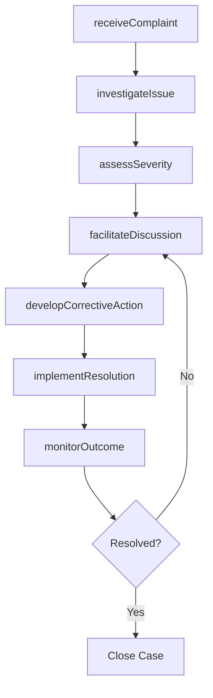
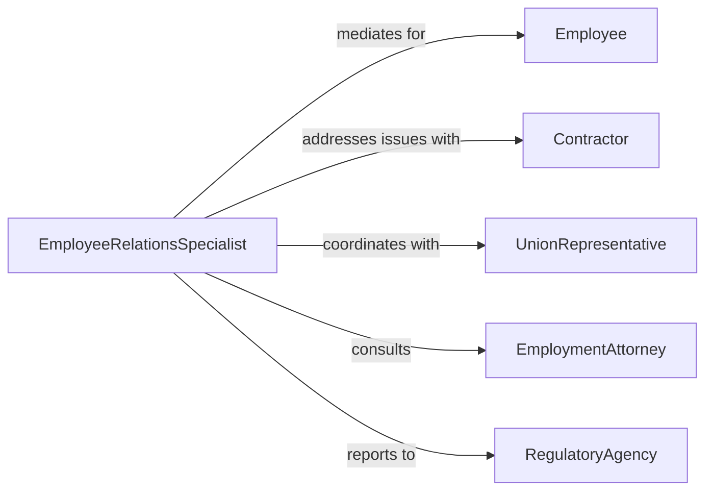

# Resolve Employee or Contractor Problems

> Business-as-Code definition for employee and contractor problem resolution. Models the process of receiving complaints or performance concerns, investigating root causes, facilitating corrective discussions, implementing remediation plans, and documenting outcomes for workforce issues.

## Overview

Resolving employee or contractor problems involves identifying workplace issues such as performance deficiencies, conduct violations, interpersonal conflicts, or contractual disputes, conducting thorough investigations, facilitating discussions between affected parties, implementing corrective action plans, and tracking resolution outcomes. This definition exposes actions for workforce problem management, event triggers for resolution milestones, and searches for case history and corrective action records.

## Actors

| Actor | Description |
|-------|-------------|
| Employee | Staff member involved in or affected by the workplace problem |
| Contractor | External worker or firm whose performance or conduct is in question |
| UnionRepresentative | Labor organization advocate present during formal proceedings |
| EmploymentAttorney | Legal counsel advising on labor law compliance and risk |
| RegulatoryAgency | Government body overseeing workplace standards and employee rights |

## Roles

| Role | Description |
|------|-------------|
| HRInvestigator | Examines complaints and gathers evidence on workforce issues |
| PeopleManager | Supervises the affected employee or contractor and initiates resolution |
| EmployeeRelationsSpecialist | Facilitates discussions and mediates between parties |
| ComplianceAdvisor | Ensures resolution actions comply with employment law and policy |

## Entities

| Entity | Description |
|--------|-------------|
| ComplaintRecord | Documented report of the workforce issue with parties and details |
| InvestigationReport | Findings from the examination of evidence and witness statements |
| CorrectiveActionPlan | Structured remediation steps with timelines and accountability |
| PerformanceImprovement | Formal plan addressing specific performance deficiencies |
| DisciplinaryAction | Official consequence imposed for policy or conduct violations |
| ResolutionAgreement | Signed document capturing agreed-upon resolution terms |
| WitnessStatement | Documented account from individuals with knowledge of the issue |

## Actions

| Action | Description |
|--------|-------------|
| receiveComplaint | Accept and document a workforce problem report |
| investigateIssue | Gather evidence, interview witnesses, and analyze the root cause |
| assessSeverity | Determine the impact and urgency of the workforce problem |
| facilitateDiscussion | Bring affected parties together to explore resolution options |
| developCorrectiveAction | Create a structured plan to address the identified problem |
| implementResolution | Execute the agreed-upon corrective actions |
| monitorOutcome | Track compliance with the resolution plan and verify improvement |

## Events

| Event | Description |
|-------|-------------|
| complaintReceived | A workforce problem report has been documented |
| issueInvestigated | Evidence has been gathered and the root cause analyzed |
| severityAssessed | The impact and urgency of the problem have been determined |
| discussionFacilitated | Affected parties have met to explore resolution options |
| correctiveActionDeveloped | A structured remediation plan has been created |
| resolutionImplemented | Corrective actions have been executed |
| outcomeMonitored | Compliance with the resolution plan has been tracked |

## Searches

| Search | Description |
|--------|-------------|
| findComplaints | List workforce problems by employee, type, status, or date |
| getInvestigations | Retrieve investigation reports by case, finding, or severity |
| getCorrectiveActions | Search remediation plans by employee, status, or deadline |
| getDisciplinaryHistory | Query past disciplinary actions by employee or violation type |

## Workflow



## Actor Relationships



## Usage

### Calling Actions

```typescript
import { resolveEmployeeContractorProblems } from '@headlessly/resolve-employee-contractor-problems'

const workforce = resolveEmployeeContractorProblems()

// Receive and investigate a performance complaint
const complaint = await workforce.receiveComplaint({
  type: 'performance-deficiency',
  subject: 'contractor-abc-consulting',
  reporter: 'project-manager-smith',
  description: 'Missed three consecutive project deadlines and deliverable quality below standards',
  priority: 'high'
})

await workforce.investigateIssue({
  complaintId: complaint.id,
  interviews: ['project-manager-smith', 'team-lead-jones', 'contractor-abc-consulting'],
  evidenceRequested: ['project-timelines', 'deliverable-reviews', 'communication-logs']
})

// Develop and implement corrective action
await workforce.developCorrectiveAction({
  complaintId: complaint.id,
  actions: [
    { step: 'weekly-progress-reviews', deadline: 'immediate', responsible: 'project-manager-smith' },
    { step: 'deliverable-quality-checklist', deadline: '2026-04-15', responsible: 'contractor-abc-consulting' },
    { step: 'contract-amendment-with-penalties', deadline: '2026-04-30', responsible: 'procurement-team' }
  ],
  reviewDate: '2026-06-01'
})
```

### Event-Driven Automation

```typescript
// Escalate high-severity complaints
workforce.severityAssessed(async ({ complaintId, severity, subjectType }) => {
  if (severity === 'critical') {
    await notify({
      to: ['hr-director', 'legal-counsel'],
      message: `Critical ${subjectType} issue ${complaintId} requires immediate attention`
    })
  }
})

// Auto-close resolved cases after monitoring period
workforce.outcomeMonitored(async ({ complaintId, status, monitoringPeriod }) => {
  if (status === 'improved' && monitoringPeriod === 'complete') {
    await workforce.closeCase({ complaintId, resolution: 'corrective-action-successful' })
  }
})
```
