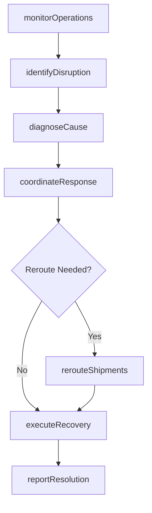
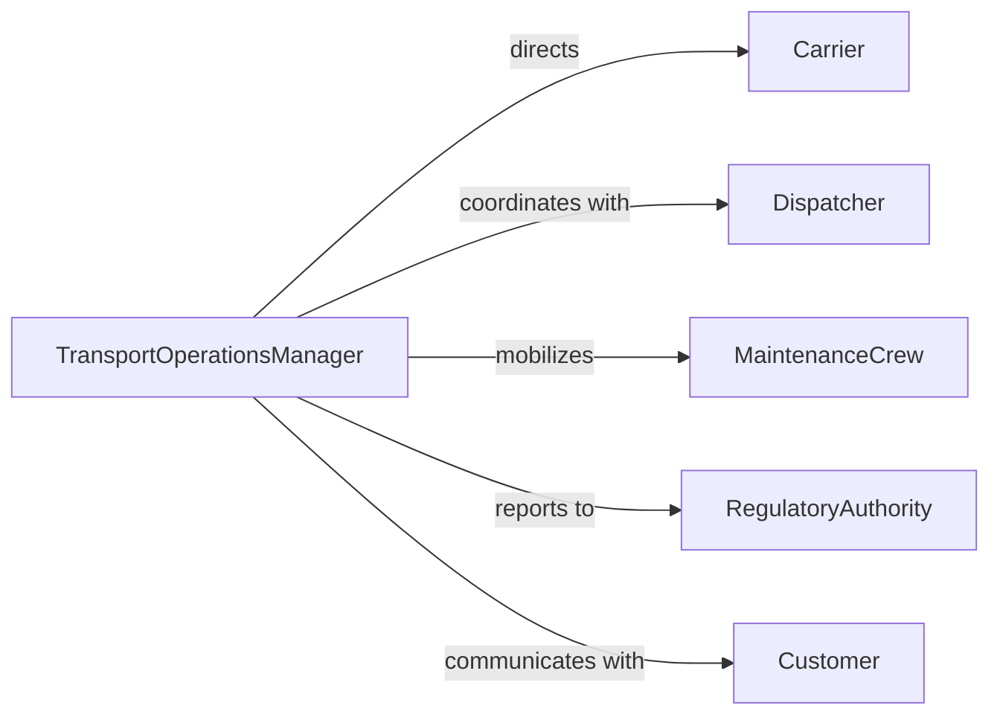

# Resolve Issues Affecting Transportation Operations

> Business-as-Code definition for transportation operations issue resolution. Models the process of detecting disruptions to freight, transit, or logistics operations, diagnosing causes, coordinating corrective responses across carriers and dispatchers, and restoring service levels.

## Overview

Resolving issues affecting transportation operations involves monitoring fleet performance and route schedules, identifying disruptions caused by equipment failures, weather events, regulatory holds, or capacity constraints, coordinating rapid response with carriers, dispatchers, and maintenance crews, and implementing corrective actions that restore on-time delivery and service reliability. This definition exposes actions for transportation disruption management, event triggers for operational milestones, and searches for incident history and fleet performance records.

## Actors

| Actor | Description |
|-------|-------------|
| Carrier | Transportation company operating vehicles and routes |
| Dispatcher | Coordinator assigning drivers and vehicles to routes |
| MaintenanceCrew | Technicians performing vehicle repairs and inspections |
| RegulatoryAuthority | Government body enforcing transportation safety and compliance rules |
| Customer | Shipper or consignee affected by transportation disruptions |

## Roles

| Role | Description |
|------|-------------|
| TransportOperationsManager | Oversees fleet operations and coordinates disruption response |
| RouteAnalyst | Evaluates route efficiency and identifies bottleneck causes |
| FleetMaintenanceCoordinator | Manages vehicle repair schedules and equipment availability |
| ComplianceOfficer | Ensures corrective actions meet transportation safety regulations |

## Entities

| Entity | Description |
|--------|-------------|
| DisruptionIncident | Documented transportation issue with cause, impact, and timeline |
| RouteDeviation | Unplanned change to a scheduled route or delivery path |
| VehicleBreakdown | Equipment failure requiring repair or replacement |
| WeatherAlert | Meteorological condition affecting transportation safety or timing |
| CapacityShortage | Insufficient vehicles, drivers, or cargo space for demand |
| CorrectiveAction | Specific step taken to resolve the transportation disruption |
| ServiceRecoveryPlan | Coordinated response to restore normal operations after a disruption |

## Actions

| Action | Description |
|--------|-------------|
| monitorOperations | Track fleet status, route adherence, and schedule compliance in real time |
| identifyDisruption | Detect and classify the transportation issue requiring response |
| diagnoseCause | Determine the root cause of the operational disruption |
| coordinateResponse | Mobilize carriers, dispatchers, and maintenance to address the issue |
| rerouteShipments | Redirect freight or passengers to alternative routes or carriers |
| executeRecovery | Implement corrective actions to restore normal service levels |
| reportResolution | Document the disruption, response, and outcome for stakeholders |

## Events

| Event | Description |
|-------|-------------|
| operationsMonitored | Fleet and route status have been tracked |
| disruptionIdentified | A transportation issue has been detected and classified |
| causeDiagnosed | The root cause of the disruption has been determined |
| responseCoordinated | Carriers and crews have been mobilized for corrective action |
| shipmentsRerouted | Freight or passengers have been redirected to alternatives |
| recoveryExecuted | Corrective actions have restored normal service |
| resolutionReported | The disruption outcome has been documented |

## Searches

| Search | Description |
|--------|-------------|
| findDisruptions | List transportation incidents by type, route, carrier, or date |
| getFleetStatus | Retrieve vehicle availability and condition by fleet or location |
| getRoutePerformance | Search on-time delivery and adherence data by route or period |
| getMaintenanceRecords | Query vehicle repair history by unit, issue type, or date |

## Workflow



## Actor Relationships



## Usage

### Calling Actions

```typescript
import { resolveIssuesAffectingTransportationOperations } from '@headlessly/resolve-issues-affecting-transportation-operations'

const transport = resolveIssuesAffectingTransportationOperations()

// Identify a fleet disruption
const disruption = await transport.identifyDisruption({
  type: 'vehicle-breakdown',
  vehicleId: 'truck-2847',
  route: 'chicago-to-dallas-i35',
  location: { lat: 36.12, lng: -97.06, description: 'oklahoma-city-area' },
  estimatedImpact: { delayedShipments: 3, hours: 8 }
})

// Diagnose and coordinate response
await transport.diagnoseCause({
  incidentId: disruption.id,
  diagnosis: 'transmission-failure',
  repairEstimate: '12-hours',
  requiresTow: true
})

await transport.rerouteShipments({
  incidentId: disruption.id,
  affectedShipments: ['ship-9201', 'ship-9202', 'ship-9203'],
  alternativeCarrier: 'express-freight-services',
  estimatedDelay: '4-hours'
})

await transport.executeRecovery({
  incidentId: disruption.id,
  actions: [
    { type: 'tow-to-service-center', provider: 'roadside-assist-inc' },
    { type: 'transfer-cargo', destination: 'alternative-carrier' },
    { type: 'notify-customers', shipments: ['ship-9201', 'ship-9202', 'ship-9203'] }
  ]
})
```

### Event-Driven Automation

```typescript
// Auto-notify customers on disruptions
transport.disruptionIdentified(async ({ incidentId, affectedShipments, estimatedDelay }) => {
  for (const shipmentId of affectedShipments) {
    await notify({
      to: `customer-for-${shipmentId}`,
      message: `Shipment ${shipmentId} delayed approximately ${estimatedDelay} due to operational disruption ${incidentId}`
    })
  }
})

// Schedule preventive maintenance after breakdowns
transport.resolutionReported(async ({ incidentId, vehicleId, rootCause }) => {
  if (rootCause.category === 'mechanical-failure') {
    await scheduleRecurring({
      action: 'monitorOperations',
      vehicleId,
      inspectionType: rootCause.component,
      frequency: 'bi-weekly',
      duration: '3-months'
    })
  }
})
```
