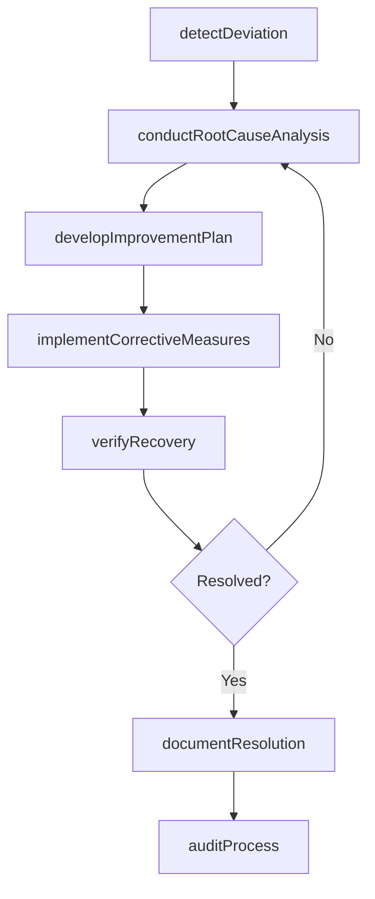
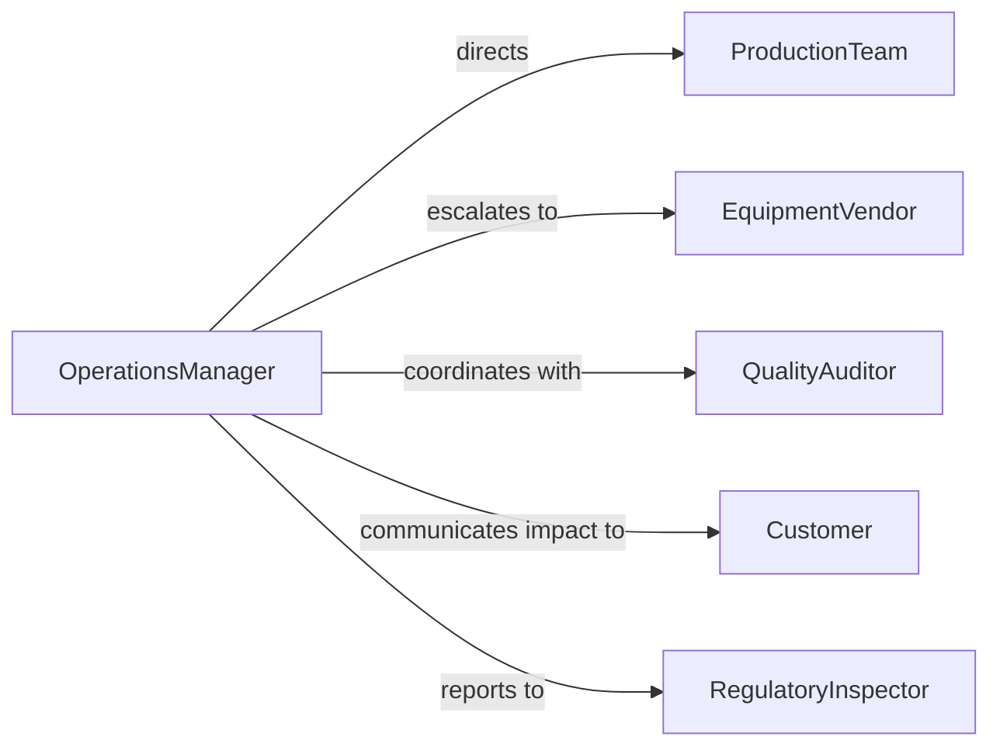

# Resolve Operational Performance Problems

> Business-as-Code definition for operational performance problem resolution. Models the process of detecting performance shortfalls, conducting root cause analysis, developing improvement plans, implementing corrective measures, and verifying that operational targets are restored.

## Overview

Resolving operational performance problems involves identifying deviations from production, quality, or efficiency targets, analyzing root causes through data review and process audits, developing and implementing corrective action plans, and monitoring recovery to confirm that operational benchmarks are met. This definition exposes actions for operational troubleshooting management, event triggers for performance milestones, and searches for incident history and improvement records.

## Actors

| Actor | Description |
|-------|-------------|
| ProductionTeam | Frontline workers executing operational processes |
| EquipmentVendor | Supplier of machinery or systems contributing to performance issues |
| QualityAuditor | External or internal inspector verifying process compliance |
| Customer | End recipient affected by operational performance degradation |
| RegulatoryInspector | Government official monitoring compliance with operational standards |

## Roles

| Role | Description |
|------|-------------|
| OperationsManager | Oversees production and identifies performance deviations |
| ProcessEngineer | Analyzes workflows and designs corrective improvements |
| QualityAnalyst | Measures defect rates and monitors quality metrics |
| ContinuousImprovementLead | Drives systematic problem-solving and process optimization |

## Entities

| Entity | Description |
|--------|-------------|
| PerformanceIncident | Documented deviation from operational targets or standards |
| RootCauseAnalysis | Systematic investigation identifying the underlying cause of a problem |
| CorrectiveMeasure | Specific action taken to eliminate the root cause of a deviation |
| ImprovementPlan | Structured set of corrective measures with timelines and owners |
| ProcessAudit | Formal review of operational workflows against standard procedures |
| PerformanceMetric | Quantitative measure of throughput, quality, or efficiency |
| IncidentReport | Final documentation of the problem, cause, and resolution outcome |

## Actions

| Action | Description |
|--------|-------------|
| detectDeviation | Identify a gap between actual and target operational performance |
| conductRootCauseAnalysis | Systematically investigate the underlying cause of the problem |
| developImprovementPlan | Create a structured set of corrective measures with assignments |
| implementCorrectiveMeasures | Execute the planned changes to processes, equipment, or procedures |
| auditProcess | Review operational workflows against standard procedures |
| verifyRecovery | Confirm that operational performance has returned to target levels |
| documentResolution | Record the problem, cause, actions taken, and final outcome |

## Events

| Event | Description |
|-------|-------------|
| deviationDetected | A performance gap has been identified |
| rootCauseAnalyzed | The underlying cause of the problem has been determined |
| improvementPlanDeveloped | Corrective measures have been structured and assigned |
| correctiveMeasuresImplemented | Planned changes have been executed |
| processAudited | Operational workflows have been reviewed for compliance |
| recoveryVerified | Performance has been confirmed at target levels |
| resolutionDocumented | The complete incident record has been finalized |

## Searches

| Search | Description |
|--------|-------------|
| findIncidents | List performance deviations by type, severity, or date |
| getRootCauses | Retrieve root cause analyses by incident, category, or process area |
| getImprovementPlans | Search corrective action plans by status, owner, or deadline |
| getMetrics | Query operational performance data by metric, period, or department |

## Workflow



## Actor Relationships



## Usage

### Calling Actions

```typescript
import { resolveOperationalPerformanceProblems } from '@headlessly/resolve-operational-performance-problems'

const ops = resolveOperationalPerformanceProblems()

// Detect a throughput deviation
const incident = await ops.detectDeviation({
  metric: 'units-per-hour',
  target: 500,
  actual: 380,
  processArea: 'assembly-line-3',
  detectedBy: 'shift-supervisor',
  severity: 'high'
})

// Conduct root cause analysis
const rca = await ops.conductRootCauseAnalysis({
  incidentId: incident.id,
  method: 'five-whys',
  team: ['process-engineer', 'maintenance-tech', 'line-operator'],
  dataReviewed: ['downtime-logs', 'defect-rates', 'equipment-maintenance-records']
})

// Develop and implement improvement plan
await ops.developImprovementPlan({
  incidentId: incident.id,
  rootCauseId: rca.id,
  measures: [
    { action: 'replace-worn-conveyor-belts', owner: 'maintenance-team', deadline: '2026-04-10' },
    { action: 'recalibrate-sensors', owner: 'process-engineer', deadline: '2026-04-12' },
    { action: 'retrain-operators-on-sop', owner: 'shift-supervisor', deadline: '2026-04-15' }
  ]
})

await ops.verifyRecovery({
  incidentId: incident.id,
  monitoringPeriod: '14-days',
  successCriteria: { metric: 'units-per-hour', minimum: 490 }
})
```

### Event-Driven Automation

```typescript
// Auto-escalate critical deviations
ops.deviationDetected(async ({ incidentId, severity, processArea }) => {
  if (severity === 'critical') {
    await notify({
      to: ['plant-manager', 'quality-director'],
      message: `Critical performance deviation in ${processArea}. Incident ${incidentId} requires immediate response.`
    })
  }
})

// Schedule preventive audits after resolution
ops.resolutionDocumented(async ({ incidentId, processArea }) => {
  await scheduleRecurring({
    action: 'auditProcess',
    processArea,
    relatedIncident: incidentId,
    frequency: 'monthly',
    duration: '6-months'
  })
})
```
