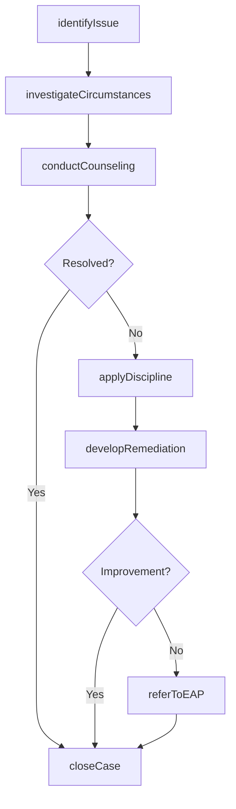
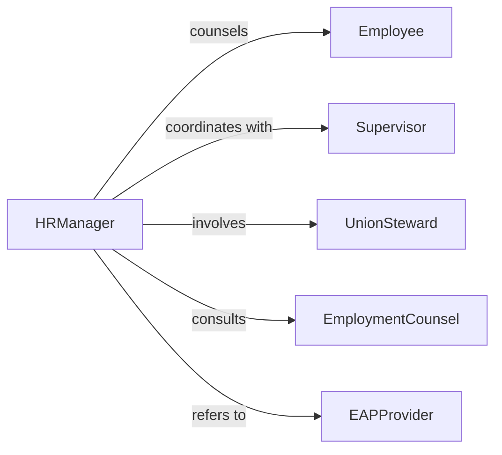

# Resolve Personnel Problems

> Business-as-Code definition for personnel problem resolution. Models the process of addressing staffing shortages, attendance issues, workplace conduct concerns, and team dysfunction through investigation, counseling, policy enforcement, and structured remediation.

## Overview

Resolving personnel problems involves identifying workforce issues such as chronic absenteeism, interpersonal conflicts, policy violations, or morale concerns, investigating the circumstances, counseling affected individuals, applying progressive discipline when warranted, and implementing solutions that restore a productive work environment. This definition exposes actions for personnel issue management, event triggers for resolution milestones, and searches for employee records and disciplinary history.

## Actors

| Actor | Description |
|-------|-------------|
| Employee | Staff member involved in or affected by the personnel issue |
| Supervisor | Direct manager reporting or addressing the personnel problem |
| UnionSteward | Labor representative present during formal disciplinary proceedings |
| EmploymentCounsel | Attorney advising on legal risks of personnel actions |
| EAPProvider | Employee assistance program offering counseling and support services |

## Roles

| Role | Description |
|------|-------------|
| HRManager | Oversees personnel problem resolution and policy application |
| EmployeeRelationsOfficer | Investigates issues and facilitates resolutions between parties |
| TrainingCoordinator | Arranges skill development or behavioral training as remediation |
| PayrollSpecialist | Processes adjustments related to leave, suspensions, or terminations |

## Entities

| Entity | Description |
|--------|-------------|
| PersonnelCase | Documented record of the personnel issue with timeline and parties |
| AttendanceRecord | Employee time-and-attendance data showing patterns or violations |
| ConductReport | Documentation of workplace behavior or policy violations |
| CounselingSession | Formal meeting to discuss the issue and expectations with the employee |
| DisciplinaryNotice | Written warning or sanction issued for personnel policy violations |
| RemediationPlan | Structured steps for the employee to correct the identified problem |
| SeparationAgreement | Terms governing voluntary or involuntary employment termination |

## Actions

| Action | Description |
|--------|-------------|
| identifyIssue | Detect and categorize the personnel problem requiring resolution |
| investigateCircumstances | Gather facts, review records, and interview relevant parties |
| conductCounseling | Meet with the employee to discuss the issue and set expectations |
| applyDiscipline | Issue formal warnings or sanctions per the progressive discipline policy |
| developRemediation | Create a structured plan for the employee to correct the problem |
| referToEAP | Connect the employee with assistance program resources when appropriate |
| closeCase | Finalize documentation and confirm the issue has been resolved |

## Events

| Event | Description |
|-------|-------------|
| issueIdentified | A personnel problem has been detected and categorized |
| circumstancesInvestigated | Facts and evidence have been gathered and reviewed |
| counselingConducted | A formal discussion has taken place with the employee |
| disciplineApplied | A warning or sanction has been issued |
| remediationDeveloped | A corrective plan has been created for the employee |
| eapReferralMade | The employee has been connected with assistance resources |
| caseClosed | The personnel issue has been resolved and documented |

## Searches

| Search | Description |
|--------|-------------|
| findCases | List personnel cases by employee, type, status, or date |
| getAttendance | Retrieve attendance records by employee, period, or pattern |
| getDisciplinaryHistory | Search past warnings and sanctions by employee or violation type |
| getCounselingRecords | Query counseling session notes by employee, issue, or date |

## Workflow



## Actor Relationships



## Usage

### Calling Actions

```typescript
import { resolvePersonnelProblems } from '@headlessly/resolve-personnel-problems'

const personnel = resolvePersonnelProblems()

// Identify a chronic attendance issue
const issue = await personnel.identifyIssue({
  type: 'chronic-absenteeism',
  employee: 'emp-4521',
  reportedBy: 'supervisor-martinez',
  description: 'Unexcused absences on 8 of last 20 scheduled shifts',
  policyReference: 'attendance-policy-3.2'
})

// Investigate and counsel
await personnel.investigateCircumstances({
  caseId: issue.id,
  reviewRecords: ['attendance-log', 'leave-requests', 'prior-warnings'],
  interviews: ['supervisor-martinez', 'emp-4521']
})

await personnel.conductCounseling({
  caseId: issue.id,
  attendees: ['hr-manager-chen', 'supervisor-martinez', 'emp-4521'],
  topics: ['attendance-expectations', 'available-leave-options', 'eap-resources'],
  outcome: 'verbal-warning-issued'
})

// Develop remediation if needed
await personnel.developRemediation({
  caseId: issue.id,
  steps: [
    { action: 'daily-check-in-with-supervisor', duration: '30-days' },
    { action: 'eap-counseling-referral', sessions: 3 },
    { action: 'attendance-review', date: '2026-05-15' }
  ]
})
```

### Event-Driven Automation

```typescript
// Escalate repeated disciplinary actions
personnel.disciplineApplied(async ({ caseId, employeeId, warningLevel }) => {
  if (warningLevel === 'final-written') {
    await notify({
      to: ['hr-director', 'employment-counsel'],
      message: `Final written warning issued to ${employeeId}. Case ${caseId} may require termination review.`
    })
  }
})

// Auto-schedule follow-up after counseling
personnel.counselingConducted(async ({ caseId, employeeId }) => {
  await scheduleReminder({
    triggerDate: addDays(new Date(), 30),
    to: 'employee-relations-officer',
    message: `30-day follow-up due for personnel case ${caseId} (${employeeId})`
  })
})
```
