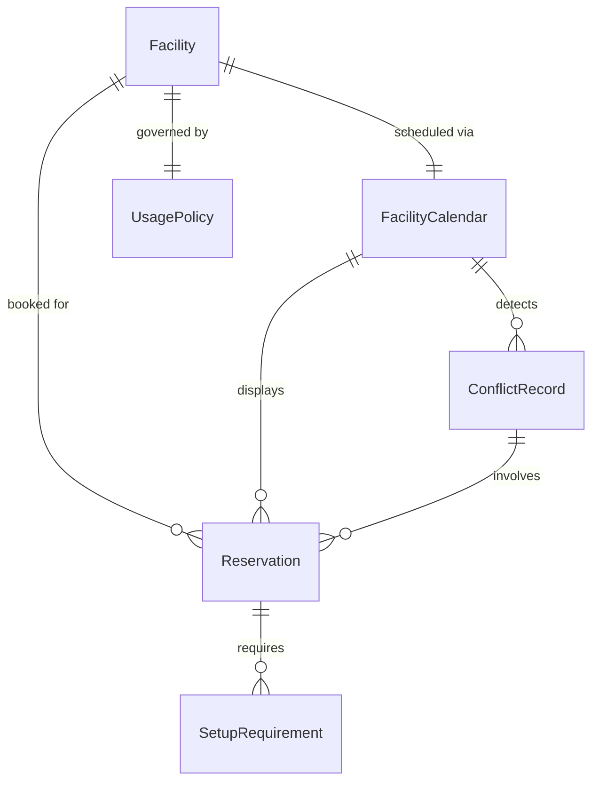
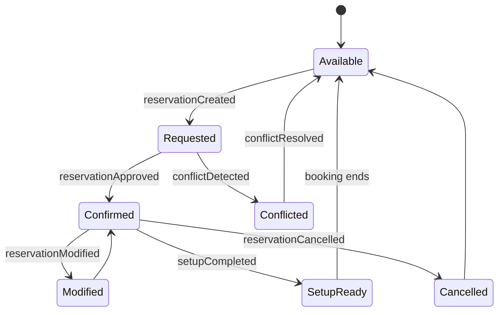
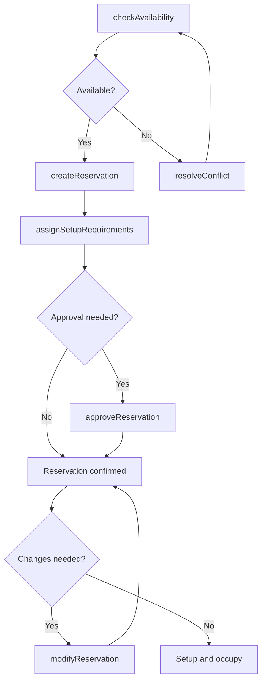
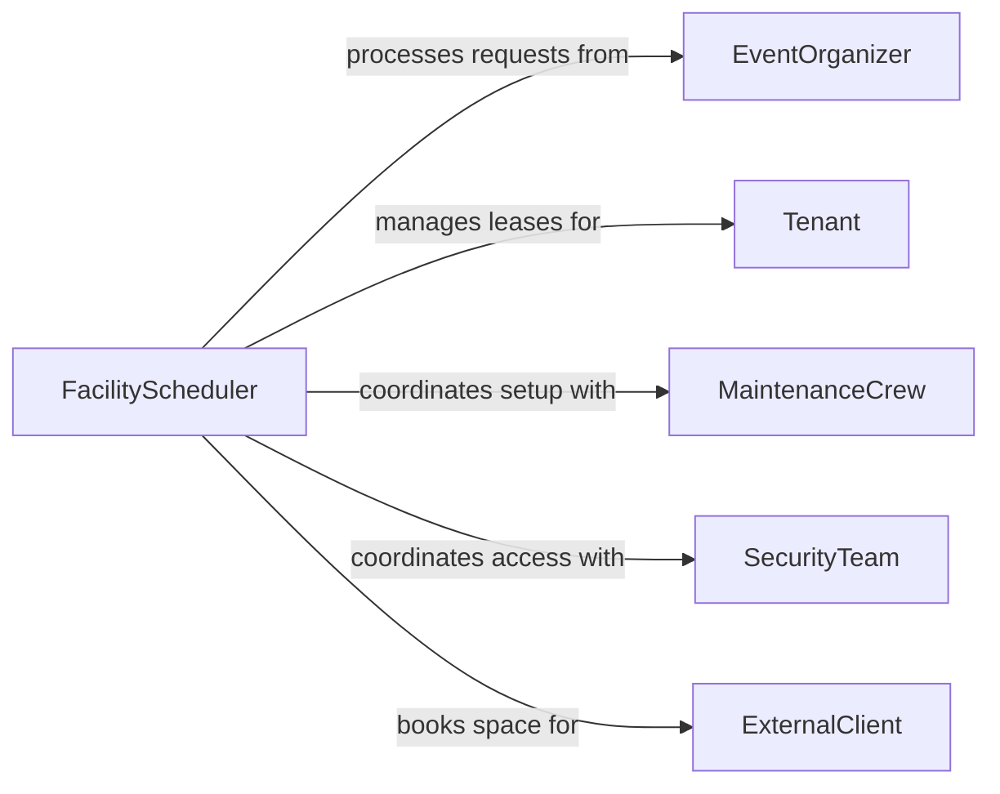

# Arrange Facility Schedules

> Business-as-Code definition for arranging facility schedules. Models the booking, coordination, and management of shared facility spaces including meeting rooms, event venues, and operational areas.

## Overview

Arranging facility schedules involves managing the allocation of physical spaces to competing demands, coordinating setup and teardown requirements, and ensuring that facility usage aligns with organizational policies. This definition exposes actions for booking spaces, managing reservations, and resolving conflicts, along with events for occupancy tracking and searches for querying availability across facilities.

## Actors

| Actor | Description |
|-------|-------------|
| Tenant | Occupies or leases facility space on a recurring basis |
| EventOrganizer | Requests facility space for meetings, conferences, or special events |
| MaintenanceCrew | Performs cleaning, setup, and repair work between bookings |
| SecurityTeam | Manages facility access control and after-hours usage |
| ExternalClient | Rents or uses facility space for external events or services |

## Roles

| Role | Description |
|------|-------------|
| FacilityScheduler | Coordinates bookings and manages the facility calendar |
| FacilityManager | Oversees facility operations, policies, and resource allocation |
| ReceptionCoordinator | Handles walk-in requests and day-of schedule adjustments |
| BuildingEngineer | Ensures HVAC, lighting, and technical systems support scheduled usage |

## Entities

| Entity | Description |
|--------|-------------|
| Facility | A building, floor, or distinct operational area available for scheduling |
| Reservation | A confirmed booking of a facility space for a specific time period |
| FacilityCalendar | The master schedule showing all bookings across facility spaces |
| SetupRequirement | The configuration, equipment, or services needed for a booking |
| ConflictRecord | A documented overlap or contention between competing reservations |
| UsagePolicy | Rules governing who may book, when, and under what conditions |

## Actions

| Action | Description |
|--------|-------------|
| createReservation | Book a facility space for a specific date, time, and purpose |
| checkAvailability | Verify whether a facility space is open for a requested period |
| approveReservation | Confirm a pending booking that requires managerial approval |
| modifyReservation | Change the time, space, or setup requirements of an existing booking |
| cancelReservation | Remove a booking from the facility calendar |
| resolveConflict | Adjudicate overlapping reservations and reassign space |
| assignSetupRequirements | Specify the configuration and equipment needed for a booking |

## Events

| Event | Description |
|-------|-------------|
| reservationCreated | A new facility booking has been submitted |
| reservationApproved | A pending booking has been confirmed by the facility manager |
| reservationModified | An existing booking has been changed |
| reservationCancelled | A booking has been removed from the calendar |
| conflictDetected | Two or more bookings overlap for the same facility space |
| conflictResolved | An overlapping booking contention has been adjudicated |
| setupCompleted | The facility space has been configured for the upcoming booking |

## Searches

| Search | Description |
|--------|-------------|
| findReservations | Retrieve bookings by facility, date range, organizer, or status |
| getAvailability | List open time slots for a specific facility or space type |
| getCalendar | View the full schedule for a facility over a given period |
| findConflicts | List all unresolved booking conflicts across facilities |

## Entity Relationships



## State Diagram



## Workflow



## Actor Relationships



## Usage

### Calling Actions

```typescript
import { arrangeFacilitySchedules } from '@headlessly/arrange-facility-schedules'

const facilities = arrangeFacilitySchedules()

// Check availability for a conference room
const slots = await facilities.checkAvailability({
  facilityId: 'conf-room-A',
  date: '2026-03-18',
  duration: 120
})

// Create a reservation
const reservation = await facilities.createReservation({
  facilityId: 'conf-room-A',
  date: '2026-03-18',
  startTime: '09:00',
  endTime: '11:00',
  organizer: 'marketing-team',
  purpose: 'Quarterly strategy review'
})

// Assign setup requirements
await facilities.assignSetupRequirements({
  reservationId: reservation.id,
  setup: ['projector', 'whiteboard', 'video-conference', 'catering-coffee']
})
```

### Event-Driven Automation

```typescript
// Auto-notify maintenance when setup is needed
facilities.reservationApproved(async ({ reservationId, facilityId, setupRequirements }) => {
  if (setupRequirements.length > 0) {
    await workOrders.create({
      type: 'facility-setup',
      facilityId,
      reservationId,
      tasks: setupRequirements
    })
  }
})

// Alert scheduler when conflicts arise
facilities.conflictDetected(async ({ facilityId, reservations }) => {
  await notify({
    to: 'facility-scheduler',
    message: `Booking conflict in ${facilityId}: ${reservations.length} overlapping reservations require resolution`
  })
})
```
