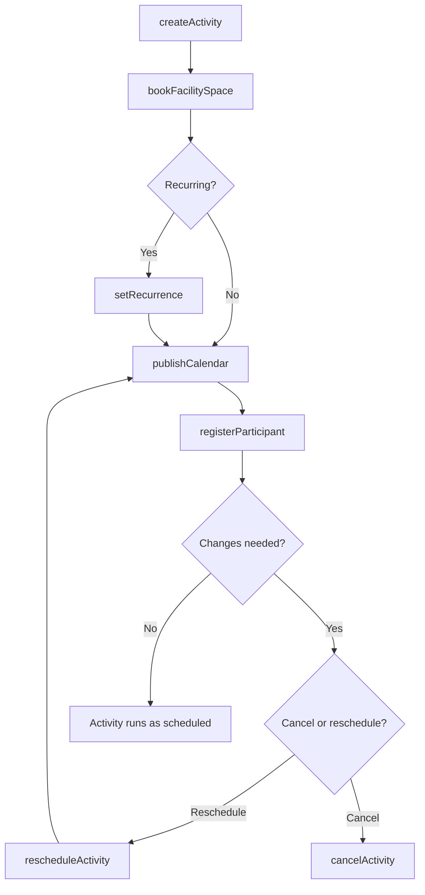
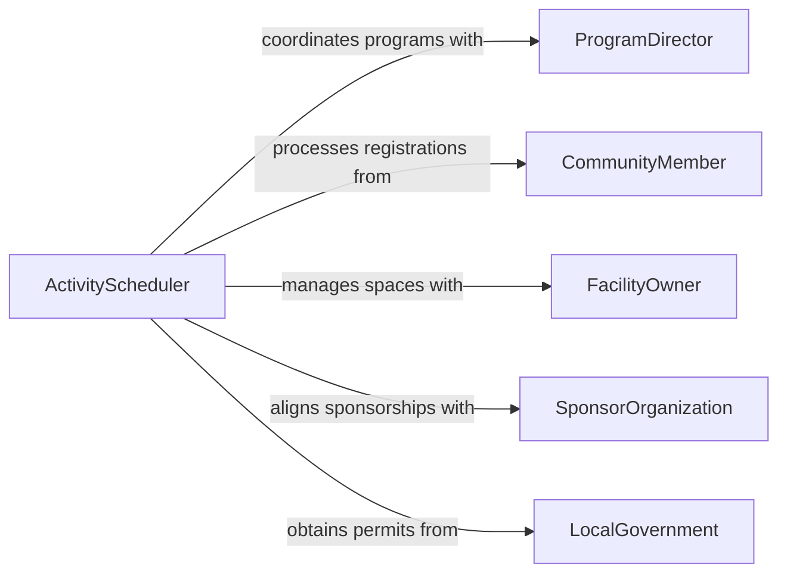

# Schedule Activities Facility Use

> Business-as-Code definition for scheduling activities and facility use. Models the coordination of programs, events, and shared space allocations across multi-purpose facilities and community organizations.

## Overview

Scheduling activities and facility use involves managing the allocation of shared spaces for programs, classes, recreational activities, and community events while balancing competing demands and maximizing utilization. This definition exposes actions for booking facilities, coordinating activity calendars, and managing participant registrations, along with events for tracking schedule changes and searches for querying availability and program offerings.

## Actors

| Actor | Description |
|-------|-------------|
| ProgramDirector | Proposes activity schedules and facility requirements for programs |
| CommunityMember | Registers for activities and requests facility time |
| FacilityOwner | Provides and maintains the physical spaces available for scheduling |
| SponsorOrganization | Funds or co-hosts activities requiring facility access |
| LocalGovernment | Regulates facility use, occupancy limits, and permitting requirements |

## Roles

| Role | Description |
|------|-------------|
| ActivityScheduler | Builds and maintains the master calendar of activities and facility bookings |
| FacilityCoordinator | Manages space allocation, setup, and turnover between activities |
| ProgramAdministrator | Oversees registration, staffing, and logistics for scheduled programs |
| ComplianceOfficer | Ensures facility use meets safety, accessibility, and capacity standards |

## Entities

| Entity | Description |
|--------|-------------|
| Activity | A program, class, event, or recreational session requiring scheduled space |
| FacilitySpace | A room, field, court, or other bookable area within a facility |
| Booking | A confirmed allocation of a facility space to a specific activity and time |
| ActivityCalendar | The published schedule of all activities across facility spaces |
| Registration | A participant's enrollment in a scheduled activity |
| RecurrencePattern | The repeat schedule for activities that occur on a regular basis |

## Actions

| Action | Description |
|--------|-------------|
| createActivity | Define a new program, class, or event with time and space requirements |
| bookFacilitySpace | Reserve a specific space for a scheduled activity |
| setRecurrence | Configure a repeating schedule for an ongoing activity |
| registerParticipant | Enroll a participant in a scheduled activity |
| publishCalendar | Release the activity calendar to the public or members |
| rescheduleActivity | Move an activity to a different time or facility space |
| cancelActivity | Remove a scheduled activity and notify registered participants |

## Events

| Event | Description |
|-------|-------------|
| activityCreated | A new activity has been defined and added to the calendar |
| facilitySpaceBooked | A space has been reserved for an activity |
| recurrenceSet | A repeating schedule has been configured for an activity |
| participantRegistered | A participant has enrolled in a scheduled activity |
| calendarPublished | The activity calendar has been released to stakeholders |
| activityRescheduled | An activity has been moved to a different time or space |
| activityCancelled | An activity has been removed and participants notified |

## Searches

| Search | Description |
|--------|-------------|
| findActivities | Retrieve activities by type, date range, facility, or instructor |
| getSpaceAvailability | List open time slots for a specific facility space or space type |
| getRegistrations | View enrolled participants for a specific activity or date |
| getCalendar | Retrieve the published activity schedule for a given period |
| findRecurringActivities | List activities with repeating schedules by day, frequency, or space |

## Workflow



## Actor Relationships



## Usage

### Calling Actions

```typescript
import { scheduleActivitiesFacilityUse } from '@headlessly/schedule-activities-facility-use'

const activities = scheduleActivitiesFacilityUse()

// Create a weekly yoga class
const yoga = await activities.createActivity({
  name: 'Morning Yoga',
  type: 'class',
  instructor: 'Sarah Lin',
  duration: 60,
  maxParticipants: 25,
  requirements: ['yoga-mats', 'sound-system']
})

// Book facility and set recurrence
await activities.bookFacilitySpace({
  activityId: yoga.id,
  spaceId: 'studio-B',
  date: '2026-03-17',
  startTime: '07:00'
})

await activities.setRecurrence({
  activityId: yoga.id,
  pattern: 'weekly',
  days: ['monday', 'wednesday', 'friday'],
  until: '2026-06-30'
})

// Register a participant
await activities.registerParticipant({
  activityId: yoga.id,
  participantId: 'member-2341',
  startDate: '2026-03-17'
})
```

### Event-Driven Automation

```typescript
// Notify participants when activities are rescheduled
activities.activityRescheduled(async ({ activityId, newDate, newTime, spaceId }) => {
  const registrations = await activities.getRegistrations({ activityId })
  for (const reg of registrations) {
    await notify({
      to: reg.participantContact,
      message: `${reg.activityName} has been moved to ${newDate} at ${newTime} in ${spaceId}`
    })
  }
})

// Auto-close registration when capacity is reached
activities.participantRegistered(async ({ activityId, currentCount, maxParticipants }) => {
  if (currentCount >= maxParticipants) {
    await activities.updateActivity({
      activityId,
      registrationStatus: 'closed'
    })
  }
})
```
