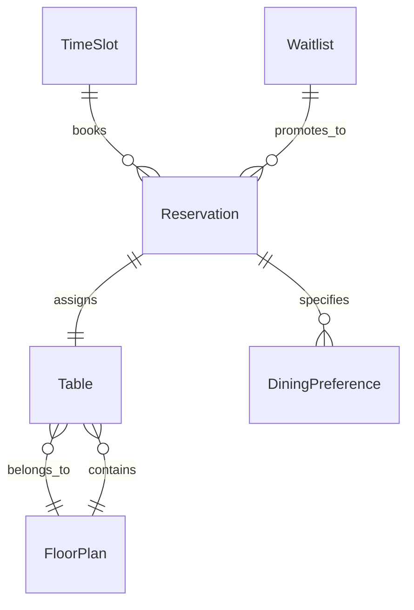
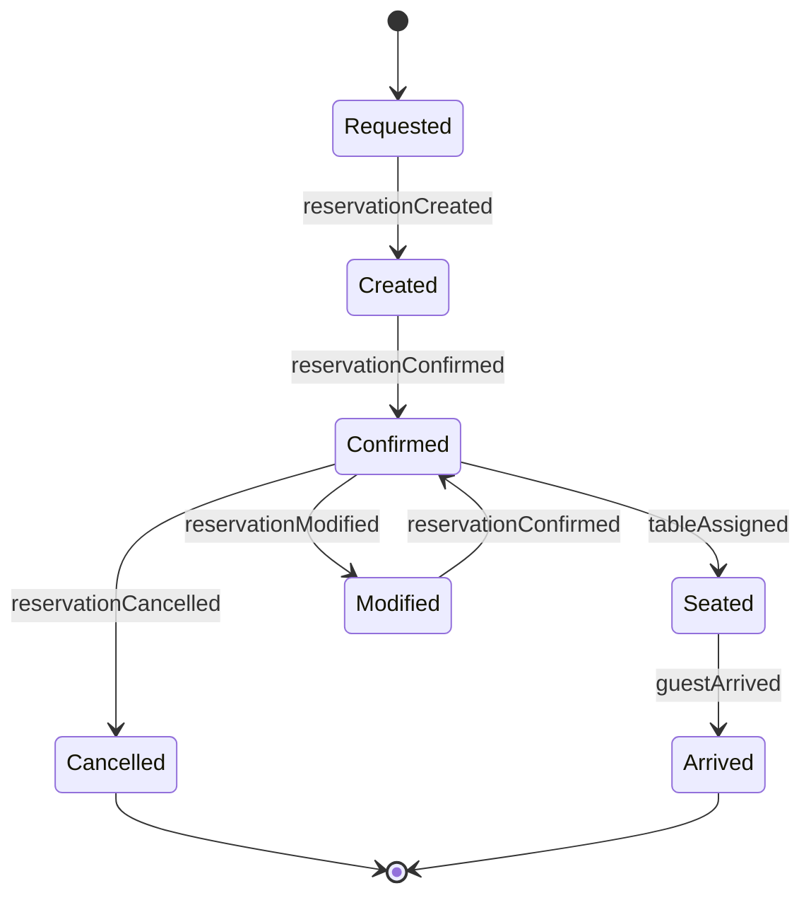
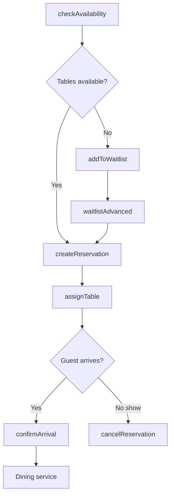
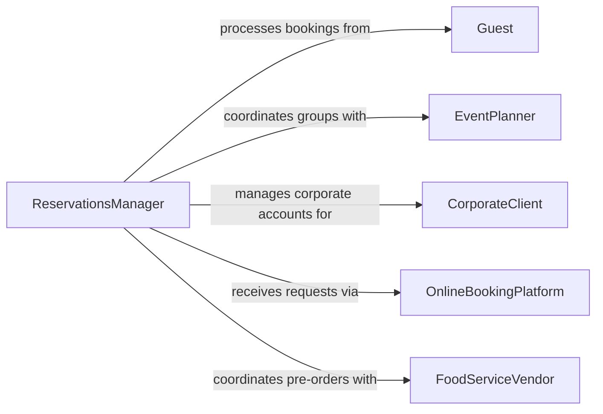

# Schedule Dining Reservations

> Business-as-Code definition for scheduling dining reservations. Models the end-to-end management of table bookings, guest seating, and dining capacity across restaurant and hospitality operations.

## Overview

Scheduling dining reservations involves managing table inventory, processing guest booking requests, optimizing seating assignments, and coordinating with kitchen and front-of-house staff to deliver a seamless dining experience. This definition exposes actions for creating and modifying reservations, events for tracking guest flow, and searches for querying availability and dining history.

## Actors

| Actor | Description |
|-------|-------------|
| Guest | Requests and holds dining reservations |
| CorporateClient | Books private dining or large-party reservations for business events |
| EventPlanner | Coordinates group dining for weddings, banquets, or conferences |
| OnlineBookingPlatform | Channels reservation requests from third-party services |
| FoodServiceVendor | Supplies specialty items for pre-ordered or prix fixe dining events |

## Roles

| Role | Description |
|------|-------------|
| ReservationsManager | Oversees the booking calendar and seating capacity |
| HostHostess | Manages walk-ins, seating assignments, and guest check-in |
| DiningRoomManager | Coordinates front-of-house operations aligned with the reservation schedule |
| KitchenCoordinator | Aligns kitchen preparation timing with expected guest arrivals |

## Entities

| Entity | Description |
|--------|-------------|
| Reservation | A confirmed dining booking with date, time, party size, and preferences |
| Table | A seating unit with defined capacity and location in the dining room |
| FloorPlan | The layout of tables and sections used for seating optimization |
| Waitlist | A queue of guests requesting tables when reservations are fully booked |
| DiningPreference | Guest specifications such as dietary restrictions, seating area, or occasion |
| TimeSlot | A discrete bookable period within the dining service window |

## Actions

| Action | Description |
|--------|-------------|
| createReservation | Book a table for a guest with date, time, and party size |
| checkAvailability | Query open time slots and table capacity for a given date |
| assignTable | Allocate a specific table to a confirmed reservation |
| modifyReservation | Change the date, time, party size, or preferences of a booking |
| cancelReservation | Remove a booking and release the table back to inventory |
| addToWaitlist | Place a guest on the waitlist when no tables are available |
| confirmArrival | Record that a guest has arrived and been seated |

## Events

| Event | Description |
|-------|-------------|
| reservationCreated | A new dining booking has been submitted |
| reservationConfirmed | A booking has been verified and the guest notified |
| tableAssigned | A specific table has been allocated to a reservation |
| reservationModified | A booking has been changed by the guest or staff |
| reservationCancelled | A booking has been removed and the table released |
| guestArrived | A guest has checked in for their reservation |
| waitlistAdvanced | A waitlisted guest has been offered an available table |

## Searches

| Search | Description |
|--------|-------------|
| findReservations | Retrieve bookings by date, guest name, party size, or status |
| getTableAvailability | List open tables by time slot, capacity, and section |
| getWaitlist | View the current queue of guests waiting for tables |
| getGuestHistory | Retrieve past reservation and dining preference data for a guest |

## Entity Relationships



## State Diagram



## Workflow



## Actor Relationships



## Usage

### Calling Actions

```typescript
import { scheduleDiningReservations } from '@headlessly/schedule-dining-reservations'

const dining = scheduleDiningReservations()

// Check availability for dinner
const slots = await dining.checkAvailability({
  date: '2026-03-21',
  partySize: 4,
  mealPeriod: 'dinner',
  preferredTime: '19:00'
})

// Create a reservation
const reservation = await dining.createReservation({
  guestName: 'Thompson',
  date: '2026-03-21',
  time: '19:00',
  partySize: 4,
  preferences: {
    seating: 'patio',
    occasion: 'anniversary',
    dietary: ['gluten-free']
  }
})

// Assign a specific table
await dining.assignTable({
  reservationId: reservation.id,
  tableId: 'patio-12',
  section: 'outdoor'
})
```

### Event-Driven Automation

```typescript
// Send confirmation to guest when reservation is created
dining.reservationCreated(async ({ reservationId, guestContact, date, time }) => {
  await notify({
    to: guestContact,
    method: 'sms',
    message: `Your reservation for ${date} at ${time} is confirmed. Ref: ${reservationId}`
  })
})

// Auto-advance waitlist when cancellations occur
dining.reservationCancelled(async ({ date, timeSlot, partySize }) => {
  const waitlist = await dining.getWaitlist({ date, minPartySize: partySize })
  if (waitlist.length > 0) {
    await dining.createReservation({
      guestName: waitlist[0].guestName,
      date,
      time: timeSlot,
      partySize: waitlist[0].partySize
    })
  }
})
```
