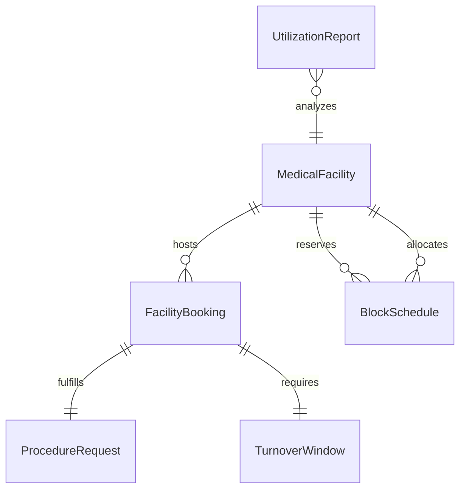
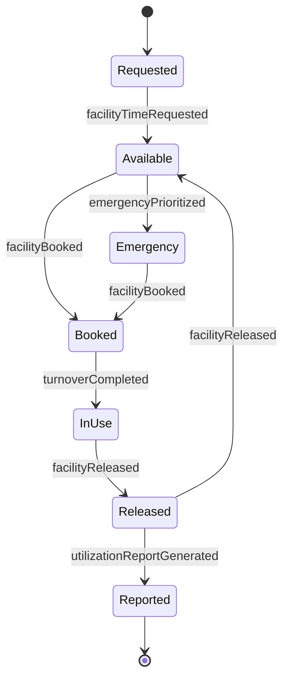
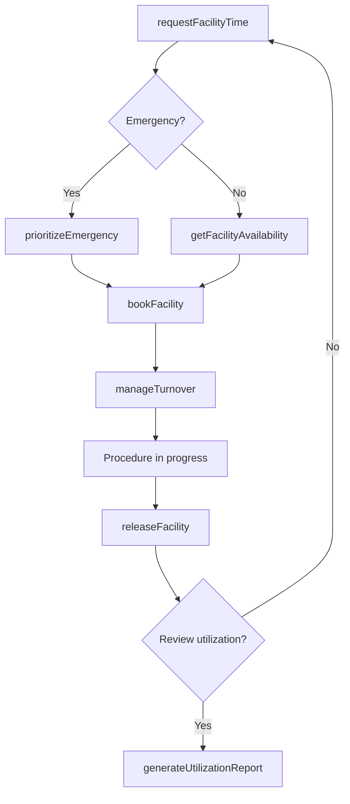
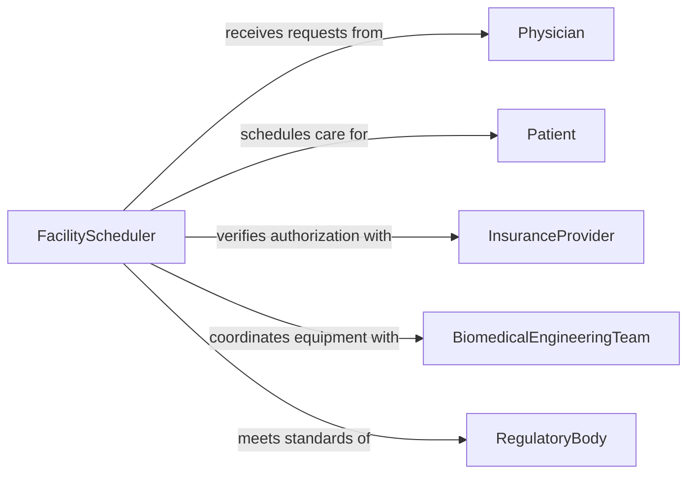

# Schedule Medical Facility Use

> Business-as-Code definition for scheduling medical facility use. Models the allocation and coordination of operating rooms, treatment suites, imaging centers, and clinical spaces across healthcare operations.

## Overview

Scheduling medical facility use involves coordinating the allocation of clinical spaces such as operating rooms, examination rooms, imaging suites, and procedure areas to meet patient care demands while maximizing utilization. This definition exposes actions for reserving medical spaces, managing turnover times, and prioritizing emergency cases, along with events for real-time schedule tracking and searches for querying facility availability and utilization metrics.

## Actors

| Actor | Description |
|-------|-------------|
| Physician | Requests facility time for surgical and clinical procedures |
| Patient | Receives care in the scheduled facility space |
| InsuranceProvider | Authorizes procedures that require facility scheduling |
| BiomedicalEngineeringTeam | Ensures medical equipment in the facility is operational and calibrated |
| RegulatoryBody | Enforces facility licensing, infection control, and capacity standards |

## Roles

| Role | Description |
|------|-------------|
| FacilityScheduler | Manages the master schedule for all medical facility spaces |
| NurseManager | Coordinates nursing staff assignments aligned with facility schedules |
| SurgicalCoordinator | Schedules operating room blocks and procedure sequences |
| UtilizationAnalyst | Monitors and optimizes facility usage rates and turnover efficiency |

## Entities

| Entity | Description |
|--------|-------------|
| MedicalFacility | A clinical space such as an operating room, procedure suite, or imaging center |
| FacilityBooking | A confirmed reservation of a medical space for a specific procedure and time |
| BlockSchedule | A recurring allocation of facility time to a department or physician |
| TurnoverWindow | The time between bookings allocated for cleaning, setup, and equipment prep |
| ProcedureRequest | A physician's request for facility time to perform a clinical procedure |
| UtilizationReport | Metrics on facility usage, idle time, and scheduling efficiency |

## Actions

| Action | Description |
|--------|-------------|
| requestFacilityTime | Submit a request for medical facility space for a procedure |
| bookFacility | Confirm a reservation of a medical space for a specific date and time |
| assignBlockSchedule | Allocate recurring facility time to a department or physician |
| manageTurnover | Define and track the transition period between consecutive bookings |
| prioritizeEmergency | Override the schedule to accommodate an urgent or emergency case |
| releaseFacility | Free an unused or cancelled booking for reallocation |
| generateUtilizationReport | Produce metrics on facility usage and scheduling efficiency |

## Events

| Event | Description |
|-------|-------------|
| facilityTimeRequested | A physician has submitted a request for facility space |
| facilityBooked | A medical space has been reserved for a procedure |
| blockScheduleAssigned | Recurring facility time has been allocated to a department |
| turnoverCompleted | The space has been cleaned and prepared for the next procedure |
| emergencyPrioritized | The schedule has been adjusted to accommodate an urgent case |
| facilityReleased | An unused or cancelled booking has been freed for reallocation |
| utilizationReportGenerated | Facility usage metrics have been produced |

## Searches

| Search | Description |
|--------|-------------|
| findBookings | Retrieve facility bookings by date, physician, procedure type, or status |
| getFacilityAvailability | List open time slots for a specific medical space or space type |
| getBlockSchedule | View recurring allocations for a department or physician |
| getUtilizationMetrics | Retrieve usage rates, idle time, and turnover statistics for a facility |

## Entity Relationships



## State Diagram



## Workflow



## Actor Relationships



## Usage

### Calling Actions

```typescript
import { scheduleMedicalFacilityUse } from '@headlessly/schedule-medical-facility-use'

const medFacility = scheduleMedicalFacilityUse()

// Request operating room time
const request = await medFacility.requestFacilityTime({
  physicianId: 'dr-chen',
  procedureType: 'arthroscopic-knee-surgery',
  patientId: 'patient-8821',
  estimatedDuration: 90,
  preferredDate: '2026-04-10',
  equipmentRequired: ['arthroscope', 'imaging-monitor']
})

// Check availability and book
const availability = await medFacility.getFacilityAvailability({
  facilityType: 'operating-room',
  date: '2026-04-10',
  duration: 120
})

await medFacility.bookFacility({
  requestId: request.id,
  facilityId: availability[0].facilityId,
  startTime: availability[0].startTime,
  turnoverMinutes: 30
})
```

### Event-Driven Automation

```typescript
// Auto-notify surgical team when facility is booked
medFacility.facilityBooked(async ({ facilityId, physicianId, startTime, procedureType }) => {
  await notify({
    to: ['surgical-team', physicianId],
    message: `OR ${facilityId} booked for ${procedureType} at ${startTime}`
  })
})

// Track utilization weekly
medFacility.facilityReleased(async ({ facilityId }) => {
  const metrics = await medFacility.getUtilizationMetrics({
    facilityId,
    period: 'current-week'
  })
  if (metrics.utilizationRate < 0.6) {
    await notify({
      to: 'utilization-analyst',
      message: `Facility ${facilityId} utilization at ${metrics.utilizationRate * 100}%. Review block allocations.`
    })
  }
})
```
