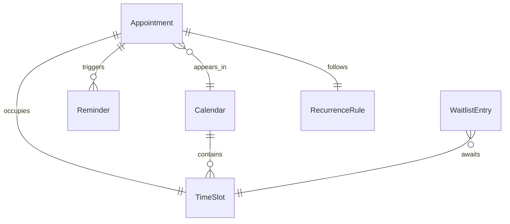
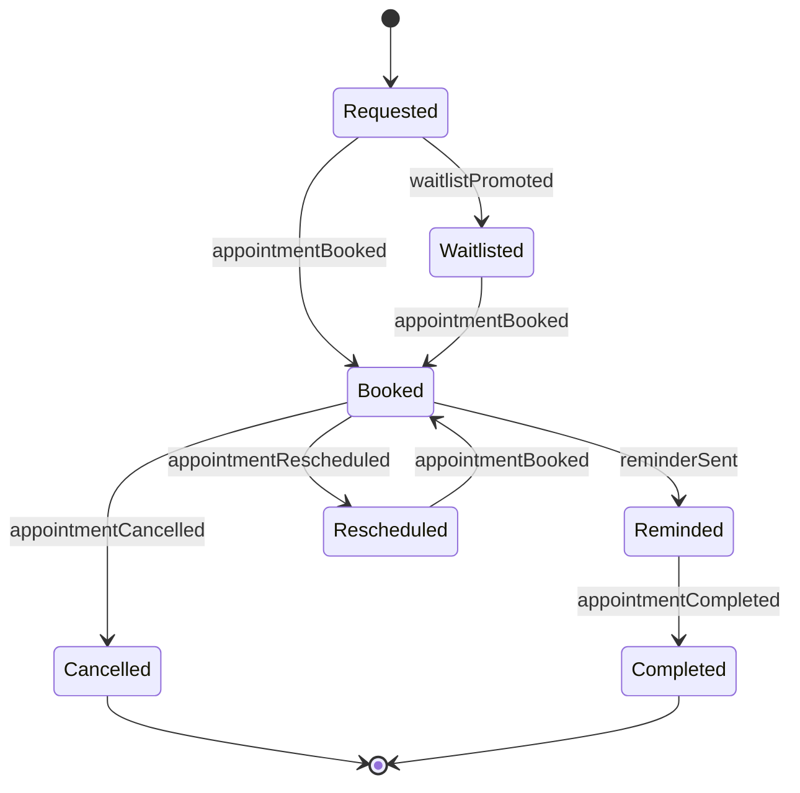
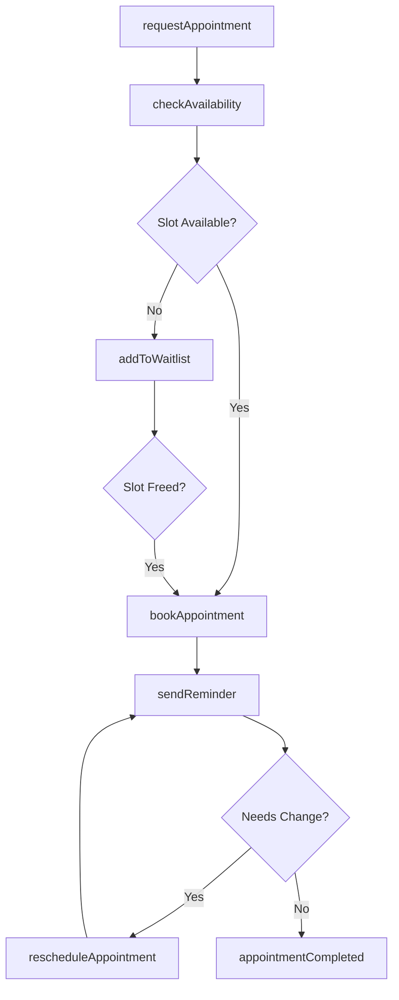
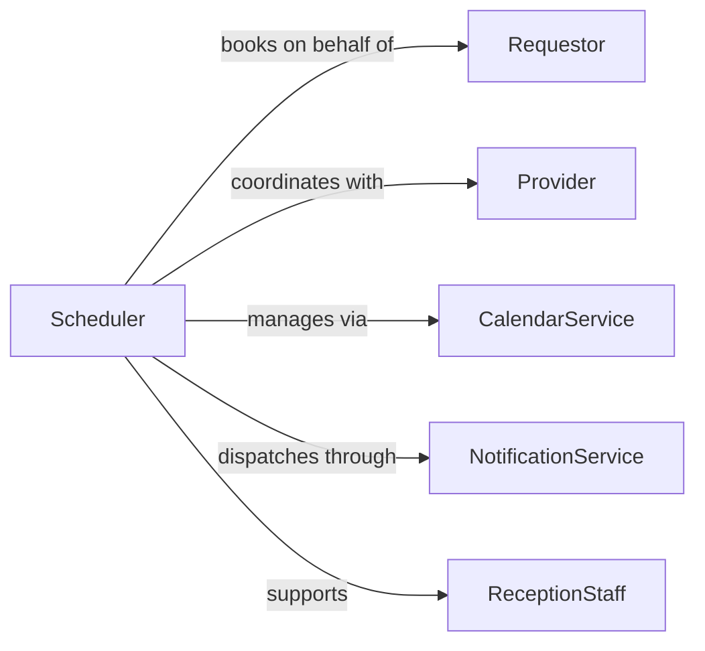

# Schedule Appointments

> Business-as-Code definition for general appointment scheduling. Models the complete appointment lifecycle from request through confirmation, rescheduling, and completion.

## Overview

Appointment scheduling involves coordinating meeting times between parties, managing calendar availability, and ensuring timely confirmations and reminders. This definition exposes actions for creating, modifying, and tracking appointments across any organizational context, events for workflow automation around booking changes, and searches for retrieving scheduling data.

## Actors

| Actor | Description |
|-------|-------------|
| Requestor | The individual or organization requesting an appointment |
| Provider | The person or team offering availability for the appointment |
| CalendarService | External platform managing calendar data and availability |
| NotificationService | System responsible for sending reminders and confirmations |
| ReceptionStaff | Front-desk or administrative personnel handling walk-in coordination |

## Roles

| Role | Description |
|------|-------------|
| Scheduler | Coordinates appointment booking and calendar management |
| AppointmentOwner | The primary party responsible for conducting the appointment |
| Administrator | Oversees scheduling policies and resolves conflicts |
| Receptionist | Handles check-in and front-desk coordination |

## Entities

| Entity | Description |
|--------|-------------|
| Appointment | A confirmed meeting between two or more parties at a specific time |
| TimeSlot | An available block of time that can be booked |
| Calendar | A schedule of existing and available appointments |
| Reminder | A notification sent before an appointment occurs |
| RecurrenceRule | A pattern defining repeated appointment schedules |
| WaitlistEntry | A queued request for a time slot that is currently unavailable |

## Actions

| Action | Description |
|--------|-------------|
| requestAppointment | Submit a request for a new appointment |
| checkAvailability | Query available time slots for a given provider or resource |
| bookAppointment | Confirm an appointment in the calendar |
| rescheduleAppointment | Move an appointment to a different date or time |
| cancelAppointment | Remove an appointment and release the time slot |
| sendReminder | Dispatch a notification ahead of the appointment |
| addToWaitlist | Place a requestor on a waitlist for a fully booked period |

## Events

| Event | Description |
|-------|-------------|
| appointmentRequested | A new appointment request has been submitted |
| appointmentBooked | An appointment has been confirmed in the calendar |
| appointmentRescheduled | An existing appointment has been moved |
| appointmentCancelled | An appointment has been removed from the calendar |
| reminderSent | A pre-appointment reminder has been dispatched |
| waitlistPromoted | A waitlisted requestor has been offered an open slot |
| appointmentCompleted | The scheduled appointment has been fulfilled |

## Searches

| Search | Description |
|--------|-------------|
| findAppointments | List appointments by provider, requestor, or date range |
| getAvailableSlots | Retrieve open time slots for a given calendar and duration |
| getWaitlist | List waitlisted entries by provider or date range |
| getUpcomingReminders | Retrieve pending reminders within a time window |

## Entity Relationships



## State Diagram



## Workflow



## Actor Relationships



## Usage

### Calling Actions

```typescript
import { scheduleAppointments } from '@headlessly/schedule-appointments'

const appointments = scheduleAppointments()

// Check available slots
const slots = await appointments.checkAvailability({
  providerId: 'provider-301',
  date: '2026-02-12',
  duration: 60
})

// Book an appointment
const appointment = await appointments.bookAppointment({
  requestorId: 'client-892',
  providerId: 'provider-301',
  timeSlot: slots[0],
  type: 'consultation',
  notes: 'Initial assessment meeting'
})

// Send a reminder 24 hours before
await appointments.sendReminder({
  appointmentId: appointment.id,
  channel: 'sms',
  advanceMinutes: 1440
})
```

### Event-Driven Automation

```typescript
// Promote waitlisted requestors when a cancellation occurs
appointments.appointmentCancelled(async ({ providerId, timeSlot }) => {
  const waitlist = await appointments.getWaitlist({ providerId })
  if (waitlist.length > 0) {
    await appointments.bookAppointment({
      requestorId: waitlist[0].requestorId,
      providerId,
      timeSlot
    })
  }
})

// Auto-send reminders when an appointment is booked
appointments.appointmentBooked(async ({ appointmentId, requestorId }) => {
  await appointments.sendReminder({
    appointmentId,
    channel: 'email',
    advanceMinutes: 1440
  })
})
```
