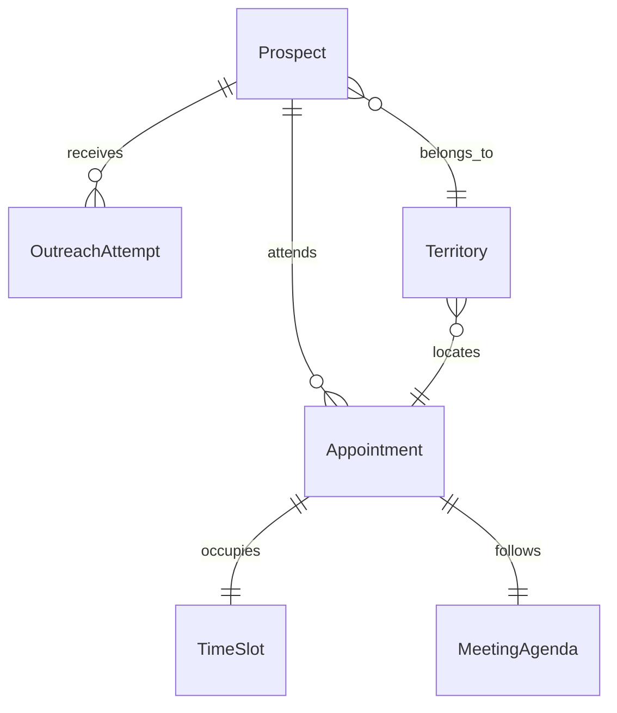
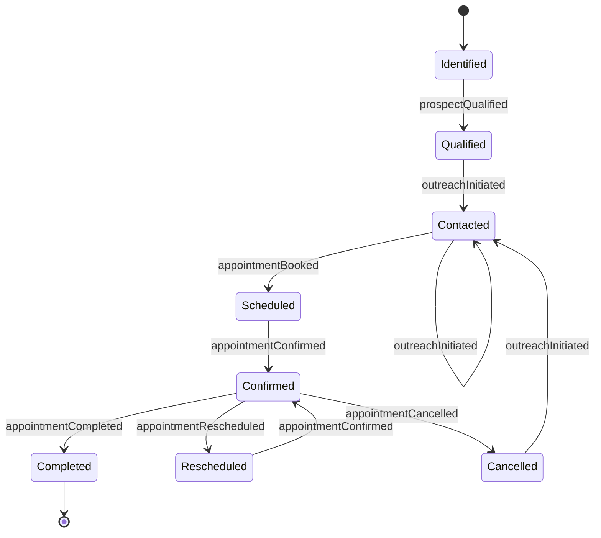
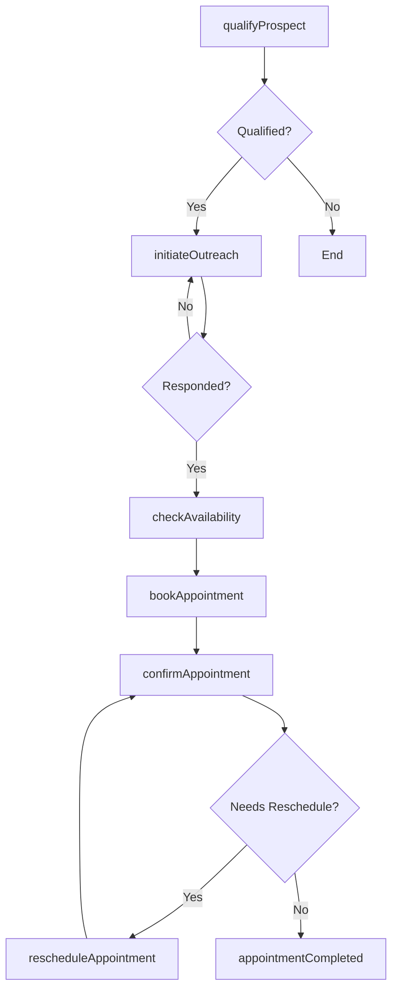
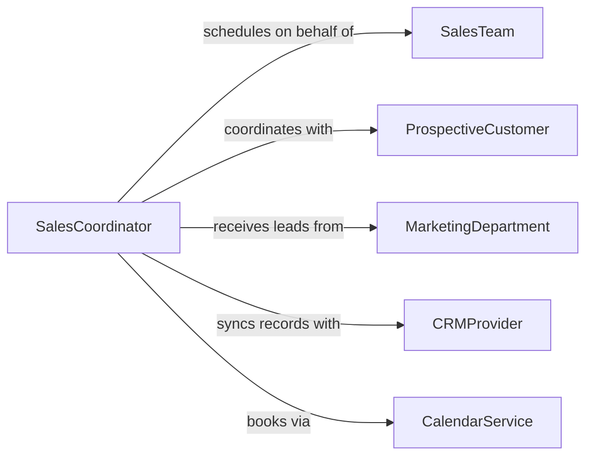

# Schedule Appointments Prospective Customers

> Business-as-Code definition for scheduling appointments with prospective customers. Models the full prospect outreach and meeting coordination lifecycle from lead qualification through calendar confirmation.

## Overview

Scheduling appointments with prospective customers involves identifying qualified leads, coordinating availability between sales representatives and prospects, and confirming meetings across channels. This definition exposes actions for each step of the prospect appointment workflow, events for pipeline automation, and searches for retrieving scheduling data across territories and time periods.

## Actors

| Actor | Description |
|-------|-------------|
| ProspectiveCustomer | Potential buyer or client being targeted for a meeting |
| SalesTeam | Group of representatives conducting outreach and attending meetings |
| MarketingDepartment | Provides qualified leads and campaign data for outreach |
| CRMProvider | External system managing contact records and pipeline stages |
| CalendarService | Third-party scheduling platform handling availability and booking |

## Roles

| Role | Description |
|------|-------------|
| SalesRepresentative | Initiates outreach and conducts prospect meetings |
| SalesCoordinator | Manages scheduling logistics and calendar availability |
| SalesManager | Oversees pipeline activity and appointment targets |
| LeadQualifier | Evaluates prospect readiness before scheduling |

## Entities

| Entity | Description |
|--------|-------------|
| Appointment | A scheduled meeting between a sales representative and a prospect |
| Prospect | A potential customer record with contact and qualification data |
| TimeSlot | An available window of time for a meeting |
| OutreachAttempt | A recorded attempt to contact a prospect for scheduling |
| Territory | A geographic or account-based region assigned to a representative |
| MeetingAgenda | The planned topics and objectives for a prospect appointment |

## Actions

| Action | Description |
|--------|-------------|
| qualifyProspect | Evaluate whether a lead is ready for an appointment |
| initiateOutreach | Begin contact with a prospect to propose a meeting |
| checkAvailability | Retrieve open time slots for both representative and prospect |
| bookAppointment | Create a confirmed appointment on both calendars |
| rescheduleAppointment | Move an existing appointment to a new date and time |
| cancelAppointment | Remove a scheduled appointment and notify all parties |
| confirmAppointment | Send a confirmation or reminder to the prospect |

## Events

| Event | Description |
|-------|-------------|
| prospectQualified | A lead has been evaluated and deemed ready for outreach |
| outreachInitiated | Contact attempt has been made with a prospect |
| appointmentBooked | A meeting has been confirmed with a prospective customer |
| appointmentRescheduled | An existing appointment has been moved to a new time |
| appointmentCancelled | A scheduled appointment has been removed |
| appointmentConfirmed | The prospect has acknowledged the upcoming meeting |
| appointmentCompleted | The scheduled meeting has taken place |

## Searches

| Search | Description |
|--------|-------------|
| findAppointments | List appointments by representative, territory, or date range |
| findProspects | Retrieve prospects by qualification status or territory |
| getAvailableSlots | Query open time slots for a given representative and date |
| getOutreachHistory | Retrieve contact attempts for a specific prospect |

## Entity Relationships



## State Diagram



## Workflow



## Actor Relationships



## Usage

### Calling Actions

```typescript
import { scheduleAppointmentsProspectiveCustomers } from '@headlessly/schedule-appointments-prospective-customers'

const scheduler = scheduleAppointmentsProspectiveCustomers()

// Qualify a prospect before scheduling
const qualification = await scheduler.qualifyProspect({
  prospectId: 'prospect-4821',
  criteria: { budget: true, authority: true, need: true, timeline: 'Q1' }
})

// Check availability and book the appointment
const slots = await scheduler.checkAvailability({
  representativeId: 'rep-112',
  dateRange: { start: '2026-02-10', end: '2026-02-14' },
  duration: 30
})

const appointment = await scheduler.bookAppointment({
  prospectId: 'prospect-4821',
  representativeId: 'rep-112',
  timeSlot: slots[0],
  agenda: { topics: ['Product demo', 'Pricing discussion'] }
})
```

### Event-Driven Automation

```typescript
// Send reminder when appointment is confirmed
scheduler.appointmentBooked(async ({ appointmentId, prospectId, timeSlot }) => {
  await sendReminder({
    to: prospectId,
    message: `Your meeting is confirmed for ${timeSlot.start}`,
    channel: 'email'
  })
})

// Re-engage prospects who cancel
scheduler.appointmentCancelled(async ({ prospectId, reason }) => {
  await scheduler.initiateOutreach({
    prospectId,
    channel: 'email',
    template: 'reschedule-followup',
    delay: '3d'
  })
})
```
