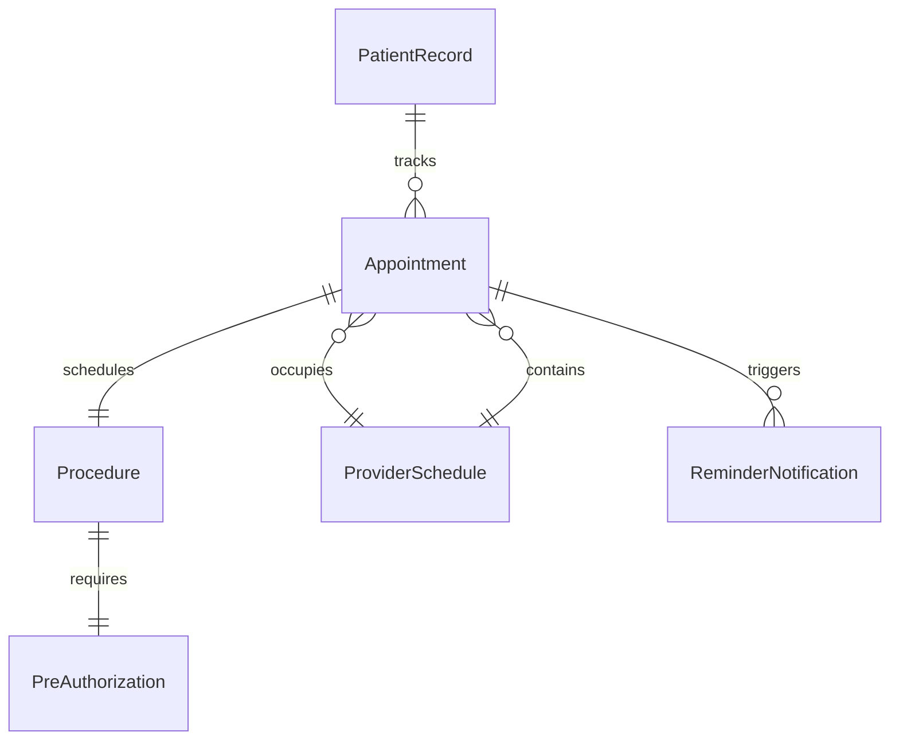
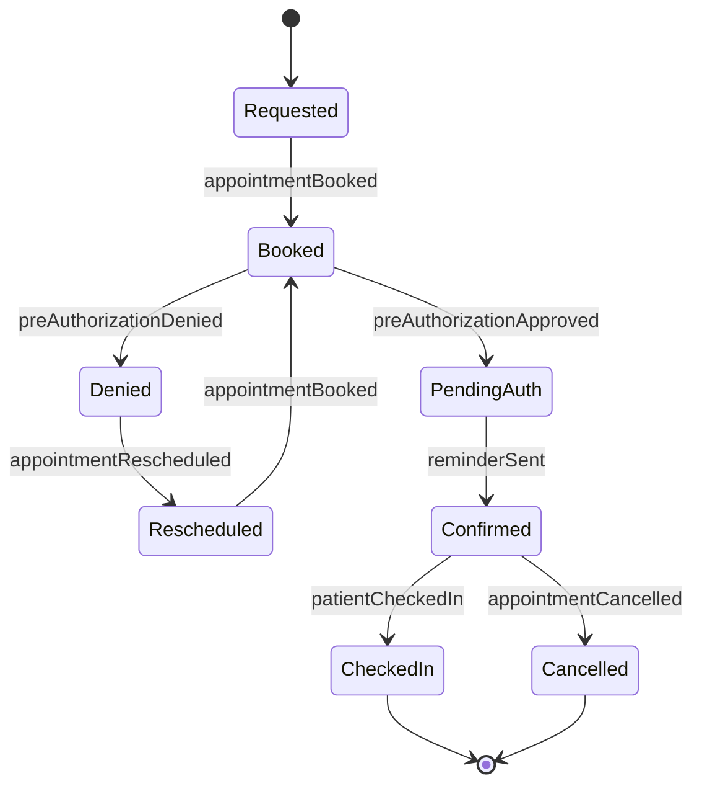
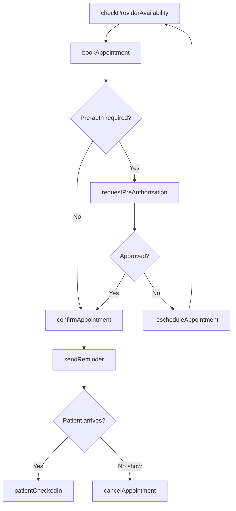
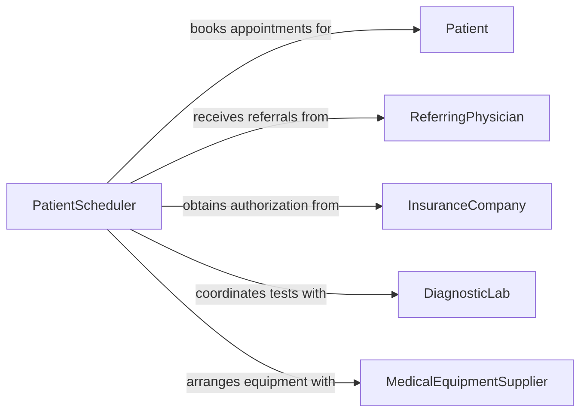

# Schedule Patient Procedures Appointments

> Business-as-Code definition for scheduling patient procedures and appointments. Models the coordination of clinical encounters including consultations, diagnostic tests, surgical procedures, and follow-up visits across healthcare providers and facilities.

## Overview

Scheduling patient procedures and appointments involves matching patient needs with provider availability, facility capacity, and insurance requirements to coordinate timely clinical care. This definition exposes actions for booking appointments, managing pre-authorization workflows, and handling cancellations and reschedules, along with events for patient notification and searches for querying provider schedules and appointment histories.

## Actors

| Actor | Description |
|-------|-------------|
| Patient | Requests and attends scheduled procedures and appointments |
| ReferringPhysician | Orders procedures and provides clinical referrals |
| InsuranceCompany | Authorizes coverage for scheduled procedures |
| DiagnosticLab | Provides pre-procedure testing and results |
| MedicalEquipmentSupplier | Delivers specialized equipment needed for scheduled procedures |

## Roles

| Role | Description |
|------|-------------|
| PatientScheduler | Coordinates appointment bookings across providers and facilities |
| ClinicalCoordinator | Manages pre-procedure requirements and clinical preparation |
| ProviderStaff | Delivers clinical care during the scheduled appointment |
| AuthorizationSpecialist | Obtains insurance pre-authorization for procedures |
| FrontDeskReceptionist | Handles patient check-in and day-of scheduling adjustments |

## Entities

| Entity | Description |
|--------|-------------|
| Appointment | A scheduled clinical encounter between a patient and provider |
| Procedure | A medical intervention requiring specific preparation and authorization |
| ProviderSchedule | A physician or clinician's calendar of available appointment slots |
| PreAuthorization | Insurance approval required before a procedure can be scheduled |
| PatientRecord | The clinical history and preferences relevant to scheduling |
| ReminderNotification | An automated message sent to the patient before the appointment |

## Actions

| Action | Description |
|--------|-------------|
| bookAppointment | Schedule a patient for a consultation, test, or procedure |
| requestPreAuthorization | Submit an insurance authorization request for a procedure |
| checkProviderAvailability | Query a provider's open appointment slots |
| sendReminder | Dispatch an automated notification to the patient before their appointment |
| rescheduleAppointment | Move a patient's appointment to a different date, time, or provider |
| cancelAppointment | Remove a scheduled appointment and update availability |
| confirmAppointment | Verify the patient's intent to attend and finalize preparation |

## Events

| Event | Description |
|-------|-------------|
| appointmentBooked | A new patient appointment has been scheduled |
| preAuthorizationApproved | Insurance has authorized coverage for a procedure |
| preAuthorizationDenied | Insurance has declined authorization for a procedure |
| reminderSent | An appointment reminder has been dispatched to the patient |
| appointmentRescheduled | A patient's appointment has been moved to a new slot |
| appointmentCancelled | A scheduled appointment has been removed |
| patientCheckedIn | The patient has arrived and been registered for their appointment |

## Searches

| Search | Description |
|--------|-------------|
| findAppointments | Retrieve appointments by patient, provider, date range, or status |
| getProviderAvailability | List open slots for a specific provider or specialty |
| getPatientSchedule | View all upcoming appointments for a specific patient |
| getPendingAuthorizations | List procedures awaiting insurance pre-authorization |

## Entity Relationships



## State Diagram



## Workflow



## Actor Relationships



## Usage

### Calling Actions

```typescript
import { schedulePatientProceduresAppointments } from '@headlessly/schedule-patient-procedures-appointments'

const scheduling = schedulePatientProceduresAppointments()

// Check provider availability
const slots = await scheduling.checkProviderAvailability({
  providerId: 'dr-patel',
  specialty: 'orthopedics',
  dateRange: { start: '2026-04-01', end: '2026-04-15' },
  duration: 30
})

// Book a consultation appointment
const appointment = await scheduling.bookAppointment({
  patientId: 'patient-5567',
  providerId: 'dr-patel',
  type: 'consultation',
  date: '2026-04-03',
  time: '14:00',
  reason: 'Knee pain evaluation'
})

// Request pre-authorization for a follow-up procedure
await scheduling.requestPreAuthorization({
  appointmentId: appointment.id,
  procedureCode: 'CPT-29881',
  insurerId: 'ins-bluecross',
  policyNumber: 'BC-449821'
})
```

### Event-Driven Automation

```typescript
// Send reminders 48 hours before appointments
scheduling.appointmentBooked(async ({ appointmentId, date, patientContact }) => {
  const reminderDate = subtractHours(date, 48)
  schedule.at(reminderDate, async () => {
    await scheduling.sendReminder({
      appointmentId,
      method: 'sms',
      contact: patientContact
    })
  })
})

// Notify coordinator when pre-auth is denied
scheduling.preAuthorizationDenied(async ({ appointmentId, reason, procedureCode }) => {
  await notify({
    to: 'clinical-coordinator',
    message: `Pre-auth denied for appointment ${appointmentId} (${procedureCode}): ${reason}. Reschedule or appeal required.`
  })
})
```
