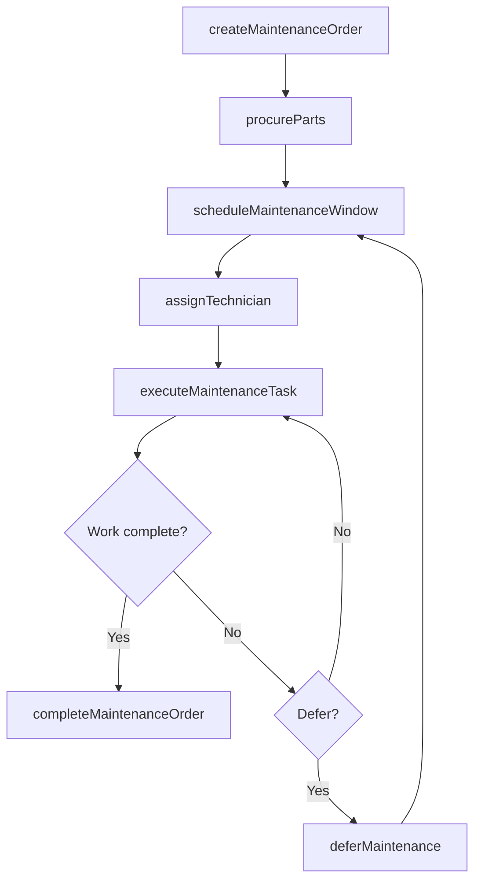
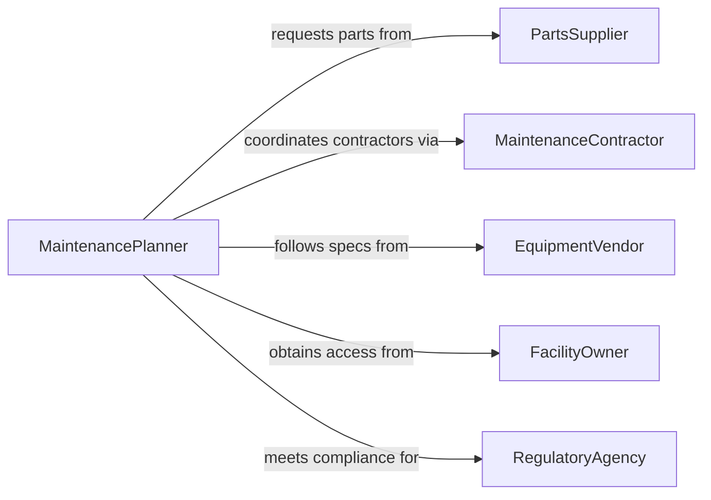

# Arrange Maintenance Activities

> Business-as-Code definition for arranging maintenance activities. Models the coordination of preventive and corrective maintenance tasks across personnel, equipment, and facilities.

## Overview

Arranging maintenance activities involves planning, scheduling, and coordinating maintenance work to minimize equipment downtime and ensure operational continuity. This definition exposes actions for creating maintenance plans, assigning technicians, and tracking completion, along with events for automated notifications and searches for querying maintenance schedules and backlogs.

## Actors

| Actor | Description |
|-------|-------------|
| EquipmentVendor | Provides maintenance specifications, service bulletins, and warranty terms |
| MaintenanceContractor | Performs specialized or overflow maintenance work under contract |
| PartsSupplier | Delivers replacement parts and consumables for scheduled maintenance |
| FacilityOwner | Authorizes maintenance windows and facility access |
| RegulatoryAgency | Mandates inspection intervals and maintenance compliance standards |

## Roles

| Role | Description |
|------|-------------|
| MaintenancePlanner | Develops and coordinates the maintenance schedule |
| MaintenanceTechnician | Executes assigned maintenance tasks on equipment and facilities |
| OperationsManager | Approves maintenance windows that affect production schedules |
| AssetManager | Tracks equipment lifecycle and determines maintenance priorities |

## Entities

| Entity | Description |
|--------|-------------|
| MaintenanceOrder | A formal request to perform specific maintenance on an asset |
| MaintenanceSchedule | The calendar of planned maintenance activities across assets |
| Asset | A piece of equipment or facility component requiring maintenance |
| MaintenanceTask | A specific maintenance procedure to be performed |
| TechnicianAssignment | The allocation of a qualified technician to a maintenance order |
| CompletionReport | Documentation of work performed, parts used, and asset condition |

## Actions

| Action | Description |
|--------|-------------|
| createMaintenanceOrder | Initiate a new maintenance request for an asset |
| scheduleMaintenanceWindow | Assign a date and time window for maintenance execution |
| assignTechnician | Allocate a qualified technician to a maintenance order |
| procureParts | Request or reserve parts needed for the maintenance task |
| executeMaintenanceTask | Record the start and progress of a maintenance activity |
| completeMaintenanceOrder | Finalize the work order and submit the completion report |
| deferMaintenance | Postpone a maintenance activity with documented justification |

## Events

| Event | Description |
|-------|-------------|
| maintenanceOrderCreated | A new maintenance request has been initiated |
| maintenanceWindowScheduled | A time window has been assigned for maintenance work |
| technicianAssigned | A technician has been allocated to a maintenance order |
| partsProcured | Required parts have been obtained or reserved |
| maintenanceTaskStarted | A maintenance activity has begun execution |
| maintenanceOrderCompleted | A maintenance work order has been finalized |
| maintenanceDeferred | A maintenance activity has been postponed |

## Searches

| Search | Description |
|--------|-------------|
| findMaintenanceOrders | Retrieve orders by asset, status, priority, or date range |
| getSchedule | View the maintenance calendar for a facility or equipment group |
| getTechnicianAvailability | Check technician schedules and skill qualifications |
| getOverdueItems | List maintenance tasks past their scheduled completion date |

## Workflow



## Actor Relationships



## Usage

### Calling Actions

```typescript
import { arrangeMaintenanceActivities } from '@headlessly/arrange-maintenance-activities'

const maintenance = arrangeMaintenanceActivities()

// Create a preventive maintenance order
const order = await maintenance.createMaintenanceOrder({
  assetId: 'HVAC-UNIT-017',
  type: 'preventive',
  description: 'Quarterly filter replacement and coil cleaning',
  priority: 'medium',
  dueDate: '2026-04-15'
})

// Schedule and assign
await maintenance.scheduleMaintenanceWindow({
  orderId: order.id,
  startTime: '2026-04-15T06:00:00',
  duration: 120
})

await maintenance.assignTechnician({
  orderId: order.id,
  technicianId: 'tech-ramirez',
  skillRequired: 'hvac-certified'
})
```

### Event-Driven Automation

```typescript
// Auto-notify when maintenance is overdue
maintenance.maintenanceDeferred(async ({ orderId, reason, newDueDate }) => {
  await notify({
    to: 'operations-manager',
    message: `Maintenance order ${orderId} deferred: ${reason}. New target: ${newDueDate}`
  })
})

// Trigger inventory reorder when parts are consumed
maintenance.maintenanceOrderCompleted(async ({ orderId, partsUsed }) => {
  for (const part of partsUsed) {
    const stock = await inventory.getStockLevel({ partId: part.id })
    if (stock.quantity < stock.reorderPoint) {
      await procurement.createPurchaseOrder({ partId: part.id, quantity: stock.reorderQuantity })
    }
  }
})
```
