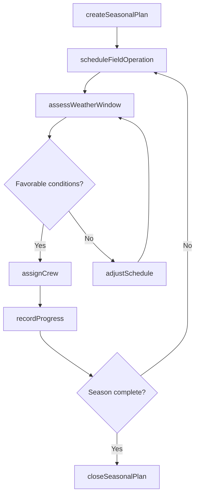
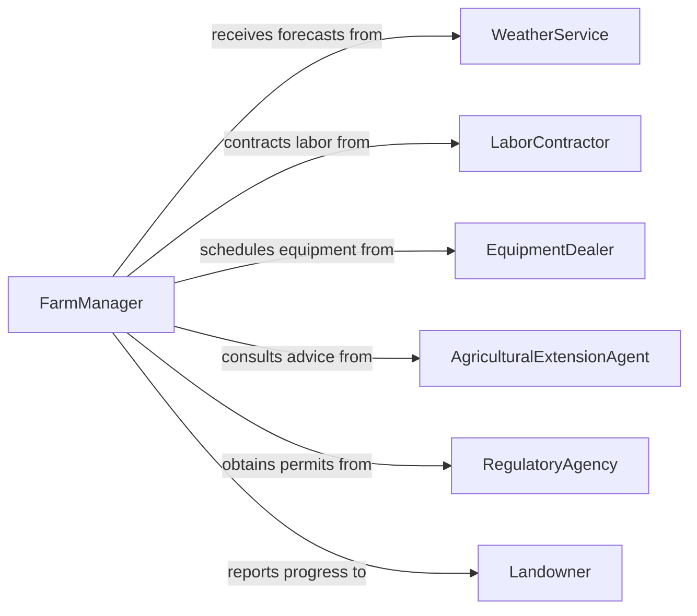

# Schedule Agricultural Forestry Work

> Business-as-Code definition for scheduling agricultural and forestry work. Models the seasonal planning and day-to-day coordination of planting, harvesting, timber operations, and land management activities.

## Overview

Scheduling agricultural and forestry work involves coordinating seasonal cycles, weather conditions, labor crews, and equipment to execute planting, cultivation, harvesting, and timber management operations. This definition exposes actions for building seasonal work plans, assigning crews to field operations, and adjusting schedules based on environmental conditions, along with events for tracking progress and searches for querying operational calendars.

## Actors

| Actor | Description |
|-------|-------------|
| Landowner | Authorizes land use and sets production objectives |
| WeatherService | Provides forecasts and alerts that affect scheduling decisions |
| EquipmentDealer | Supplies and services agricultural and forestry machinery |
| LaborContractor | Provides seasonal workers for planting, harvesting, and timber operations |
| AgriculturalExtensionAgent | Advises on optimal timing for planting and treatment activities |
| RegulatoryAgency | Enforces environmental compliance, burn permits, and harvest limits |

## Roles

| Role | Description |
|------|-------------|
| FarmManager | Plans and oversees all agricultural or forestry operations |
| CrewSupervisor | Directs field crews and reports on daily work progress |
| AgronomistForester | Provides technical guidance on crop or timber management timing |
| EquipmentOperator | Operates machinery according to the work schedule |

## Entities

| Entity | Description |
|--------|-------------|
| SeasonalPlan | The annual or seasonal calendar of agricultural or forestry operations |
| FieldOperation | A specific activity such as planting, spraying, or harvesting for a parcel |
| Parcel | A defined area of land where work is performed |
| CrewAssignment | The allocation of a labor crew to a field operation |
| WeatherWindow | A favorable period for conducting weather-sensitive operations |
| HarvestSchedule | The timetable for collecting crops or timber from designated parcels |

## Actions

| Action | Description |
|--------|-------------|
| createSeasonalPlan | Define the annual cycle of agricultural or forestry operations |
| scheduleFieldOperation | Assign a date and crew to a specific field activity |
| assignCrew | Allocate labor resources to a scheduled operation |
| assessWeatherWindow | Evaluate weather conditions to determine operation feasibility |
| adjustSchedule | Modify planned dates based on weather, soil, or resource changes |
| recordProgress | Log completion status and yield data for a field operation |
| closeSeasonalPlan | Finalize the season and archive results for future planning |

## Events

| Event | Description |
|-------|-------------|
| seasonalPlanCreated | A new seasonal operations calendar has been established |
| fieldOperationScheduled | A field activity has been assigned a date and resources |
| crewAssigned | A labor crew has been allocated to an operation |
| weatherWindowAssessed | Weather conditions have been evaluated for an operation |
| scheduleAdjusted | Planned dates have been modified due to changing conditions |
| progressRecorded | Completion status and yield data have been logged |
| seasonalPlanClosed | The season has been finalized and results archived |

## Searches

| Search | Description |
|--------|-------------|
| findFieldOperations | Retrieve operations by parcel, crop type, status, or date range |
| getCrewAvailability | Check labor crew schedules and capacity for a given period |
| getWeatherForecast | Retrieve weather data relevant to planned operations |
| getSeasonalProgress | View completion rates and yield summaries for the current season |

## Workflow



## Actor Relationships



## Usage

### Calling Actions

```typescript
import { scheduleAgriculturalForestryWork } from '@headlessly/schedule-agricultural-forestry-work'

const farmOps = scheduleAgriculturalForestryWork()

// Create a seasonal plan
const plan = await farmOps.createSeasonalPlan({
  year: 2026,
  type: 'spring-planting',
  parcels: ['field-north-40', 'field-south-80'],
  crops: ['corn', 'soybeans']
})

// Schedule a planting operation
const operation = await farmOps.scheduleFieldOperation({
  planId: plan.id,
  parcelId: 'field-north-40',
  activity: 'planting',
  targetDate: '2026-04-15',
  crop: 'corn'
})

// Check weather before committing crew
const weather = await farmOps.assessWeatherWindow({
  operationId: operation.id,
  date: '2026-04-15',
  requirements: { minTemp: 50, maxWindSpeed: 15, precipitation: 'none' }
})
```

### Event-Driven Automation

```typescript
// Automatically adjust schedule when weather is unfavorable
farmOps.weatherWindowAssessed(async ({ operationId, favorable, nextWindow }) => {
  if (!favorable) {
    await farmOps.adjustSchedule({
      operationId,
      newDate: nextWindow.date,
      reason: 'Unfavorable weather conditions'
    })
  }
})

// Notify landowner when seasonal results are finalized
farmOps.seasonalPlanClosed(async ({ planId, totalYield, acresCompleted }) => {
  await notify({
    to: 'landowner',
    message: `Season complete: ${acresCompleted} acres harvested with total yield of ${totalYield} bushels`
  })
})
```
