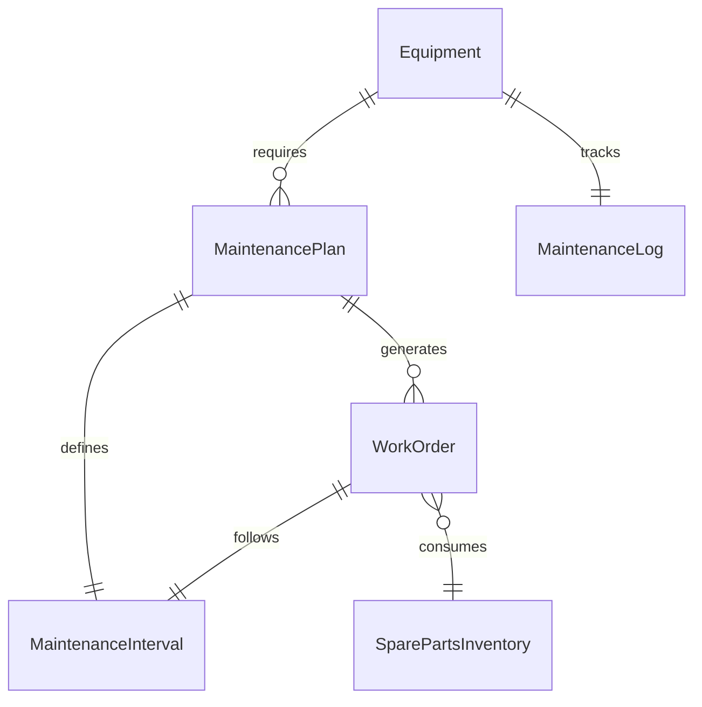
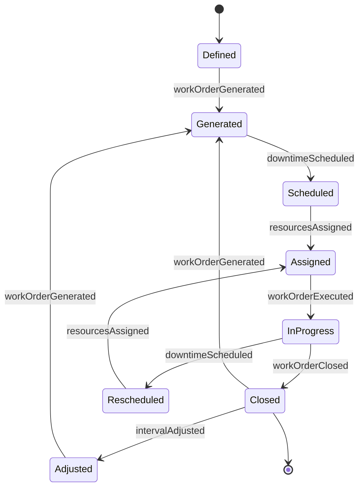
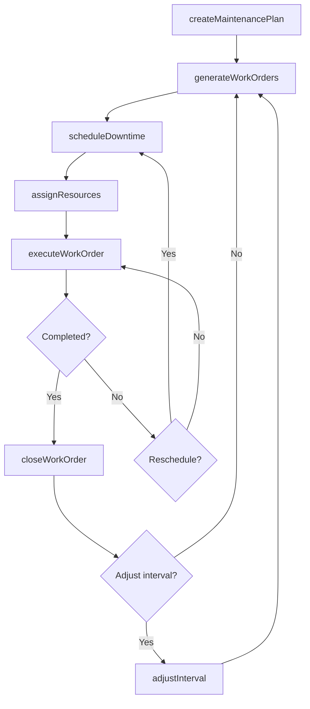
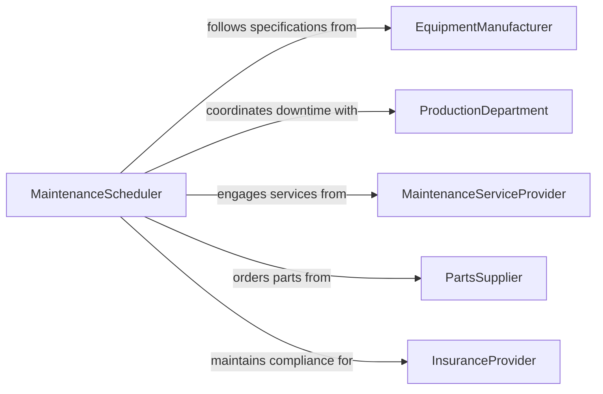

# Schedule Equipment Maintenance

> Business-as-Code definition for scheduling equipment maintenance. Models the planning and coordination of preventive, predictive, and corrective maintenance cycles to maximize equipment uptime and lifespan.

## Overview

Scheduling equipment maintenance involves establishing maintenance intervals, coordinating downtime windows with production schedules, and dispatching qualified technicians to perform inspections, repairs, and overhauls. This definition exposes actions for creating maintenance calendars, managing work order queues, and tracking asset health, along with events for automated alerting and searches for querying maintenance histories and upcoming tasks.

## Actors

| Actor | Description |
|-------|-------------|
| EquipmentManufacturer | Specifies maintenance intervals, procedures, and warranty conditions |
| MaintenanceServiceProvider | Performs outsourced or specialized maintenance under contract |
| PartsSupplier | Provides spare parts, lubricants, and consumables |
| ProductionDepartment | Coordinates downtime windows with manufacturing schedules |
| InsuranceProvider | Requires maintenance compliance for equipment coverage |

## Roles

| Role | Description |
|------|-------------|
| MaintenanceScheduler | Plans and sequences maintenance activities across the asset fleet |
| MaintenanceTechnician | Performs inspections, repairs, and preventive maintenance tasks |
| ReliabilityEngineer | Analyzes equipment data to optimize maintenance intervals |
| PlantManager | Approves maintenance windows and resource allocation |

## Entities

| Entity | Description |
|--------|-------------|
| MaintenancePlan | A recurring schedule of maintenance activities for an asset or group |
| WorkOrder | A specific maintenance task with assigned resources and due date |
| Equipment | A machine, vehicle, or system requiring scheduled maintenance |
| MaintenanceInterval | The time-based or usage-based frequency for a maintenance activity |
| SparePartsInventory | The stock of replacement components available for maintenance |
| MaintenanceLog | The historical record of all maintenance performed on an asset |

## Actions

| Action | Description |
|--------|-------------|
| createMaintenancePlan | Define a recurring maintenance schedule for an equipment asset |
| generateWorkOrders | Produce work orders from the maintenance plan based on intervals |
| scheduleDowntime | Reserve a production downtime window for maintenance execution |
| assignResources | Allocate technicians and parts to a scheduled work order |
| executeWorkOrder | Begin and track the progress of a maintenance task |
| closeWorkOrder | Finalize a maintenance task and update the asset maintenance log |
| adjustInterval | Modify maintenance frequency based on condition monitoring data |

## Events

| Event | Description |
|-------|-------------|
| maintenancePlanCreated | A new maintenance schedule has been defined for an asset |
| workOrderGenerated | A work order has been produced from the maintenance plan |
| downtimeScheduled | A production downtime window has been reserved |
| resourcesAssigned | Technicians and parts have been allocated to a work order |
| workOrderExecuted | A maintenance task has been completed |
| workOrderClosed | A maintenance work order has been finalized and logged |
| intervalAdjusted | A maintenance frequency has been modified |

## Searches

| Search | Description |
|--------|-------------|
| findWorkOrders | Retrieve work orders by equipment, status, priority, or date range |
| getMaintenanceCalendar | View scheduled maintenance across all assets for a given period |
| getEquipmentHealth | Retrieve condition monitoring data and maintenance history for an asset |
| getUpcomingMaintenance | List work orders due within a specified time horizon |

## Entity Relationships



## State Diagram



## Workflow



## Actor Relationships



## Usage

### Calling Actions

```typescript
import { scheduleEquipmentMaintenance } from '@headlessly/schedule-equipment-maintenance'

const maintenance = scheduleEquipmentMaintenance()

// Create a preventive maintenance plan
const plan = await maintenance.createMaintenancePlan({
  equipmentId: 'PRESS-LINE-03',
  name: 'Quarterly PM - Hydraulic Press',
  interval: { type: 'calendar', frequency: 'quarterly' },
  tasks: ['hydraulic-fluid-check', 'seal-inspection', 'pressure-calibration']
})

// Generate upcoming work orders
const workOrders = await maintenance.generateWorkOrders({
  planId: plan.id,
  horizon: '6-months'
})

// Schedule downtime and assign resources
await maintenance.scheduleDowntime({
  workOrderId: workOrders[0].id,
  window: { start: '2026-04-01T06:00:00', end: '2026-04-01T14:00:00' }
})

await maintenance.assignResources({
  workOrderId: workOrders[0].id,
  technicianId: 'tech-johnson',
  parts: ['HYD-SEAL-42', 'FILTER-HP-100']
})
```

### Event-Driven Automation

```typescript
// Auto-generate next cycle of work orders when current ones close
maintenance.workOrderClosed(async ({ workOrderId, equipmentId, planId }) => {
  const upcoming = await maintenance.getUpcomingMaintenance({ equipmentId, horizon: '30-days' })
  if (upcoming.length === 0) {
    await maintenance.generateWorkOrders({ planId, horizon: '3-months' })
  }
})

// Alert when maintenance is overdue
maintenance.workOrderGenerated(async ({ workOrderId, dueDate }) => {
  schedule.at(dueDate, async () => {
    const wo = await maintenance.findWorkOrders({ workOrderId })
    if (wo.status === 'pending') {
      await notify({
        to: 'plant-manager',
        message: `Work order ${workOrderId} is overdue. Immediate scheduling required.`
      })
    }
  })
})
```
