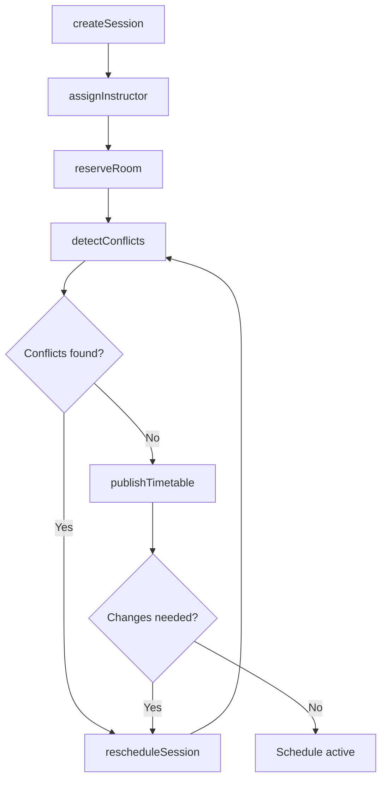
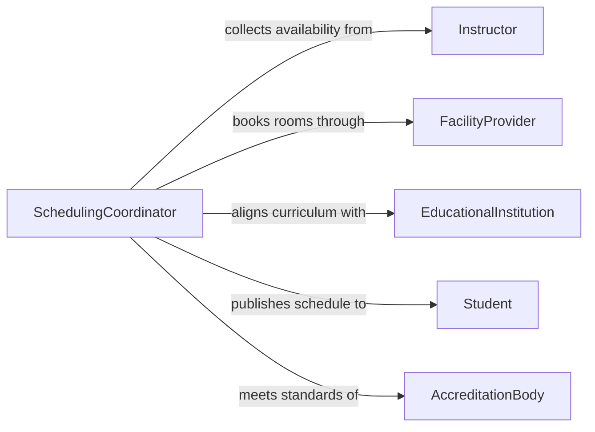

# Schedule Instructional Activities

> Business-as-Code definition for scheduling instructional activities. Models the planning and coordination of classes, training sessions, workshops, and educational programs across facilities and instructors.

## Overview

Scheduling instructional activities involves coordinating instructors, classrooms, curricula, and learners to produce conflict-free timetables for educational and training programs. This definition exposes actions for creating and adjusting instructional schedules, events for tracking changes and conflicts, and searches for querying availability and session details.

## Actors

| Actor | Description |
|-------|-------------|
| EducationalInstitution | Provides curriculum requirements and accreditation constraints |
| Instructor | Delivers instructional sessions and specifies availability |
| Student | Enrolls in scheduled sessions and reports conflicts |
| FacilityProvider | Manages classroom and lab availability |
| AccreditationBody | Mandates minimum instructional hours and scheduling standards |

## Roles

| Role | Description |
|------|-------------|
| SchedulingCoordinator | Builds and maintains the instructional timetable |
| AcademicAdvisor | Ensures schedules align with learner program requirements |
| DepartmentChair | Approves course offerings and instructor assignments |
| TrainingManager | Oversees professional development and corporate training schedules |

## Entities

| Entity | Description |
|--------|-------------|
| Session | A single scheduled instructional period with time, location, and instructor |
| Course | A defined curriculum unit that requires one or more scheduled sessions |
| Timetable | The complete schedule of instructional sessions for a term or period |
| Room | A physical or virtual space allocated for instruction |
| Enrollment | A learner's registration in a specific session or course |
| ConflictRecord | A logged scheduling overlap or resource contention |

## Actions

| Action | Description |
|--------|-------------|
| createSession | Define a new instructional session with time, location, and instructor |
| assignInstructor | Allocate an available instructor to a session or course |
| reserveRoom | Book a classroom or lab for an instructional session |
| publishTimetable | Release the finalized schedule to instructors and learners |
| rescheduleSession | Move a session to a different time slot or location |
| cancelSession | Remove a session from the timetable and notify participants |
| detectConflicts | Check for overlapping sessions, double-booked rooms, or instructor clashes |

## Events

| Event | Description |
|-------|-------------|
| sessionCreated | A new instructional session has been added to the timetable |
| instructorAssigned | An instructor has been allocated to a session |
| roomReserved | A room has been booked for an instructional session |
| timetablePublished | The schedule has been released to all participants |
| sessionRescheduled | A session has been moved to a new time or location |
| sessionCancelled | A session has been removed from the timetable |
| conflictDetected | A scheduling overlap or resource contention has been identified |

## Searches

| Search | Description |
|--------|-------------|
| findSessions | List sessions by course, instructor, date range, or room |
| getInstructorAvailability | Retrieve open time slots for a specific instructor |
| getRoomAvailability | Retrieve available rooms for a given date and time window |
| findConflicts | List all scheduling conflicts for a timetable or instructor |

## Workflow



## Actor Relationships



## Usage

### Calling Actions

```typescript
import { scheduleInstructionalActivities } from '@headlessly/schedule-instructional-activities'

const scheduler = scheduleInstructionalActivities()

// Create a new lecture session
const session = await scheduler.createSession({
  courseId: 'CS-301',
  title: 'Data Structures - Lecture 12',
  dateTime: '2026-03-15T10:00:00',
  duration: 90,
  capacity: 40
})

// Assign instructor and reserve room
await scheduler.assignInstructor({
  sessionId: session.id,
  instructorId: 'prof-martinez'
})

await scheduler.reserveRoom({
  sessionId: session.id,
  roomId: 'HALL-204',
  setup: 'lecture'
})

// Check for conflicts before publishing
const conflicts = await scheduler.detectConflicts({ timetableId: 'fall-2026' })
```

### Event-Driven Automation

```typescript
// Notify students when sessions are rescheduled
scheduler.sessionRescheduled(async ({ sessionId, oldTime, newTime, roomId }) => {
  const enrollments = await scheduler.findSessions({ sessionId })
  await notify({
    to: enrollments.studentIds,
    message: `Session moved from ${oldTime} to ${newTime} in room ${roomId}`
  })
})

// Auto-resolve conflicts by suggesting alternative slots
scheduler.conflictDetected(async ({ sessionId, conflictType }) => {
  const alternatives = await scheduler.getRoomAvailability({
    date: conflict.date,
    duration: conflict.duration
  })
  await scheduler.rescheduleSession({
    sessionId,
    newSlot: alternatives[0]
  })
})
```
