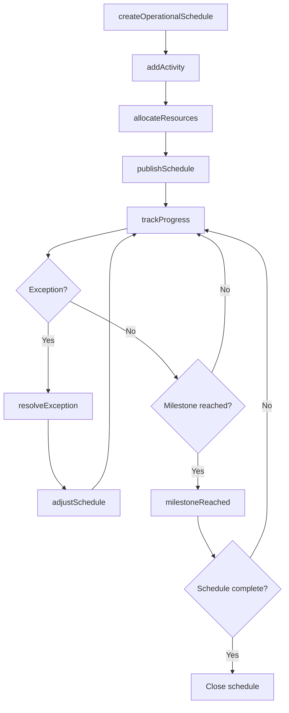
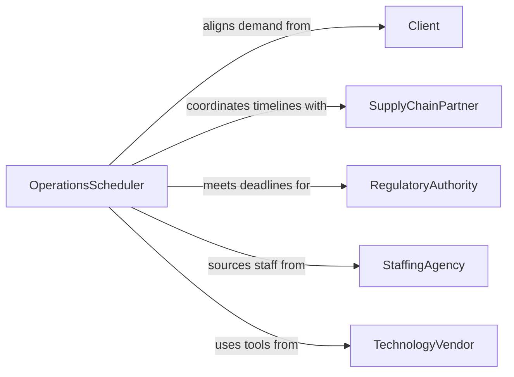

# Schedule Operational Activities

> Business-as-Code definition for scheduling operational activities. Models the broad coordination of day-to-day business operations including task sequencing, resource allocation, and timeline management.

## Overview

Scheduling operational activities involves planning and sequencing the tasks, personnel, and resources needed to execute daily business operations across departments. This definition exposes actions for building operational schedules, allocating staff and resources, and responding to disruptions, along with events for workflow coordination and searches for querying schedules and resource utilization.

## Actors

| Actor | Description |
|-------|-------------|
| Client | Drives demand and service-level expectations that shape operational schedules |
| SupplyChainPartner | Provides materials and services on timelines that constrain operations |
| RegulatoryAuthority | Imposes compliance deadlines and operational restrictions |
| StaffingAgency | Supplies temporary labor to supplement operational capacity |
| TechnologyVendor | Provides systems and tools that support scheduling and execution |

## Roles

| Role | Description |
|------|-------------|
| OperationsScheduler | Builds and maintains the operational schedule across functions |
| ShiftSupervisor | Manages daily execution and adjusts activities in real time |
| ResourcePlanner | Forecasts resource needs and ensures adequate capacity |
| OperationsDirector | Sets priorities and approves schedule modifications |

## Entities

| Entity | Description |
|--------|-------------|
| OperationalSchedule | The master plan of activities, assignments, and timelines for a period |
| Activity | A discrete operational task with defined inputs, outputs, and duration |
| ResourceAllocation | The assignment of personnel, equipment, or materials to an activity |
| ShiftPlan | The staffing schedule organizing personnel into work shifts |
| Milestone | A key date or deliverable within the operational schedule |
| ScheduleException | An unplanned change or disruption that requires schedule adjustment |

## Actions

| Action | Description |
|--------|-------------|
| createOperationalSchedule | Define a new schedule for a department, project, or operational period |
| addActivity | Insert an operational task into the schedule with dependencies and resources |
| allocateResources | Assign personnel, equipment, or materials to scheduled activities |
| publishSchedule | Release the finalized schedule to all affected stakeholders |
| adjustSchedule | Modify the schedule in response to changes in demand or availability |
| trackProgress | Monitor completion status of activities against the planned schedule |
| resolveException | Address an unplanned disruption and update the schedule accordingly |

## Events

| Event | Description |
|-------|-------------|
| operationalScheduleCreated | A new operational schedule has been established |
| activityAdded | A task has been inserted into the operational schedule |
| resourcesAllocated | Personnel or equipment have been assigned to an activity |
| schedulePublished | The schedule has been released to stakeholders |
| scheduleAdjusted | The schedule has been modified due to changing conditions |
| milestoneReached | A key deliverable or date in the schedule has been achieved |
| exceptionResolved | An unplanned disruption has been addressed |

## Searches

| Search | Description |
|--------|-------------|
| findActivities | Retrieve activities by department, status, date range, or assignee |
| getResourceUtilization | View how resources are allocated across the schedule |
| getScheduleTimeline | Retrieve the full timeline of activities and milestones for a period |
| findExceptions | List unresolved schedule disruptions by severity or impact |

## Workflow



## Actor Relationships



## Usage

### Calling Actions

```typescript
import { scheduleOperationalActivities } from '@headlessly/schedule-operational-activities'

const ops = scheduleOperationalActivities()

// Create a weekly operational schedule
const schedule = await ops.createOperationalSchedule({
  name: 'Week 12 - Production Operations',
  period: { start: '2026-03-16', end: '2026-03-22' },
  department: 'manufacturing'
})

// Add activities with dependencies
const setup = await ops.addActivity({
  scheduleId: schedule.id,
  name: 'Line changeover - Product B',
  duration: 120,
  startTime: '2026-03-16T06:00:00',
  dependencies: []
})

await ops.addActivity({
  scheduleId: schedule.id,
  name: 'Production run - Product B',
  duration: 480,
  dependencies: [setup.id]
})

// Allocate resources and publish
await ops.allocateResources({
  scheduleId: schedule.id,
  assignments: [
    { activityId: setup.id, resource: 'crew-alpha', type: 'personnel' },
    { activityId: setup.id, resource: 'tooling-set-B', type: 'equipment' }
  ]
})

await ops.publishSchedule({ scheduleId: schedule.id })
```

### Event-Driven Automation

```typescript
// Notify stakeholders when schedule changes
ops.scheduleAdjusted(async ({ scheduleId, changes, reason }) => {
  await notify({
    to: 'shift-supervisors',
    message: `Schedule ${scheduleId} updated: ${reason}. ${changes.length} activities affected.`
  })
})

// Auto-escalate unresolved exceptions
ops.activityAdded(async ({ scheduleId, activityId }) => {
  // Monitor for delays
  ops.trackProgress({ scheduleId })
})
```
