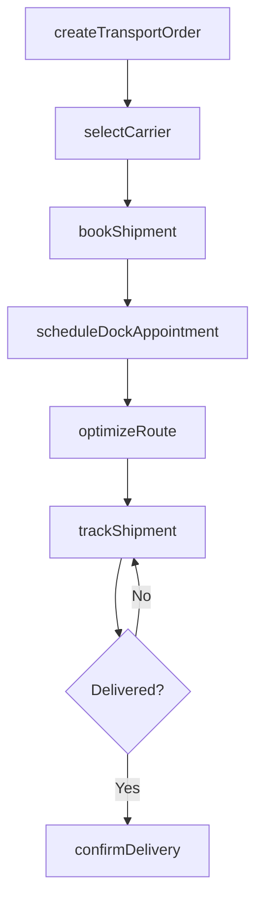
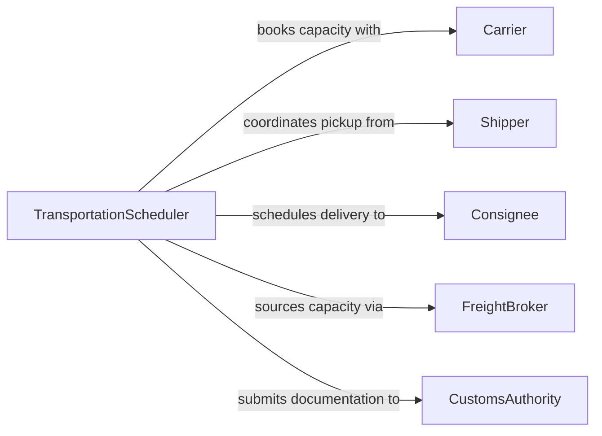

# Schedule Product Material Transportation

> Business-as-Code definition for scheduling product and material transportation. Models the coordination of freight shipments, carrier selection, and delivery timing across supply chain networks.

## Overview

Scheduling product and material transportation involves planning the movement of goods from origin to destination by coordinating carriers, routes, dock appointments, and delivery windows. This definition exposes actions for booking shipments, optimizing routes, and tracking deliveries, along with events for real-time status updates and searches for querying transportation capacity and shipment histories.

## Actors

| Actor | Description |
|-------|-------------|
| Carrier | Provides freight transportation services via truck, rail, air, or ocean |
| Shipper | Originates the shipment and provides pickup requirements |
| Consignee | Receives the shipment at the destination facility |
| FreightBroker | Matches available carrier capacity with shipment demand |
| CustomsAuthority | Processes import/export documentation for cross-border shipments |

## Roles

| Role | Description |
|------|-------------|
| TransportationScheduler | Plans and coordinates shipment pickups and deliveries |
| LogisticsManager | Oversees transportation operations and carrier performance |
| WarehouseCoordinator | Manages dock scheduling for inbound and outbound freight |
| RoutePlanner | Optimizes carrier routes and consolidation opportunities |

## Entities

| Entity | Description |
|--------|-------------|
| Shipment | A consignment of products or materials to be transported |
| TransportOrder | A formal request to move goods from origin to destination |
| CarrierBooking | A confirmed reservation with a carrier for a specific shipment |
| Route | The planned path and stops for a transportation movement |
| DockAppointment | A scheduled time window for loading or unloading at a facility |
| BillOfLading | The contract and receipt document between shipper and carrier |

## Actions

| Action | Description |
|--------|-------------|
| createTransportOrder | Initiate a request to move products or materials |
| selectCarrier | Choose a carrier based on cost, transit time, and capacity |
| bookShipment | Confirm a carrier reservation and obtain booking reference |
| scheduleDockAppointment | Reserve a loading or unloading time at a warehouse dock |
| optimizeRoute | Calculate the most efficient path considering constraints |
| trackShipment | Monitor real-time location and status of an in-transit shipment |
| confirmDelivery | Record proof of delivery and close the transport order |

## Events

| Event | Description |
|-------|-------------|
| transportOrderCreated | A new transportation request has been initiated |
| carrierSelected | A carrier has been chosen for a shipment |
| shipmentBooked | A carrier booking has been confirmed |
| dockAppointmentScheduled | A loading or unloading window has been reserved |
| shipmentPickedUp | The carrier has collected the shipment from the origin |
| shipmentInTransit | The shipment is moving toward the destination |
| deliveryConfirmed | The shipment has been received and delivery recorded |

## Searches

| Search | Description |
|--------|-------------|
| findTransportOrders | Retrieve orders by origin, destination, status, or date range |
| getCarrierCapacity | Check available carrier slots for a given lane and date |
| getDockSchedule | View scheduled appointments for a specific warehouse dock |
| getShipmentStatus | Retrieve the current location and status of an in-transit shipment |
| getTransitHistory | List past shipments by customer, carrier, or route |

## Workflow



## Actor Relationships



## Usage

### Calling Actions

```typescript
import { scheduleProductMaterialTransportation } from '@headlessly/schedule-product-material-transportation'

const transport = scheduleProductMaterialTransportation()

// Create a transport order
const order = await transport.createTransportOrder({
  origin: { facilityId: 'warehouse-east', city: 'Newark, NJ' },
  destination: { facilityId: 'dc-midwest', city: 'Columbus, OH' },
  commodity: 'electronics',
  weight: 18000,
  pallets: 24,
  requiredDelivery: '2026-03-22'
})

// Select carrier and book
const carrier = await transport.selectCarrier({
  orderId: order.id,
  criteria: { mode: 'ftl', maxTransitDays: 2, temperatureControlled: false }
})

await transport.bookShipment({
  orderId: order.id,
  carrierId: carrier.id,
  pickupDate: '2026-03-20'
})

// Schedule dock appointments
await transport.scheduleDockAppointment({
  orderId: order.id,
  type: 'pickup',
  facilityId: 'warehouse-east',
  window: '2026-03-20T06:00-08:00'
})
```

### Event-Driven Automation

```typescript
// Notify consignee when shipment is in transit
transport.shipmentPickedUp(async ({ orderId, estimatedArrival }) => {
  const order = await transport.findTransportOrders({ orderId })
  await notify({
    to: order.consigneeContact,
    message: `Shipment ${orderId} picked up. ETA: ${estimatedArrival}`
  })
})

// Auto-close orders on delivery confirmation
transport.deliveryConfirmed(async ({ orderId, proofOfDelivery }) => {
  await billing.createInvoice({
    transportOrderId: orderId,
    deliveryDate: proofOfDelivery.timestamp
  })
})
```
