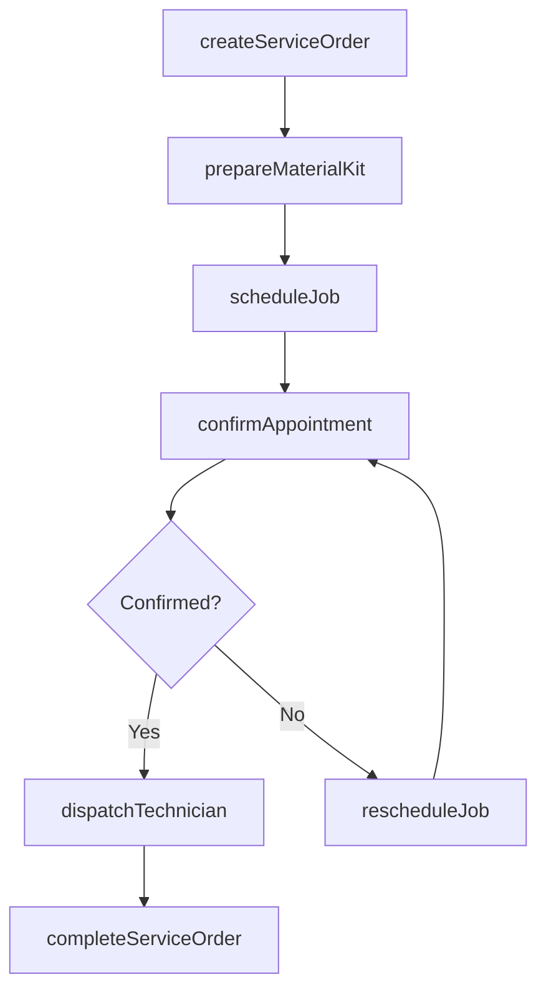
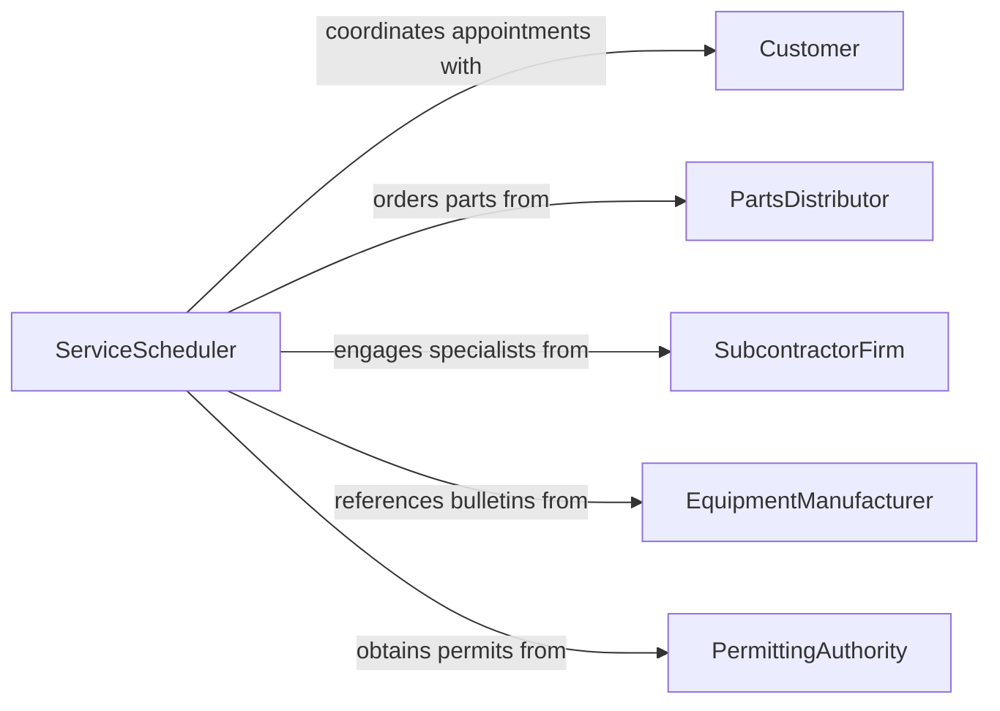

# Schedule Repair Installation Maintenance Activities

> Business-as-Code definition for scheduling repair, installation, and maintenance activities. Models the end-to-end coordination of field service work including job prioritization, crew dispatching, and completion tracking.

## Overview

Scheduling repair, installation, and maintenance activities involves coordinating technicians, materials, and customer availability to execute field service work orders efficiently. This definition exposes actions for creating schedules, dispatching crews, and managing work order lifecycles, along with events for real-time status tracking and searches for querying job backlogs and resource capacity.

## Actors

| Actor | Description |
|-------|-------------|
| Customer | Requests service and provides site access windows |
| PartsDistributor | Supplies components needed for repair and installation work |
| SubcontractorFirm | Provides specialized labor for complex installations or repairs |
| EquipmentManufacturer | Issues service bulletins and provides technical support |
| PermittingAuthority | Grants required permits for installation and structural work |

## Roles

| Role | Description |
|------|-------------|
| ServiceScheduler | Coordinates job assignments and technician dispatch |
| FieldTechnician | Performs on-site repair, installation, and maintenance work |
| ServiceManager | Oversees service operations and approves schedule changes |
| DispatchCoordinator | Manages real-time routing and technician allocation |

## Entities

| Entity | Description |
|--------|-------------|
| ServiceOrder | A formal request for repair, installation, or maintenance work |
| ScheduleSlot | A time window allocated for a specific service job |
| TechnicianRoster | The list of available technicians with skills and locations |
| JobSite | The physical location where service work is performed |
| MaterialKit | The pre-assembled set of parts and tools required for a job |
| ServiceReport | Documentation of work performed and job outcome |

## Actions

| Action | Description |
|--------|-------------|
| createServiceOrder | Register a new repair, installation, or maintenance request |
| scheduleJob | Assign a date, time slot, and technician to a service order |
| dispatchTechnician | Send a technician to the job site with routing and job details |
| prepareMaterialKit | Assemble the parts and tools needed for the scheduled job |
| confirmAppointment | Verify customer availability and site access for the scheduled time |
| completeServiceOrder | Finalize the job, record outcomes, and close the work order |
| rescheduleJob | Move a job to a different time slot or reassign to another technician |

## Events

| Event | Description |
|-------|-------------|
| serviceOrderCreated | A new service request has been registered |
| jobScheduled | A service order has been assigned a time slot and technician |
| technicianDispatched | A technician has been sent to the job site |
| materialKitPrepared | Parts and tools have been assembled for the job |
| appointmentConfirmed | The customer has confirmed the scheduled service window |
| serviceOrderCompleted | The job has been finalized and the work order closed |
| jobRescheduled | A service job has been moved to a new time or technician |

## Searches

| Search | Description |
|--------|-------------|
| findServiceOrders | Retrieve orders by type, status, customer, or date range |
| getTechnicianSchedule | View a technician's assigned jobs and available slots |
| getJobBacklog | List unscheduled or pending service orders by priority |
| findMaterialAvailability | Check parts inventory for upcoming scheduled jobs |
| getServiceHistory | Retrieve past service records for a customer or site |

## Workflow



## Actor Relationships



## Usage

### Calling Actions

```typescript
import { scheduleRepairInstallationMaintenanceActivities } from '@headlessly/schedule-repair-installation-maintenance-activities'

const service = scheduleRepairInstallationMaintenanceActivities()

// Create a new installation service order
const order = await service.createServiceOrder({
  type: 'installation',
  customerId: 'cust-4521',
  description: 'Install commercial HVAC unit - rooftop',
  priority: 'high',
  siteAddress: '1200 Industrial Blvd, Suite 300'
})

// Schedule and confirm
await service.scheduleJob({
  orderId: order.id,
  technicianId: 'tech-nguyen',
  date: '2026-03-20',
  timeSlot: '08:00-12:00'
})

await service.confirmAppointment({
  orderId: order.id,
  contactMethod: 'sms',
  contactNumber: '+1-555-0142'
})
```

### Event-Driven Automation

```typescript
// Auto-dispatch when appointment is confirmed
service.appointmentConfirmed(async ({ orderId, technicianId, date }) => {
  await service.dispatchTechnician({
    orderId,
    technicianId,
    routingPriority: 'optimal'
  })
})

// Alert scheduler when jobs are rescheduled multiple times
service.jobRescheduled(async ({ orderId, rescheduleCount }) => {
  if (rescheduleCount >= 3) {
    await notify({
      to: 'service-manager',
      message: `Service order ${orderId} has been rescheduled ${rescheduleCount} times. Review required.`
    })
  }
})
```
