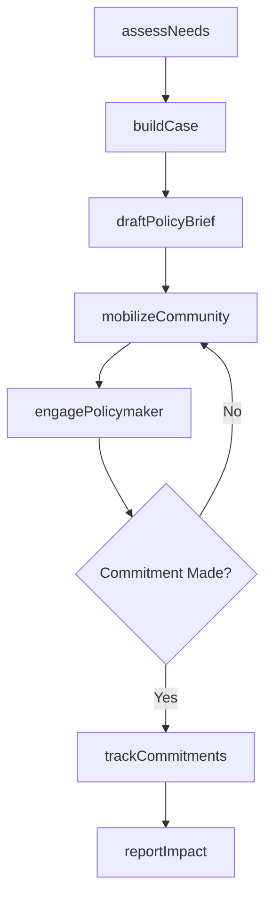
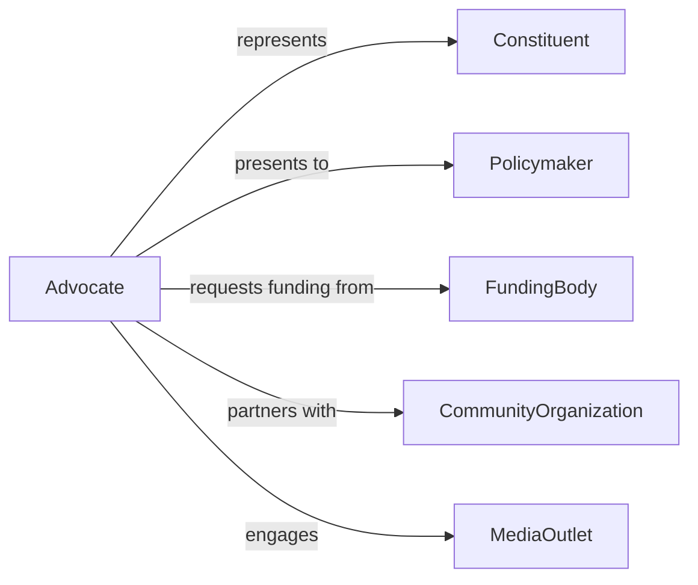

# Advocate for Individual or Community Needs

> Business-as-Code definition for individual and community advocacy. Models the process of identifying unmet needs, building cases for support, engaging decision-makers, and tracking advocacy outcomes.

## Overview

Individual and community advocacy involves assessing needs, building persuasive cases, coordinating with stakeholders, presenting arguments to decision-makers, and following through on commitments. This definition exposes actions for advocacy case management, event triggers for engagement milestones, and searches for constituent needs and policy impact records.

## Actors

| Actor | Description |
|-------|-------------|
| Constituent | Individual or community group whose needs are being advocated |
| Policymaker | Government official or organizational leader with decision authority |
| FundingBody | Organization providing grants or financial support |
| CommunityOrganization | Nonprofit or civic group collaborating on advocacy efforts |
| MediaOutlet | Press or publication amplifying advocacy messages |
| RegulatoryAgency | Government body enforcing relevant rules and standards |

## Roles

| Role | Description |
|------|-------------|
| Advocate | Leads the case for individual or community needs |
| CaseWorker | Documents individual circumstances and gathers evidence |
| PolicyAnalyst | Researches regulations and their impact on constituents |
| OutreachCoordinator | Mobilizes community support and engagement |

## Entities

| Entity | Description |
|--------|-------------|
| AdvocacyCase | Documented need or issue being championed |
| NeedsAssessment | Evaluation of individual or community requirements |
| PolicyBrief | Summary document presenting the case to decision-makers |
| Petition | Formal request signed by supporters |
| TestimonialRecord | Personal story or evidence supporting the advocacy case |
| ActionItem | Specific step committed to by a decision-maker or organization |
| ImpactReport | Documentation of outcomes resulting from advocacy efforts |

## Actions

| Action | Description |
|--------|-------------|
| assessNeeds | Evaluate and document individual or community requirements |
| buildCase | Compile evidence, testimonials, and data supporting the need |
| draftPolicyBrief | Prepare a persuasive summary for decision-makers |
| engagePolicymaker | Present the case and request action from a decision-maker |
| mobilizeCommunity | Organize supporters and collect petition signatures |
| trackCommitments | Monitor follow-through on promises made by decision-makers |
| reportImpact | Document the outcomes and effectiveness of advocacy efforts |

## Events

| Event | Description |
|-------|-------------|
| needsAssessed | Individual or community requirements have been documented |
| caseBuilt | Evidence and testimonials have been compiled |
| policyBriefDrafted | A persuasive summary has been prepared |
| policymakerEngaged | A case has been presented to a decision-maker |
| communityMobilized | Supporters have been organized and petitions collected |
| commitmentTracked | A decision-maker follow-through has been monitored |
| impactReported | Advocacy outcomes have been documented |

## Searches

| Search | Description |
|--------|-------------|
| findCases | List advocacy cases by issue, status, or constituency |
| getAssessments | Retrieve needs assessments by community or date |
| getPolicyBriefs | Find briefing documents by topic or policymaker |
| getCommitments | Track decision-maker commitments by status or deadline |
| getImpactReports | Search outcome reports by issue or period |

## Workflow



## Actor Relationships



## Usage

### Calling Actions

```typescript
import { advocateIndividualCommunityNeeds } from '@headlessly/advocate-individual-community-needs'

const advocacy = advocateIndividualCommunityNeeds()

// Assess community needs
const assessment = await advocacy.assessNeeds({
  community: 'riverside-district',
  issues: ['affordable-housing', 'public-transit', 'park-access'],
  population: 12000
})

// Build and present the case
const advocacyCase = await advocacy.buildCase({
  assessmentId: assessment.id,
  primaryIssue: 'affordable-housing',
  evidence: ['census-data', 'housing-cost-study', 'resident-testimonials']
})

await advocacy.engagePolicymaker({
  caseId: advocacyCase.id,
  policymaker: 'city-council-district-5',
  requestedAction: 'inclusionary-zoning-amendment'
})
```

### Event-Driven Automation

```typescript
// Alert team when policymaker commitment is due
advocacy.commitmentTracked(async ({ caseId, deadline, status }) => {
  if (status === 'overdue') {
    await notify({
      to: 'advocacy-team',
      message: `Commitment on case ${caseId} is overdue. Follow up required.`
    })
  }
})

// Generate impact report after successful advocacy
advocacy.policymakerEngaged(async ({ caseId, outcome }) => {
  if (outcome === 'commitment-made') {
    await scheduleTask({
      action: 'reportImpact',
      caseId,
      dueIn: 90
    })
  }
})
```
