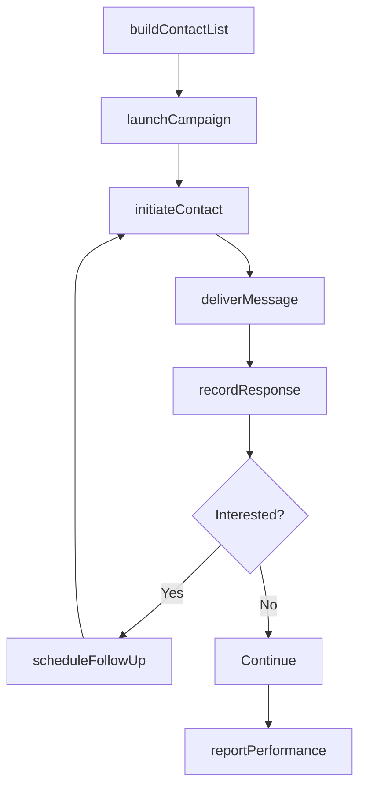
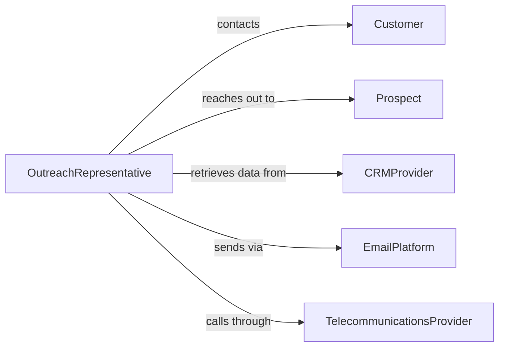

# Contact Current or Potential Customers to Promote Products or Services

> Business-as-Code definition for customer outreach and promotion. Models the process of identifying prospects, initiating contact through multiple channels, delivering promotional messaging, and tracking engagement outcomes.

## Overview

Contacting customers for promotion involves segmenting target audiences, selecting outreach channels, crafting personalized messaging, executing contact campaigns, and measuring response rates and conversion outcomes. This definition exposes actions for outreach campaign management, event triggers for contact milestones, and searches for prospect engagement and campaign performance records.

## Actors

| Actor | Description |
|-------|-------------|
| Customer | Existing client targeted for upselling or cross-selling |
| Prospect | Potential buyer who has not yet purchased |
| CRMProvider | System managing customer records and interaction history |
| EmailPlatform | Service delivering bulk and personalized email communications |
| TelecommunicationsProvider | Phone and messaging infrastructure for outbound calls |

## Roles

| Role | Description |
|------|-------------|
| OutreachRepresentative | Initiates contact with customers and prospects |
| CampaignManager | Plans and oversees promotional contact campaigns |
| ListAnalyst | Segments and qualifies contact lists for targeting |
| ResponseCoordinator | Manages incoming replies and schedules follow-ups |

## Entities

| Entity | Description |
|--------|-------------|
| ContactList | Segmented group of customers or prospects for outreach |
| OutreachCampaign | Organized series of promotional contacts with goals and timeline |
| ContactAttempt | Individual outreach interaction via phone, email, or message |
| ProspectProfile | Demographic and behavioral data for a potential customer |
| ResponseRecord | Customer reply or engagement resulting from outreach |
| FollowUpTask | Scheduled subsequent contact based on initial response |
| CampaignReport | Summary of outreach performance metrics and outcomes |

## Actions

| Action | Description |
|--------|-------------|
| buildContactList | Segment and qualify customers or prospects for targeting |
| launchCampaign | Initiate a coordinated promotional outreach effort |
| initiateContact | Make a phone call, send an email, or message a prospect |
| deliverMessage | Communicate the promotional offer or product information |
| recordResponse | Log the customer reaction, interest level, or objection |
| scheduleFollowUp | Plan a subsequent contact based on the initial interaction |
| reportPerformance | Summarize campaign reach, response rates, and conversions |

## Events

| Event | Description |
|-------|-------------|
| contactListBuilt | A targeted list of customers or prospects has been created |
| campaignLaunched | A promotional outreach effort has been initiated |
| contactInitiated | An outreach interaction has been made |
| messageDelivered | The promotional content has been communicated |
| responseRecorded | A customer reaction has been logged |
| followUpScheduled | A subsequent contact has been planned |
| performanceReported | Campaign metrics have been summarized |

## Searches

| Search | Description |
|--------|-------------|
| findContacts | List customers or prospects by segment, status, or campaign |
| getCampaigns | Retrieve outreach campaigns by product, channel, or date |
| getResponses | Search customer reactions by sentiment, interest level, or date |
| getPerformance | Query campaign metrics by channel, conversion rate, or period |

## Workflow



## Actor Relationships



## Usage

### Calling Actions

```typescript
import { contactCurrentPotentialCustomersPromote } from '@headlessly/contact-current-potential-customers-promote'

const outreach = contactCurrentPotentialCustomersPromote()

// Build a targeted contact list
const list = await outreach.buildContactList({
  segment: 'enterprise-accounts',
  criteria: { industry: 'healthcare', lastPurchase: 'over-6-months' },
  maxContacts: 500
})

// Launch the outreach campaign
const campaign = await outreach.launchCampaign({
  listId: list.id,
  product: 'compliance-suite-v4',
  channels: ['email', 'phone'],
  startDate: '2026-03-01'
})

// Initiate contact with a prospect
await outreach.initiateContact({
  campaignId: campaign.id,
  prospectId: 'prospect-8891',
  channel: 'phone',
  script: 'compliance-suite-intro'
})
```

### Event-Driven Automation

```typescript
// Auto-schedule follow-up for interested responses
outreach.responseRecorded(async ({ contactId, interestLevel, campaignId }) => {
  if (interestLevel === 'high') {
    await outreach.scheduleFollowUp({
      contactId,
      campaignId,
      delay: '3-days',
      channel: 'email'
    })
  }
})

// Generate performance report at campaign end
outreach.campaignLaunched(async ({ campaignId, endDate }) => {
  await scheduleTask({
    action: 'reportPerformance',
    campaignId,
    runAt: endDate
  })
})
```
