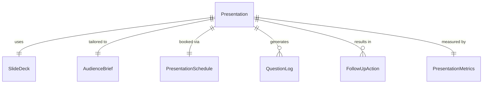
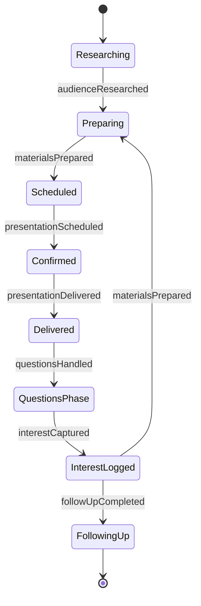
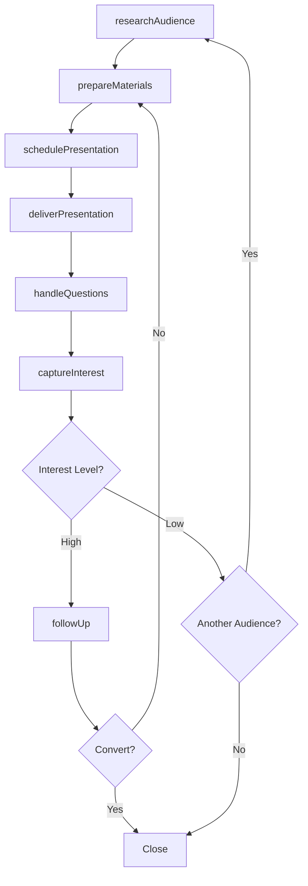
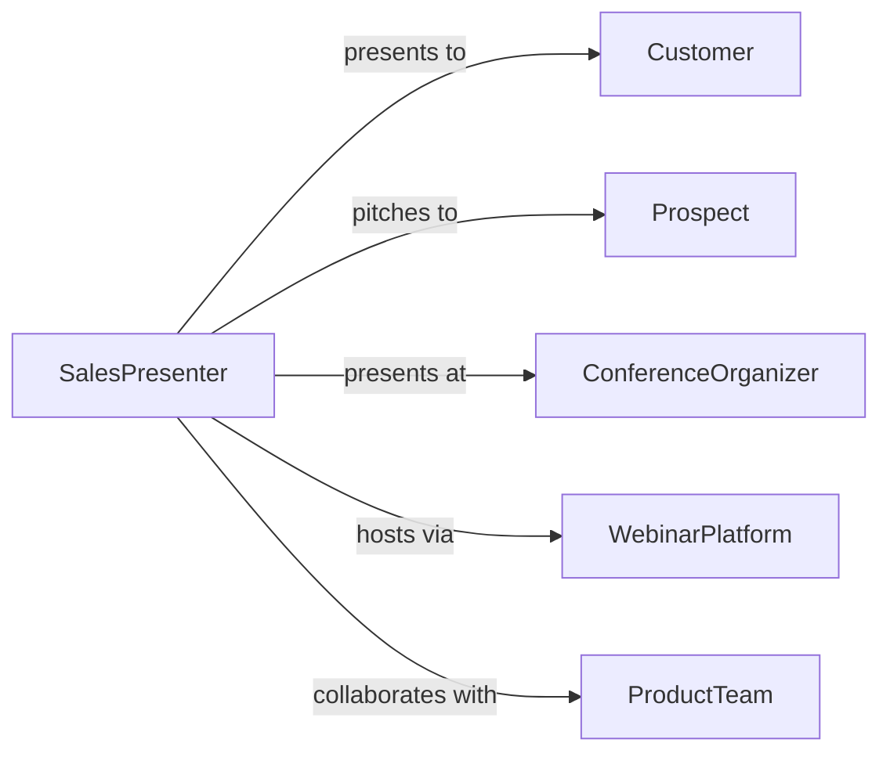

# Deliver Promotional Presentations to Current or Prospective Customers

> Business-as-Code definition for promotional presentation delivery. Models the process of preparing, scheduling, delivering, and following up on sales presentations to current and prospective customers.

## Overview

Delivering promotional presentations involves researching audience needs, preparing tailored slide decks and demonstrations, scheduling and conducting presentations in-person or virtually, handling questions, and following up on expressed interest. This definition exposes actions for presentation lifecycle management, event triggers for engagement milestones, and searches for presentation performance and audience records.

## Actors

| Actor | Description |
|-------|-------------|
| Customer | Existing client receiving a presentation on new or upgraded offerings |
| Prospect | Potential buyer being introduced to products or services |
| ConferenceOrganizer | Host of trade shows or industry events where presentations occur |
| WebinarPlatform | Technology provider hosting virtual presentation delivery |
| ProductTeam | Internal group providing technical product information and demos |

## Roles

| Role | Description |
|------|-------------|
| SalesPresenter | Delivers the promotional presentation to the audience |
| PresentationDesigner | Creates slide decks, visuals, and supporting materials |
| AccountExecutive | Identifies opportunities and schedules presentations |
| FollowUpCoordinator | Manages post-presentation engagement and lead nurturing |

## Entities

| Entity | Description |
|--------|-------------|
| Presentation | Structured promotional talk with slides, demos, and key messages |
| SlideDeck | Visual materials supporting the promotional narrative |
| AudienceBrief | Profile of attendees including roles, needs, and decision authority |
| PresentationSchedule | Booking with date, time, venue, and attendee list |
| QuestionLog | Record of audience questions asked during or after the presentation |
| FollowUpAction | Planned next step resulting from presentation engagement |
| PresentationMetrics | Attendance, engagement scores, and conversion data |

## Actions

| Action | Description |
|--------|-------------|
| researchAudience | Analyze attendee profiles, needs, and decision-making authority |
| prepareMaterials | Create slide decks, demos, and handout materials |
| schedulePresentation | Book the presentation with attendees and venue or platform |
| deliverPresentation | Conduct the promotional talk with live demonstration |
| handleQuestions | Address audience inquiries during and after the presentation |
| captureInterest | Record expressed interest and potential next steps |
| followUp | Execute post-presentation engagement with interested attendees |

## Events

| Event | Description |
|-------|-------------|
| audienceResearched | Attendee profiles and needs have been analyzed |
| materialsPrepared | Slide decks and demo materials have been created |
| presentationScheduled | A promotional talk has been booked |
| presentationDelivered | The promotional presentation has been conducted |
| questionsHandled | Audience inquiries have been addressed |
| interestCaptured | Expressed buying interest and next steps have been recorded |
| followUpCompleted | Post-presentation engagement has been executed |

## Searches

| Search | Description |
|--------|-------------|
| findPresentations | List presentations by product, audience, date, or status |
| getAudiences | Retrieve attendee profiles by presentation, role, or company |
| getQuestions | Search audience questions by topic, presentation, or frequency |
| getMetrics | Query presentation performance by conversion rate, attendance, or period |

## Entity Relationships



## State Diagram



## Workflow



## Actor Relationships



## Usage

### Calling Actions

```typescript
import { deliverPromotionalPresentationsCurrentProspective } from '@headlessly/deliver-promotional-presentations-current-prospective'

const presentations = deliverPromotionalPresentationsCurrentProspective()

// Research the audience for a tailored presentation
const brief = await presentations.researchAudience({
  company: 'acme-manufacturing',
  attendees: ['vp-operations', 'procurement-director', 'it-manager'],
  interests: ['supply-chain-optimization', 'cost-reduction']
})

// Schedule and deliver the presentation
const schedule = await presentations.schedulePresentation({
  audienceBriefId: brief.id,
  product: 'logistics-platform-enterprise',
  date: '2026-03-18',
  format: 'virtual-webinar',
  duration: 45
})

await presentations.deliverPresentation({
  scheduleId: schedule.id,
  slideDeck: 'logistics-enterprise-pitch-v3',
  liveDemo: true,
  attendeesPresent: 6
})
```

### Event-Driven Automation

```typescript
// Auto-prepare materials when audience research is complete
presentations.audienceResearched(async ({ briefId, interests }) => {
  await presentations.prepareMaterials({
    briefId,
    template: 'enterprise-pitch',
    customSections: interests
  })
})

// Auto-follow up with interested attendees
presentations.interestCaptured(async ({ presentationId, contactId, interestLevel }) => {
  if (interestLevel === 'high') {
    await presentations.followUp({
      contactId,
      presentationId,
      action: 'schedule-demo',
      within: '48-hours'
    })
  }
})
```
