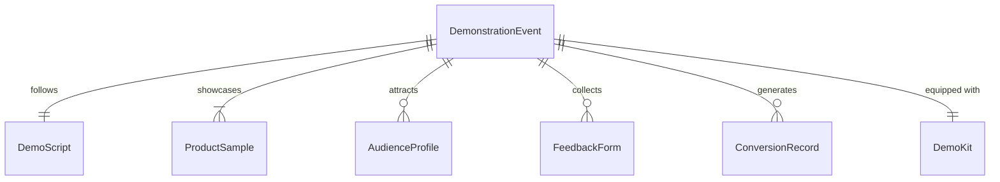
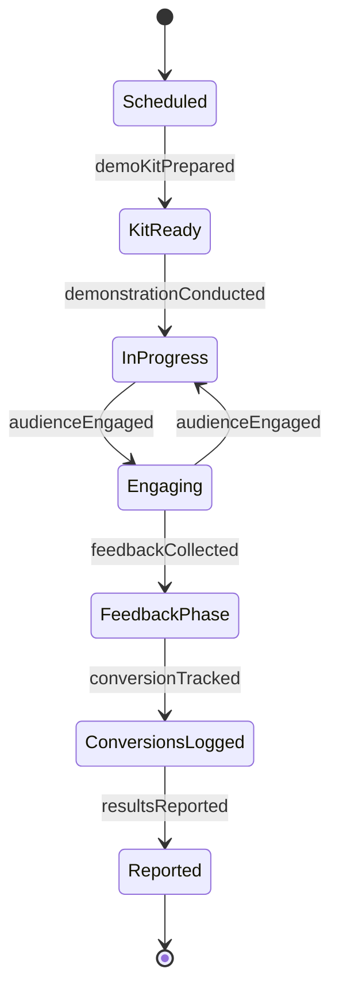
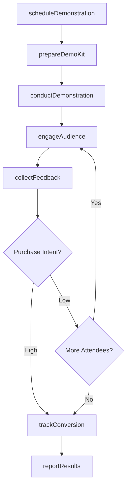
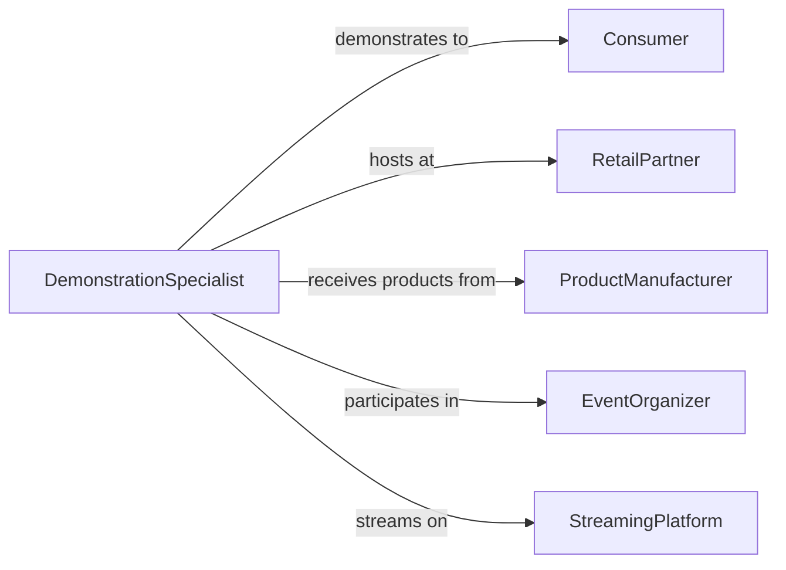

# Demonstrate Products to Consumers

> Business-as-Code definition for product demonstration operations. Models the process of planning, staging, and delivering hands-on product demonstrations to consumers in retail, trade show, and digital environments.

## Overview

Product demonstration involves preparing demonstration materials and environments, engaging consumers with interactive product experiences, communicating features and benefits, collecting audience feedback, and tracking conversion outcomes. This definition exposes actions for demonstration lifecycle management, event triggers for engagement milestones, and searches for demonstration performance and consumer interest records.

## Actors

| Actor | Description |
|-------|-------------|
| Consumer | Individual experiencing the product demonstration |
| RetailPartner | Store or venue hosting in-person demonstrations |
| ProductManufacturer | Provides product samples, specifications, and training materials |
| EventOrganizer | Coordinates trade shows or promotional events for demonstrations |
| StreamingPlatform | Hosts live or recorded digital product demonstrations |

## Roles

| Role | Description |
|------|-------------|
| DemonstrationSpecialist | Conducts live product demonstrations for consumers |
| DemoCoordinator | Schedules, equips, and manages demonstration events |
| ProductTrainer | Educates demonstration staff on product features and messaging |
| ConversionAnalyst | Tracks demonstration-to-purchase rates and engagement metrics |

## Entities

| Entity | Description |
|--------|-------------|
| DemonstrationEvent | Scheduled product showcase at a specific venue or platform |
| DemoScript | Structured presentation outline with key talking points |
| ProductSample | Physical or digital product unit used during demonstrations |
| AudienceProfile | Demographics and interests of demonstration attendees |
| FeedbackForm | Consumer impressions and purchase intent captured during demos |
| ConversionRecord | Documented sale or lead generated from a demonstration |
| DemoKit | Packaged set of samples, displays, and materials for a demonstration |

## Actions

| Action | Description |
|--------|-------------|
| scheduleDemonstration | Plan a product demonstration at a venue or on a platform |
| prepareDemoKit | Assemble product samples, displays, and presentation materials |
| conductDemonstration | Deliver a live product showcase to consumers |
| engageAudience | Interact with attendees, answer questions, and encourage trial |
| collectFeedback | Gather consumer impressions and purchase intent data |
| trackConversion | Record sales or leads resulting from the demonstration |
| reportResults | Summarize demonstration outcomes and consumer response |

## Events

| Event | Description |
|-------|-------------|
| demonstrationScheduled | A product showcase has been planned |
| demoKitPrepared | Samples and materials have been assembled |
| demonstrationConducted | A live product showcase has been delivered |
| audienceEngaged | Consumer interactions and trials have occurred |
| feedbackCollected | Consumer impressions and intent data have been gathered |
| conversionTracked | Sales or leads from the demonstration have been recorded |
| resultsReported | Demonstration outcomes have been summarized |

## Searches

| Search | Description |
|--------|-------------|
| findDemonstrations | List demonstrations by product, venue, date, or status |
| getFeedback | Retrieve consumer feedback by event, product, or rating |
| getConversions | Query sales or leads by demonstration, product, or period |
| getAudiences | Search audience profiles by event, demographics, or interests |

## Entity Relationships



## State Diagram



## Workflow



## Actor Relationships



## Usage

### Calling Actions

```typescript
import { demonstrateProductsConsumers } from '@headlessly/demonstrate-products-consumers'

const demos = demonstrateProductsConsumers()

// Schedule a product demonstration
const event = await demos.scheduleDemonstration({
  product: 'smart-home-hub-v3',
  venue: 'bestbuy-store-1205',
  date: '2026-03-15',
  timeSlot: '14:00-17:00',
  format: 'in-store-interactive'
})

// Conduct the demonstration
await demos.conductDemonstration({
  eventId: event.id,
  script: 'smart-home-setup-demo',
  samplesUsed: 5,
  attendees: 42
})

// Track resulting conversions
await demos.trackConversion({
  eventId: event.id,
  salesCount: 8,
  leadsGenerated: 15,
  totalRevenue: 3192
})
```

### Event-Driven Automation

```typescript
// Auto-prepare demo kit when demonstration is scheduled
demos.demonstrationScheduled(async ({ eventId, product, venue }) => {
  await demos.prepareDemoKit({
    eventId,
    product,
    shipTo: venue,
    items: ['product-samples', 'display-stand', 'brochures']
  })
})

// Alert sales team on high-conversion demonstrations
demos.resultsReported(async ({ eventId, conversionRate, product }) => {
  if (conversionRate > 0.2) {
    await notify({
      to: 'sales-leadership',
      message: `High-performing demo for ${product}: ${Math.round(conversionRate * 100)}% conversion`
    })
  }
})
```
