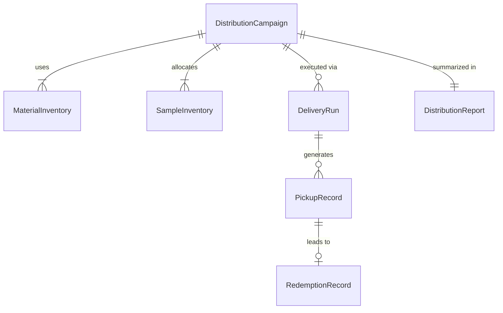
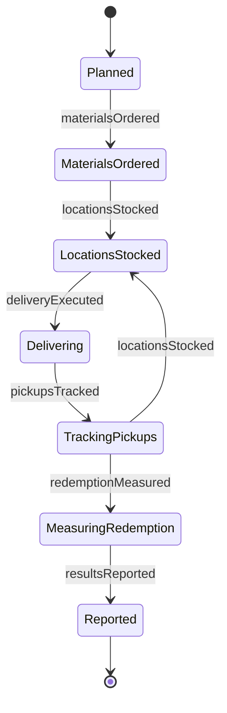
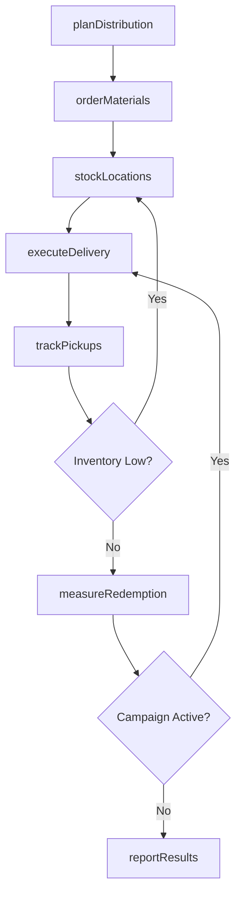
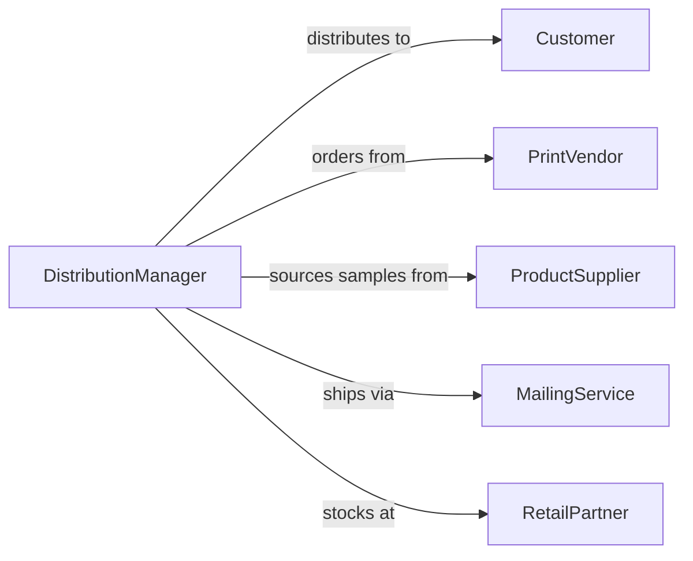

# Distribute Promotional Literature or Samples to Customers

> Business-as-Code definition for promotional material and sample distribution. Models the process of planning distribution campaigns, preparing materials and samples, executing delivery through multiple channels, and tracking customer engagement outcomes.

## Overview

Distributing promotional literature and samples involves planning distribution strategy, preparing printed materials and product samples, selecting delivery channels such as direct mail, in-store placement, or event handouts, executing distribution runs, and measuring pickup rates and customer response. This definition exposes actions for distribution operations management, event triggers for delivery milestones, and searches for inventory tracking and engagement records.

## Actors

| Actor | Description |
|-------|-------------|
| Customer | Recipient of promotional materials or product samples |
| PrintVendor | Produces printed brochures, flyers, and catalogs |
| ProductSupplier | Provides product samples for distribution |
| MailingService | Handles direct mail sorting, addressing, and delivery |
| RetailPartner | In-store location hosting material displays or sample stations |

## Roles

| Role | Description |
|------|-------------|
| DistributionManager | Plans and oversees promotional material distribution campaigns |
| FieldRepresentative | Delivers materials and samples at events or locations |
| InventoryCoordinator | Tracks material and sample stock levels across distribution points |
| ResponseAnalyst | Measures customer engagement and redemption rates |

## Entities

| Entity | Description |
|--------|-------------|
| DistributionCampaign | Planned effort to deliver materials or samples to a target audience |
| MaterialInventory | Stock of brochures, flyers, catalogs, or other printed items |
| SampleInventory | Stock of product samples allocated for promotional distribution |
| DeliveryRun | Scheduled distribution execution to a set of locations or addresses |
| PickupRecord | Documented customer receipt of materials or samples |
| RedemptionRecord | Tracked use of coupon or offer included with distributed materials |
| DistributionReport | Summary of delivery volumes, pickup rates, and response metrics |

## Actions

| Action | Description |
|--------|-------------|
| planDistribution | Design the campaign strategy, channels, and target locations |
| orderMaterials | Request production of printed materials and product samples |
| stockLocations | Deliver inventory to retail, event, or mailing distribution points |
| executeDelivery | Carry out the physical or mail distribution of materials and samples |
| trackPickups | Record customer receipt and interaction with distributed items |
| measureRedemption | Monitor use of coupons, offers, or trial invitations from materials |
| reportResults | Summarize distribution volumes and customer response outcomes |

## Events

| Event | Description |
|-------|-------------|
| distributionPlanned | A distribution campaign has been designed |
| materialsOrdered | Production of printed items and samples has been requested |
| locationsStocked | Inventory has been delivered to distribution points |
| deliveryExecuted | Materials and samples have been physically distributed |
| pickupsTracked | Customer receipt of items has been recorded |
| redemptionMeasured | Coupon or offer usage has been monitored |
| resultsReported | Distribution outcomes have been summarized |

## Searches

| Search | Description |
|--------|-------------|
| findCampaigns | List distribution campaigns by product, channel, or date |
| getInventory | Retrieve material and sample stock levels by location or item |
| getPickups | Search customer pickup records by location, date, or item |
| getRedemptions | Query coupon or offer usage by campaign, product, or period |

## Entity Relationships



## State Diagram



## Workflow



## Actor Relationships



## Usage

### Calling Actions

```typescript
import { distributePromotionalLiteratureSamplesCustomers } from '@headlessly/distribute-promotional-literature-samples-customers'

const distribution = distributePromotionalLiteratureSamplesCustomers()

// Plan a distribution campaign
const campaign = await distribution.planDistribution({
  product: 'organic-skincare-line',
  materials: ['product-catalog', 'sample-sachets', 'discount-coupon'],
  channels: ['direct-mail', 'in-store-display'],
  targetRegion: 'pacific-northwest',
  targetVolume: 10000
})

// Order materials and stock locations
await distribution.orderMaterials({
  campaignId: campaign.id,
  items: [
    { type: 'catalog', quantity: 10000 },
    { type: 'sample-sachet', quantity: 10000 },
    { type: 'coupon-card', quantity: 10000 }
  ]
})

// Execute delivery
await distribution.executeDelivery({
  campaignId: campaign.id,
  channel: 'direct-mail',
  addresses: 8000,
  dropDate: '2026-03-01'
})
```

### Event-Driven Automation

```typescript
// Auto-restock when inventory runs low
distribution.pickupsTracked(async ({ locationId, remaining, threshold }) => {
  if (remaining < threshold) {
    await distribution.stockLocations({
      locationId,
      replenishQuantity: threshold * 2
    })
  }
})

// Alert marketing on high redemption campaigns
distribution.redemptionMeasured(async ({ campaignId, redemptionRate }) => {
  if (redemptionRate > 0.15) {
    await notify({
      to: 'marketing-team',
      message: `Campaign ${campaignId} achieving ${Math.round(redemptionRate * 100)}% redemption rate`
    })
  }
})
```
