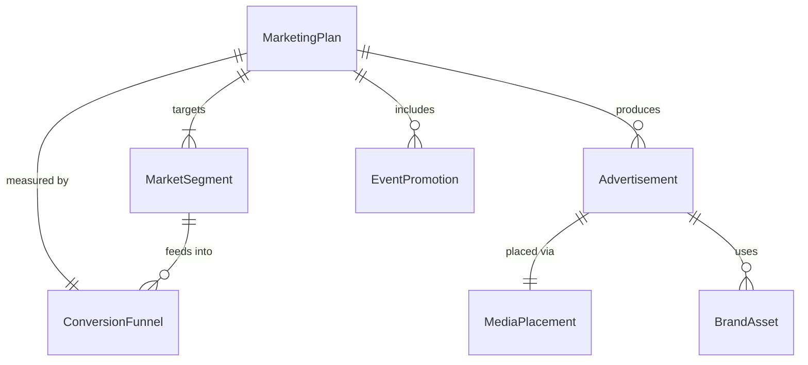
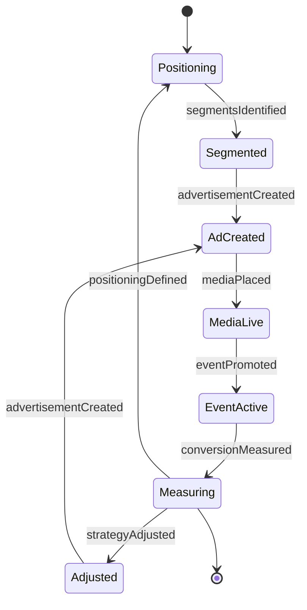
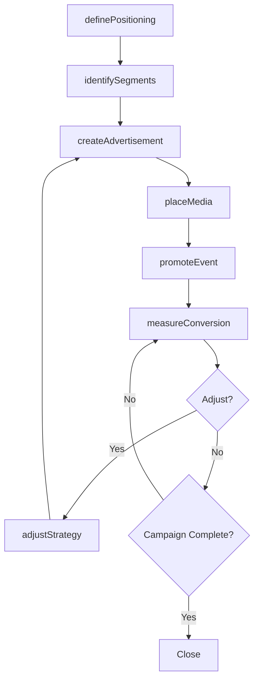
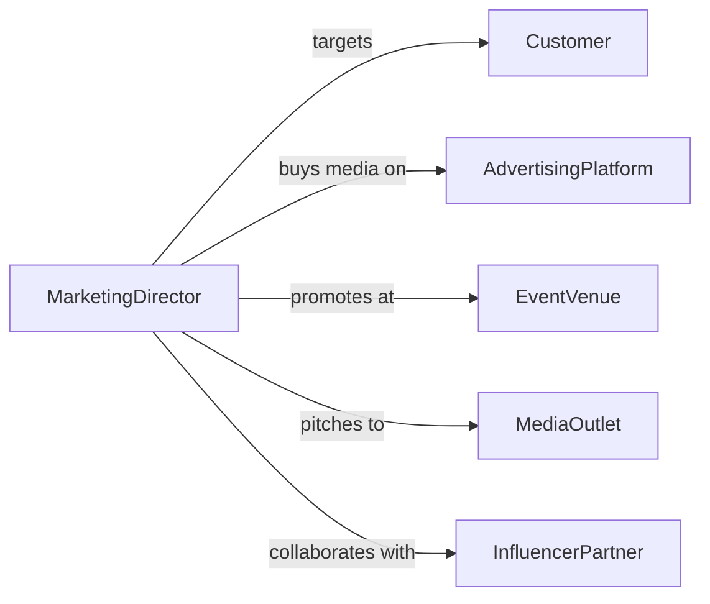

# Market Products, Services, or Events

> Business-as-Code definition for product, service, and event marketing. Models the go-to-market process from positioning through audience targeting, campaign execution, and conversion tracking.

## Overview

Marketing products, services, and events involves defining value propositions, identifying target markets, developing promotional strategies, executing multi-channel campaigns, and measuring market response. This definition exposes actions for go-to-market management, event triggers for audience engagement, and searches for market intelligence and campaign data.

## Actors

| Actor | Description |
|-------|-------------|
| Customer | Target buyer for the marketed offering |
| AdvertisingPlatform | Channel for paid media placement and distribution |
| EventVenue | Location hosting marketed events |
| MediaOutlet | Press or publication covering the marketed offering |
| InfluencerPartner | Individual with audience reach for promotional collaboration |
| PrintVendor | Produces physical marketing collateral |

## Roles

| Role | Description |
|------|-------------|
| MarketingDirector | Sets strategy and oversees go-to-market execution |
| BrandManager | Maintains brand consistency across marketing materials |
| EventMarketer | Plans and promotes event-specific campaigns |
| MediaBuyer | Purchases advertising placements across channels |

## Entities

| Entity | Description |
|--------|-------------|
| MarketingPlan | Strategic document defining positioning, audience, and tactics |
| Advertisement | Paid promotional placement on a media channel |
| EventPromotion | Campaign specifically promoting an event |
| MarketSegment | Defined audience group based on demographics or interests |
| ConversionFunnel | Staged pathway from awareness to purchase or registration |
| BrandAsset | Logo, tagline, color scheme, or other brand identity element |
| MediaPlacement | Specific location and timing of an advertisement |

## Actions

| Action | Description |
|--------|-------------|
| definePositioning | Articulate the value proposition and competitive differentiation |
| identifySegments | Determine target market segments for the offering |
| createAdvertisement | Develop paid promotional content for a channel |
| placeMedia | Purchase and schedule advertising slots |
| promoteEvent | Execute marketing activities specific to an event |
| measureConversion | Track audience movement through the conversion funnel |
| adjustStrategy | Modify positioning or targeting based on market response |

## Events

| Event | Description |
|-------|-------------|
| positioningDefined | The value proposition has been articulated |
| segmentsIdentified | Target market groups have been determined |
| advertisementCreated | A paid promotional asset has been developed |
| mediaPlaced | An advertising slot has been purchased and scheduled |
| eventPromoted | Event-specific marketing has been launched |
| conversionMeasured | Funnel metrics have been updated |
| strategyAdjusted | Marketing approach has been modified |

## Searches

| Search | Description |
|--------|-------------|
| findAdvertisements | List ads by channel, status, or campaign |
| getConversions | Retrieve funnel metrics by segment or channel |
| getMediaPlacements | View scheduled or active advertising slots |
| findSegments | Search audience segments by criteria or performance |

## Entity Relationships



## State Diagram



## Workflow



## Actor Relationships



## Usage

### Calling Actions

```typescript
import { marketProductsServicesEvents } from '@headlessly/market-products-services-events'

const market = marketProductsServicesEvents()

// Define positioning for a new product
await market.definePositioning({
  product: 'CloudSync Pro',
  valueProposition: 'Real-time data synchronization for distributed teams',
  competitors: ['SyncBase', 'DataBridge'],
  differentiators: ['sub-second latency', 'zero-config setup']
})

// Create and place an advertisement
const ad = await market.createAdvertisement({
  product: 'CloudSync Pro',
  channel: 'linkedin',
  format: 'sponsored-content',
  targetSegment: 'enterprise-it-directors'
})

await market.placeMedia({
  advertisementId: ad.id,
  budget: 5000,
  startDate: '2026-03-01',
  endDate: '2026-03-31'
})
```

### Event-Driven Automation

```typescript
// Track ROI when conversions are measured
market.conversionMeasured(async ({ channel, conversions, spend }) => {
  const roi = (conversions * averageDealValue - spend) / spend
  await logMetric({ event: 'channel-roi', channel, roi })
})

// Pause underperforming ads
market.conversionMeasured(async ({ advertisementId, conversionRate }) => {
  if (conversionRate < 0.01) {
    await market.adjustStrategy({
      advertisementId,
      action: 'pause',
      reason: 'below-threshold-conversion-rate'
    })
  }
})
```
