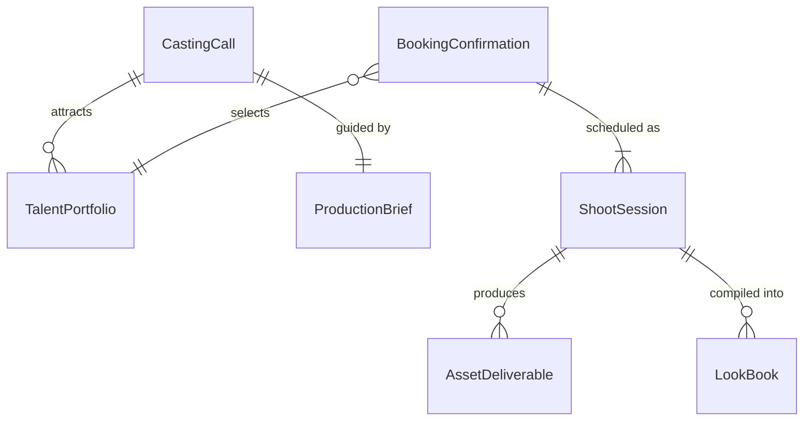
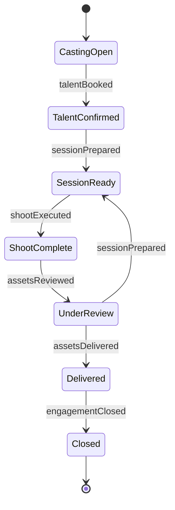
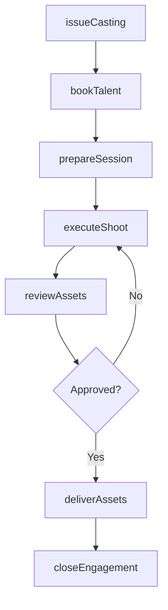
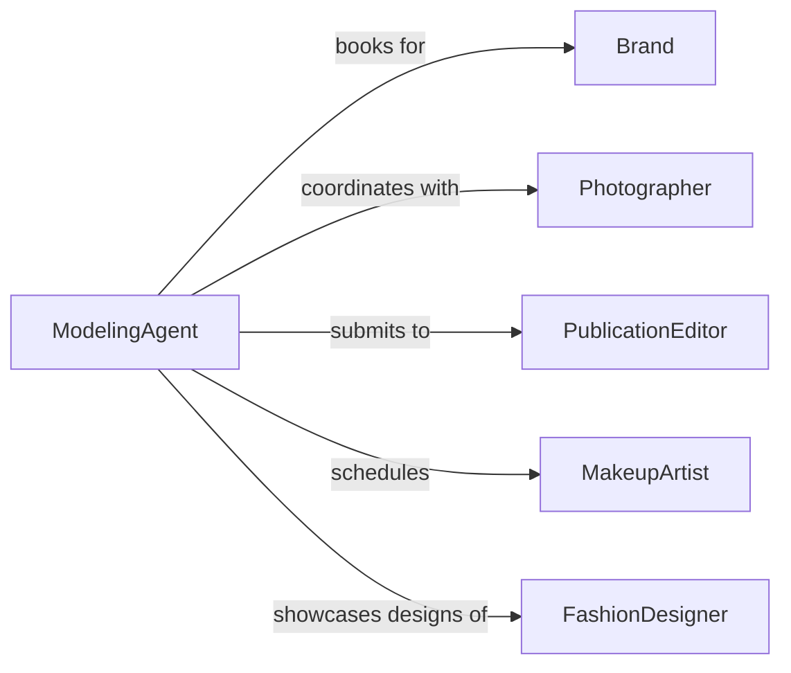

# Model Cosmetics, Clothing, or Accessories

> Business-as-Code definition for fashion and beauty modeling operations. Models the process of casting, booking, styling, and executing product showcase sessions for cosmetics, apparel, and accessories across editorial, commercial, and runway formats.

## Overview

Modeling cosmetics, clothing, and accessories involves casting talent for specific product lines, coordinating styling and wardrobe, executing photo shoots, runway shows, and video productions, managing talent schedules, and delivering final assets to brands and publications. This definition exposes actions for modeling engagement management, event triggers for production milestones, and searches for talent portfolios and campaign asset records.

## Actors

| Actor | Description |
|-------|-------------|
| Brand | Fashion or beauty company commissioning the modeling engagement |
| Photographer | Professional capturing images for editorial or commercial use |
| PublicationEditor | Magazine or digital media decision-maker selecting content |
| MakeupArtist | Specialist applying cosmetic products for showcases |
| FashionDesigner | Creator of clothing or accessories being modeled |

## Roles

| Role | Description |
|------|-------------|
| ModelingAgent | Books talent and manages scheduling for modeling engagements |
| CreativeDirector | Sets the visual concept and oversees production execution |
| Stylist | Selects and coordinates outfits and accessories for sessions |
| ProductionManager | Manages logistics, timelines, and crew for shoots and shows |

## Entities

| Entity | Description |
|--------|-------------|
| CastingCall | Open or targeted request for model talent for a specific project |
| BookingConfirmation | Agreed engagement between model, agent, and brand |
| ShootSession | Scheduled photo, video, or runway production event |
| LookBook | Collection of styled product images for brand or seasonal review |
| TalentPortfolio | Model profile with measurements, photos, and experience |
| ProductionBrief | Creative direction document specifying mood, style, and requirements |
| AssetDeliverable | Final photographs, videos, or runway footage from a session |

## Actions

| Action | Description |
|--------|-------------|
| issueCasting | Create a casting call for model talent matching product requirements |
| bookTalent | Confirm a model for a specific engagement with terms |
| prepareSession | Coordinate styling, hair, makeup, and wardrobe for a shoot |
| executeShoot | Conduct the photo, video, or runway production |
| reviewAssets | Evaluate captured content for brand alignment and quality |
| deliverAssets | Provide final images or footage to the brand or publication |
| closeEngagement | Finalize payment, usage rights, and campaign records |

## Events

| Event | Description |
|-------|-------------|
| castingIssued | A casting call has been created for talent |
| talentBooked | A model has been confirmed for an engagement |
| sessionPrepared | Styling, hair, and makeup have been coordinated |
| shootExecuted | The production session has been conducted |
| assetsReviewed | Captured content has been evaluated for quality |
| assetsDelivered | Final images or footage have been provided |
| engagementClosed | Payment and usage rights have been finalized |

## Searches

| Search | Description |
|--------|-------------|
| findCastings | List open casting calls by product type, look, or date |
| getTalent | Search model portfolios by measurements, experience, or availability |
| getBookings | Retrieve confirmed engagements by brand, model, or date |
| getAssets | Find delivered photos or footage by campaign, product, or session |

## Entity Relationships



## State Diagram



## Workflow



## Actor Relationships



## Usage

### Calling Actions

```typescript
import { modelCosmeticsClothingAccessories } from '@headlessly/model-cosmetics-clothing-accessories'

const modeling = modelCosmeticsClothingAccessories()

// Issue a casting call
const casting = await modeling.issueCasting({
  brand: 'luxe-cosmetics',
  product: 'spring-collection-lipstick',
  requirements: { look: 'editorial', ageRange: '20-30', diversity: true },
  shootDate: '2026-04-05'
})

// Book talent and prepare the session
const booking = await modeling.bookTalent({
  castingId: casting.id,
  modelId: 'talent-4421',
  rate: 2500,
  usageRights: ['print', 'digital', 'social-media']
})

await modeling.prepareSession({
  bookingId: booking.id,
  styling: { makeup: 'spring-palette', wardrobe: 'editorial-minimal' },
  location: 'downtown-studio-b'
})
```

### Event-Driven Automation

```typescript
// Auto-prepare session when talent is booked
modeling.talentBooked(async ({ bookingId, shootDate }) => {
  await modeling.prepareSession({
    bookingId,
    scheduleMakeup: true,
    scheduleWardrobe: true,
    confirmDate: shootDate
  })
})

// Notify brand when assets are ready
modeling.assetsDelivered(async ({ campaignId, assetCount, brand }) => {
  await notify({
    to: brand,
    message: `${assetCount} final assets delivered for campaign ${campaignId}`
  })
})
```
