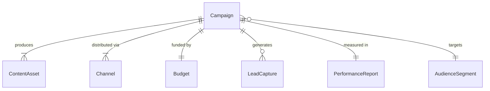
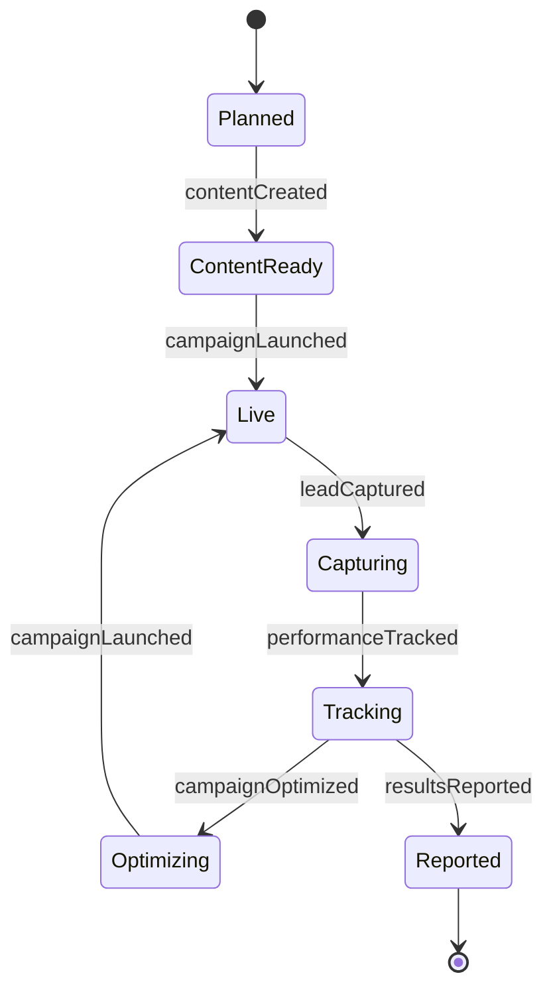
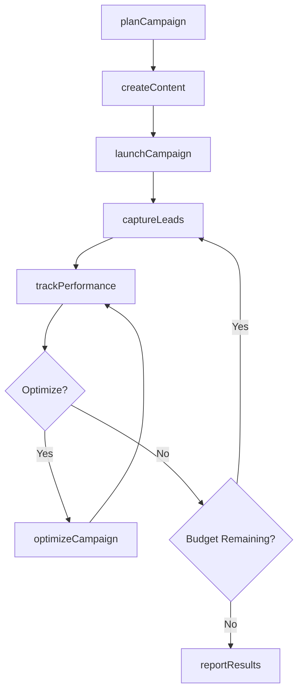
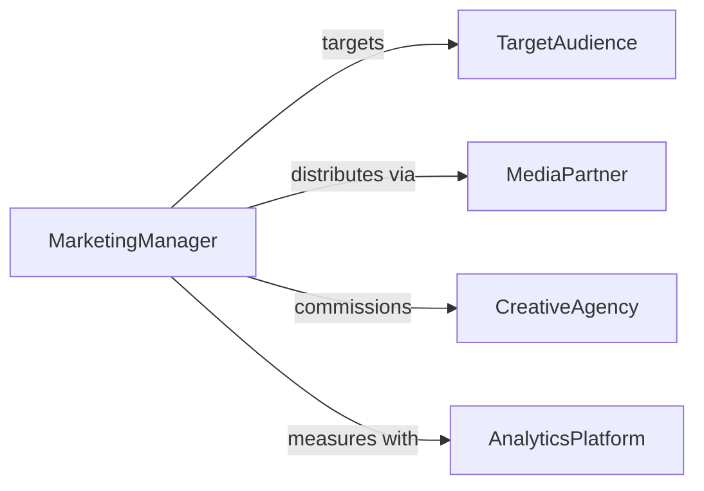

# Perform Marketing Activities

> Business-as-Code definition for marketing activity execution. Models the planning, delivery, and measurement of marketing campaigns across digital, print, and experiential channels.

## Overview

Marketing activity execution involves planning campaigns, creating content, distributing materials across channels, managing budgets, and measuring performance outcomes. This definition exposes actions for campaign lifecycle management, event triggers for engagement milestones, and searches for campaign analytics and audience data.

## Actors

| Actor | Description |
|-------|-------------|
| TargetAudience | Prospective customers or market segments being reached |
| MediaPartner | Advertising platform or publication distributing content |
| CreativeAgency | External firm producing marketing content and designs |
| AnalyticsPlatform | Provides campaign performance data and attribution |
| CompetitorIntel | Source of competitive market positioning information |

## Roles

| Role | Description |
|------|-------------|
| MarketingManager | Plans and oversees marketing campaigns |
| ContentCreator | Develops copy, graphics, and multimedia assets |
| DigitalMarketingSpecialist | Manages online advertising and social media channels |
| MarketingAnalyst | Measures campaign performance and reports on ROI |

## Entities

| Entity | Description |
|--------|-------------|
| Campaign | Coordinated marketing initiative with objectives and timeline |
| ContentAsset | Creative material such as copy, image, video, or landing page |
| Channel | Distribution medium such as email, social, search, or print |
| Budget | Financial allocation for a campaign or channel |
| LeadCapture | Contact information collected through marketing activities |
| PerformanceReport | Metrics summary for a campaign or channel |
| AudienceSegment | Defined group of prospects based on demographics or behavior |

## Actions

| Action | Description |
|--------|-------------|
| planCampaign | Define objectives, audience, channels, and budget |
| createContent | Develop marketing assets for distribution |
| launchCampaign | Activate the campaign across selected channels |
| captureLeads | Collect prospect information through marketing touchpoints |
| trackPerformance | Monitor engagement, conversion, and spend metrics |
| optimizeCampaign | Adjust targeting, creative, or budget based on results |
| reportResults | Generate a performance summary for stakeholders |

## Events

| Event | Description |
|-------|-------------|
| campaignPlanned | Campaign objectives and strategy have been defined |
| contentCreated | Marketing assets have been produced |
| campaignLaunched | The campaign has been activated across channels |
| leadCaptured | A new prospect contact has been collected |
| performanceTracked | Campaign metrics have been updated |
| campaignOptimized | Targeting or creative has been adjusted |
| resultsReported | A performance summary has been delivered |

## Searches

| Search | Description |
|--------|-------------|
| findCampaigns | List campaigns by status, channel, or objective |
| getPerformance | Retrieve metrics for a campaign by date or channel |
| getLeads | List captured prospects by campaign or segment |
| getContentAssets | Find marketing materials by type, campaign, or status |

## Entity Relationships



## State Diagram



## Workflow



## Actor Relationships



## Usage

### Calling Actions

```typescript
import { performMarketingActivities } from '@headlessly/perform-marketing-activities'

const marketing = performMarketingActivities()

// Plan a product launch campaign
const campaign = await marketing.planCampaign({
  name: 'Spring Product Launch 2026',
  objective: 'lead-generation',
  audience: 'smb-technology-buyers',
  channels: ['email', 'linkedin', 'search'],
  budget: 25000,
  startDate: '2026-03-15'
})

// Create and launch content
await marketing.createContent({
  campaignId: campaign.id,
  assets: ['landing-page', 'email-sequence', 'social-posts']
})

await marketing.launchCampaign({ campaignId: campaign.id })

// Track results
const metrics = await marketing.trackPerformance({
  campaignId: campaign.id,
  metrics: ['impressions', 'clicks', 'conversions', 'cost-per-lead']
})
```

### Event-Driven Automation

```typescript
// Auto-route new leads to sales
marketing.leadCaptured(async ({ leadId, campaign, score }) => {
  if (score > 70) {
    await routeToSales({ leadId, priority: 'high' })
  }
})

// Alert team when budget is 80% spent
marketing.performanceTracked(async ({ campaignId, budgetSpent, budgetTotal }) => {
  if (budgetSpent / budgetTotal > 0.8) {
    await notify({
      to: 'marketing-team',
      message: `Campaign ${campaignId} has used 80% of budget`
    })
  }
})
```
