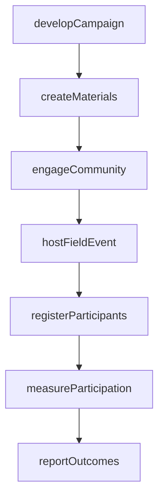
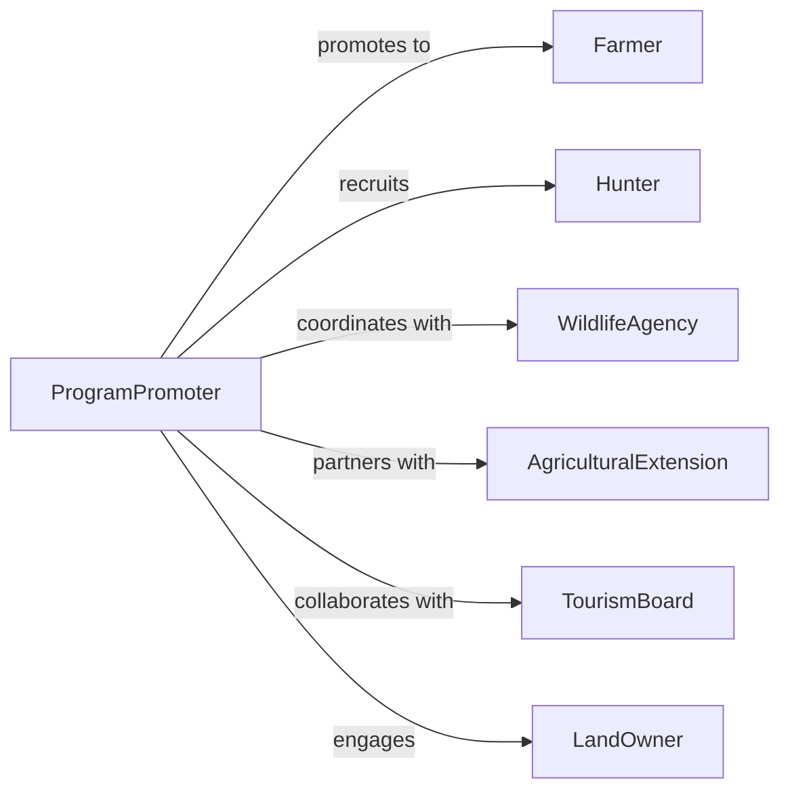

# Promote Agricultural or Hunting Activities

> Business-as-Code definition for agricultural and hunting activity promotion. Models the process of developing outreach programs, engaging rural communities, marketing agritourism and outdoor recreation, and tracking participation outcomes.

## Overview

Promoting agricultural and hunting activities involves developing awareness campaigns for farming programs, outdoor recreation, and agritourism; engaging landowners, sportsmen, and rural communities; coordinating with wildlife agencies and agricultural extension services; and measuring participation and economic impact. This definition exposes actions for promotional program management, event triggers for outreach milestones, and searches for participation and program effectiveness records.

## Actors

| Actor | Description |
|-------|-------------|
| Farmer | Agricultural producer participating in or benefiting from promoted programs |
| Hunter | Licensed sportsman engaging in promoted hunting activities |
| WildlifeAgency | State or federal body managing game populations and hunting regulations |
| AgriculturalExtension | University-affiliated service providing farming education and outreach |
| TourismBoard | Organization promoting regional agritourism and outdoor recreation |
| LandOwner | Property owner offering access for hunting or agricultural tours |

## Roles

| Role | Description |
|------|-------------|
| ProgramPromoter | Develops and executes campaigns for agricultural and hunting activities |
| OutreachCoordinator | Engages communities and schedules promotional events |
| WildlifeEducator | Delivers hunter safety and conservation education content |
| AgritourismPlanner | Designs and markets farm-based tourism experiences |

## Entities

| Entity | Description |
|--------|-------------|
| PromotionalCampaign | Organized marketing effort for agricultural or hunting programs |
| OutreachEvent | Field day, fair, or workshop promoting activities to the public |
| HuntingProgram | Structured hunting season, permit, or guided experience offering |
| AgriculturalProgram | Farming initiative, subsidy, or educational series being promoted |
| ParticipationRecord | Documented enrollment or attendance in a promoted activity |
| PromotionalMaterial | Brochures, videos, and digital content supporting outreach |
| ImpactReport | Summary of program participation, economic benefit, and conservation outcomes |

## Actions

| Action | Description |
|--------|-------------|
| developCampaign | Design a promotional initiative for agricultural or hunting activities |
| createMaterials | Produce brochures, guides, and digital content for outreach |
| hostFieldEvent | Organize farm tours, field days, or outdoor recreation showcases |
| engageCommunity | Contact landowners, sportsmen, and rural residents about programs |
| registerParticipants | Enroll individuals in promoted programs or activities |
| measureParticipation | Track attendance, enrollment, and economic impact |
| reportOutcomes | Summarize promotional program results and conservation benefits |

## Events

| Event | Description |
|-------|-------------|
| campaignDeveloped | A promotional initiative has been designed |
| materialsCreated | Outreach content and collateral have been produced |
| fieldEventHosted | A farm tour, field day, or outdoor showcase has occurred |
| communityEngaged | Landowners and sportsmen have been contacted about programs |
| participantsRegistered | Individuals have been enrolled in promoted activities |
| participationMeasured | Attendance and economic data have been tracked |
| outcomesReported | Program results and conservation benefits have been summarized |

## Searches

| Search | Description |
|--------|-------------|
| findCampaigns | List promotional campaigns by activity type, region, or season |
| getEvents | Retrieve field events by type, date, or location |
| getParticipation | Search enrollment and attendance records by program or period |
| getImpact | Query economic and conservation outcome data by campaign |

## Workflow



## Actor Relationships



## Usage

### Calling Actions

```typescript
import { promoteAgriculturalHuntingActivities } from '@headlessly/promote-agricultural-hunting-activities'

const promo = promoteAgriculturalHuntingActivities()

// Develop a campaign for fall hunting season
const campaign = await promo.developCampaign({
  activity: 'managed-deer-hunt',
  region: 'ozark-highlands',
  season: 'fall-2026',
  targetAudience: ['licensed-hunters', 'first-time-hunters'],
  partnerAgency: 'state-wildlife-conservation'
})

// Host a field event
await promo.hostFieldEvent({
  campaignId: campaign.id,
  type: 'hunter-safety-clinic',
  location: 'conservation-area-north',
  date: '2026-09-10',
  capacity: 75
})

// Measure participation
await promo.measureParticipation({
  campaignId: campaign.id,
  metrics: {
    registrations: 320,
    permits: 280,
    economicImpact: 450000
  }
})
```

### Event-Driven Automation

```typescript
// Auto-create materials when campaign is developed
promo.campaignDeveloped(async ({ campaignId, activity, region }) => {
  await promo.createMaterials({
    campaignId,
    formats: ['trail-map', 'regulations-guide', 'social-media-graphics'],
    region
  })
})

// Alert coordinators on high registration events
promo.participantsRegistered(async ({ eventId, count, capacity }) => {
  if (count >= capacity * 0.9) {
    await notify({
      to: 'event-coordinator',
      message: `Event ${eventId} is at ${Math.round(count / capacity * 100)}% capacity`
    })
  }
})
```
