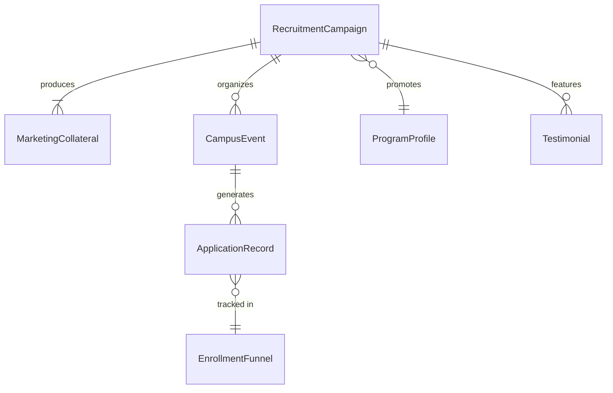
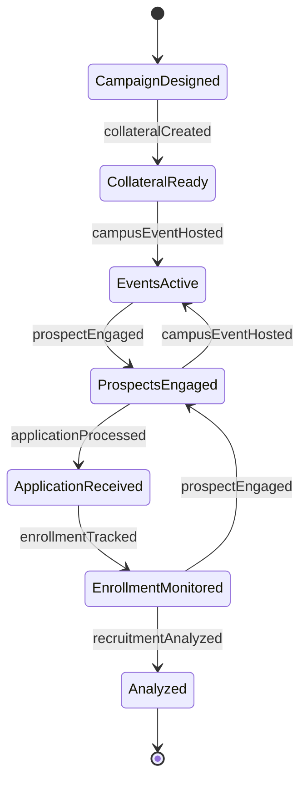
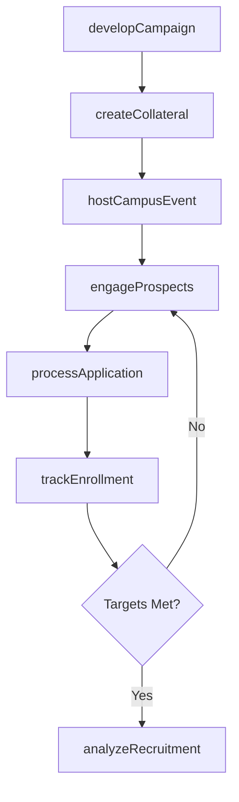
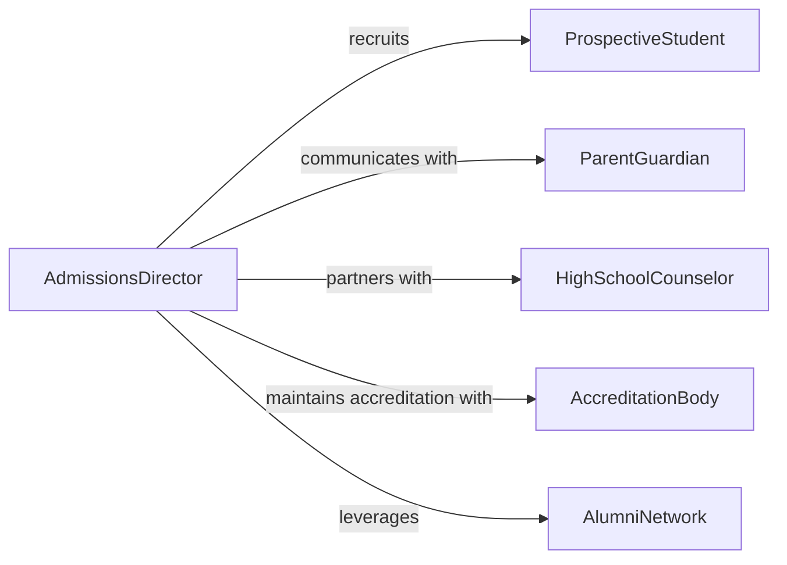

# Promote Educational Institutions or Programs

> Business-as-Code definition for educational institution and program promotion. Models the process of developing enrollment marketing strategies, engaging prospective students and families, executing recruitment campaigns, and tracking enrollment outcomes.

## Overview

Promoting educational institutions involves developing brand messaging, targeting prospective students and families, organizing campus events and informational sessions, executing recruitment campaigns across digital and traditional channels, and measuring application and enrollment conversion rates. This definition exposes actions for enrollment marketing management, event triggers for recruitment milestones, and searches for prospect engagement and enrollment analytics.

## Actors

| Actor | Description |
|-------|-------------|
| ProspectiveStudent | Individual considering enrollment at the institution |
| ParentGuardian | Family member influencing the enrollment decision |
| HighSchoolCounselor | Advisor referring students to post-secondary programs |
| AccreditationBody | Organization certifying the quality of educational programs |
| AlumniNetwork | Former students supporting recruitment through testimonials |

## Roles

| Role | Description |
|------|-------------|
| AdmissionsDirector | Sets enrollment strategy and oversees recruitment operations |
| RecruitmentCounselor | Engages prospective students and guides them through application |
| MarketingSpecialist | Creates promotional content and manages digital campaigns |
| EventCoordinator | Organizes campus visits, open houses, and information sessions |

## Entities

| Entity | Description |
|--------|-------------|
| RecruitmentCampaign | Organized marketing effort targeting prospective students |
| ProgramProfile | Description of academic offerings, outcomes, and differentiators |
| CampusEvent | Open house, tour, or information session for prospects |
| ApplicationRecord | Prospective student submission for program admission |
| EnrollmentFunnel | Staged pathway from inquiry through enrollment |
| Testimonial | Alumni or student endorsement of the institution or program |
| MarketingCollateral | Brochures, videos, and digital assets promoting the institution |

## Actions

| Action | Description |
|--------|-------------|
| developCampaign | Design a recruitment marketing initiative for a program or institution |
| createCollateral | Produce brochures, videos, and digital content for promotion |
| hostCampusEvent | Organize and run tours, open houses, or information sessions |
| engageProspects | Contact and nurture prospective students through the funnel |
| processApplication | Receive and review prospective student submissions |
| trackEnrollment | Monitor conversion rates from inquiry through matriculation |
| analyzeRecruitment | Assess campaign effectiveness and enrollment trends |

## Events

| Event | Description |
|-------|-------------|
| campaignDeveloped | A recruitment marketing initiative has been designed |
| collateralCreated | Promotional content and materials have been produced |
| campusEventHosted | A tour, open house, or information session has occurred |
| prospectEngaged | A prospective student has been contacted or nurtured |
| applicationProcessed | A student submission has been received and reviewed |
| enrollmentTracked | Conversion metrics have been updated |
| recruitmentAnalyzed | Campaign effectiveness has been assessed |

## Searches

| Search | Description |
|--------|-------------|
| findProspects | List prospective students by program interest, region, or stage |
| getCampaigns | Retrieve recruitment campaigns by program, channel, or date |
| getEvents | Search campus events by type, date, or attendance |
| getEnrollmentMetrics | Query conversion rates by program, campaign, or period |

## Entity Relationships



## State Diagram



## Workflow



## Actor Relationships



## Usage

### Calling Actions

```typescript
import { promoteEducationalInstitutionsPrograms } from '@headlessly/promote-educational-institutions-programs'

const admissions = promoteEducationalInstitutionsPrograms()

// Develop a recruitment campaign for a new program
const campaign = await admissions.developCampaign({
  program: 'data-science-ms',
  targetAudience: 'stem-undergraduates',
  channels: ['social-media', 'college-fairs', 'email'],
  enrollmentGoal: 60,
  term: 'fall-2026'
})

// Host a virtual information session
await admissions.hostCampusEvent({
  campaignId: campaign.id,
  type: 'virtual-info-session',
  topic: 'data-science-career-outcomes',
  date: '2026-03-20',
  speakers: ['program-director', 'alumni-panel']
})

// Track enrollment funnel progress
await admissions.trackEnrollment({
  campaignId: campaign.id,
  metrics: { inquiries: 450, applications: 120, accepted: 85, enrolled: 52 }
})
```

### Event-Driven Automation

```typescript
// Auto-send follow-up materials after campus event
admissions.campusEventHosted(async ({ eventId, attendees }) => {
  for (const attendee of attendees) {
    await admissions.engageProspects({
      prospectId: attendee.id,
      channel: 'email',
      content: 'post-event-follow-up'
    })
  }
})

// Alert admissions team when enrollment targets are at risk
admissions.enrollmentTracked(async ({ campaignId, enrollmentGoal, enrolled, deadline }) => {
  const progress = enrolled / enrollmentGoal
  if (progress < 0.5 && isApproaching(deadline)) {
    await notify({
      to: 'admissions-team',
      message: `Campaign ${campaignId} at ${Math.round(progress * 100)}% of enrollment goal`
    })
  }
})
```
