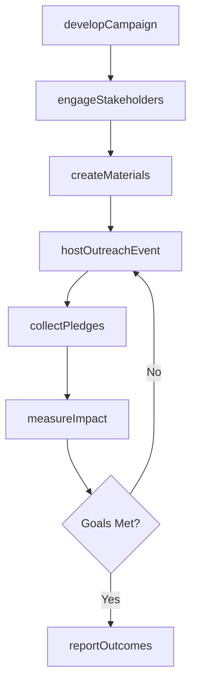
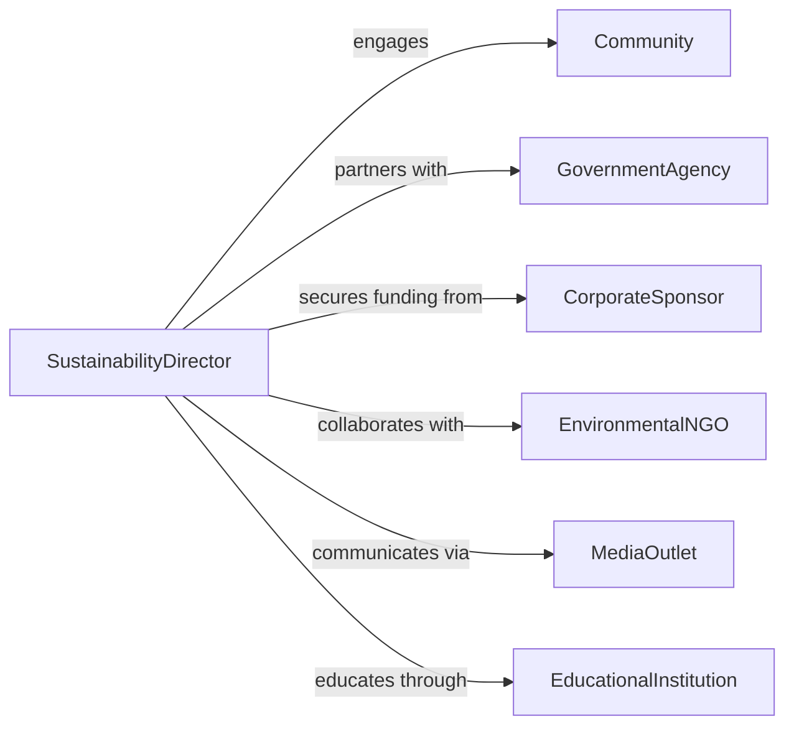

# Promote Environmental Sustainability or Conservation Initiatives

> Business-as-Code definition for environmental sustainability promotion. Models the process of developing conservation campaigns, engaging stakeholders, delivering educational outreach, and measuring adoption of sustainable practices.

## Overview

Promoting environmental sustainability involves developing conservation messaging, building coalitions of stakeholders, executing awareness campaigns across community and digital channels, facilitating adoption of green practices, and measuring environmental impact outcomes. This definition exposes actions for sustainability campaign management, event triggers for engagement milestones, and searches for outreach effectiveness and adoption records.

## Actors

| Actor | Description |
|-------|-------------|
| Community | Local residents and organizations targeted by sustainability initiatives |
| GovernmentAgency | Regulatory body providing grants, mandates, or policy support |
| CorporateSponsor | Business providing funding or partnership for green initiatives |
| EnvironmentalNGO | Nonprofit organization collaborating on conservation efforts |
| MediaOutlet | Press and broadcast channels amplifying sustainability messaging |
| EducationalInstitution | School or university participating in environmental education |

## Roles

| Role | Description |
|------|-------------|
| SustainabilityDirector | Sets strategy and oversees conservation promotion programs |
| OutreachCoordinator | Plans and executes community engagement campaigns |
| EnvironmentalEducator | Delivers sustainability training and educational content |
| ImpactAnalyst | Measures adoption rates and environmental outcomes |

## Entities

| Entity | Description |
|--------|-------------|
| Campaign | Organized sustainability promotion effort with goals and timeline |
| OutreachEvent | Community workshop, webinar, or awareness activity |
| EducationalMaterial | Brochures, videos, or curricula promoting conservation practices |
| AdoptionPledge | Individual or organizational commitment to sustainable behavior |
| ImpactMetric | Quantified environmental outcome such as emissions reduced or waste diverted |
| PartnershipAgreement | Formal collaboration with sponsors, NGOs, or government bodies |
| GrantApplication | Request for funding to support sustainability initiatives |

## Actions

| Action | Description |
|--------|-------------|
| developCampaign | Design a sustainability promotion initiative with goals and messaging |
| engageStakeholders | Build partnerships with government, corporate, and NGO collaborators |
| createMaterials | Produce educational content and promotional collateral |
| hostOutreachEvent | Organize and deliver community engagement activities |
| collectPledges | Gather commitments from individuals or organizations to adopt practices |
| measureImpact | Track environmental outcomes and adoption rates |
| reportOutcomes | Publish results and progress toward sustainability goals |

## Events

| Event | Description |
|-------|-------------|
| campaignDeveloped | A sustainability initiative has been designed |
| stakeholdersEngaged | Partnerships have been established with collaborators |
| materialsCreated | Educational content and collateral have been produced |
| outreachEventHosted | A community engagement activity has been delivered |
| pledgesCollected | Sustainability commitments have been gathered |
| impactMeasured | Environmental outcomes have been quantified |
| outcomesReported | Program results have been published |

## Searches

| Search | Description |
|--------|-------------|
| findCampaigns | List sustainability campaigns by initiative, region, or status |
| getEvents | Retrieve outreach events by type, date, or attendance |
| getPledges | Search adoption commitments by organization, practice, or date |
| getImpactMetrics | Query environmental outcomes by campaign, metric type, or period |
| getPartnerships | Find partner agreements by organization, type, or status |

## Workflow



## Actor Relationships



## Usage

### Calling Actions

```typescript
import { promoteEnvironmentalSustainabilityConservationInit } from '@headlessly/promote-environmental-sustainability-conservation-initiatives'

const sustainability = promoteEnvironmentalSustainabilityConservationInit()

// Develop a conservation campaign
const campaign = await sustainability.developCampaign({
  name: 'Green Commute Challenge',
  goal: 'reduce-commuter-emissions-20-percent',
  region: 'metro-portland',
  duration: { start: '2026-04-01', end: '2026-06-30' }
})

// Host a community outreach event
await sustainability.hostOutreachEvent({
  campaignId: campaign.id,
  type: 'community-workshop',
  topic: 'cycling-infrastructure-and-transit',
  venue: 'portland-community-center',
  expectedAttendance: 150
})

// Measure environmental impact
await sustainability.measureImpact({
  campaignId: campaign.id,
  metrics: [
    { type: 'co2-reduced', amount: 45, unit: 'metric-tons' },
    { type: 'transit-ridership-increase', amount: 12, unit: 'percent' }
  ]
})
```

### Event-Driven Automation

```typescript
// Auto-create materials when campaign is developed
sustainability.campaignDeveloped(async ({ campaignId, goal, region }) => {
  await sustainability.createMaterials({
    campaignId,
    formats: ['social-media-kit', 'community-flyer', 'web-landing-page'],
    languages: ['en', 'es']
  })
})

// Alert leadership when impact goals are achieved
sustainability.impactMeasured(async ({ campaignId, metrics, goalProgress }) => {
  if (goalProgress >= 100) {
    await notify({
      to: 'executive-team',
      message: `Campaign ${campaignId} has achieved its sustainability target`
    })
  }
})
```
