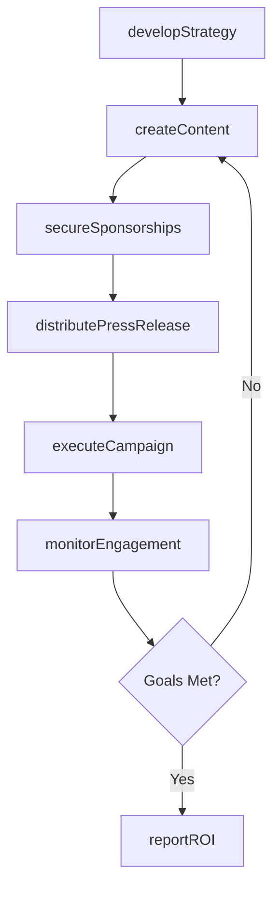
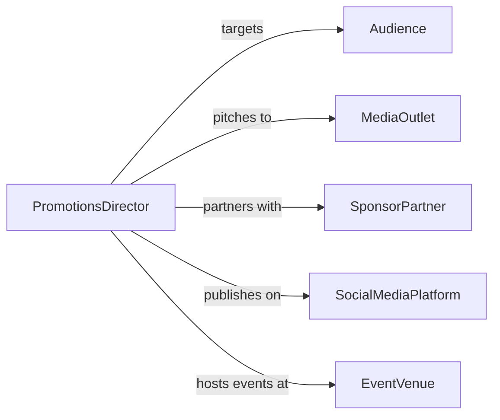

# Promote Products, Activities, or Organizations

> Business-as-Code definition for general promotional operations. Models the process of developing brand awareness campaigns, executing multi-channel promotional strategies, managing public relations, and tracking brand visibility and engagement outcomes.

## Overview

Promoting products, activities, or organizations involves crafting brand narratives, developing promotional strategies across digital, print, and event channels, coordinating public relations and media outreach, executing campaigns, and measuring brand awareness and audience engagement. This definition exposes actions for promotional campaign lifecycle management, event triggers for visibility milestones, and searches for brand analytics and campaign performance records.

## Actors

| Actor | Description |
|-------|-------------|
| Audience | Target public, community, or market segment for promotional messages |
| MediaOutlet | Press, broadcast, or digital publication amplifying promotional content |
| SponsorPartner | Organization providing funding or co-branding for promotional efforts |
| SocialMediaPlatform | Digital channel hosting promotional posts and engagement |
| EventVenue | Location hosting promotional activities or brand experiences |

## Roles

| Role | Description |
|------|-------------|
| PromotionsDirector | Sets strategy and oversees all promotional campaigns |
| PublicRelationsManager | Manages media relationships and earned coverage |
| ContentCreator | Produces promotional copy, visuals, and multimedia |
| CampaignAnalyst | Tracks brand visibility, engagement metrics, and campaign ROI |

## Entities

| Entity | Description |
|--------|-------------|
| PromotionalCampaign | Coordinated effort to increase visibility of a product, activity, or organization |
| PressRelease | Official statement distributed to media outlets |
| BrandAsset | Logo, tagline, visual identity element used across promotions |
| SocialPost | Individual piece of content published on a social media platform |
| MediaCoverage | Earned press mention or feature story about the promoted entity |
| SponsorshipAgreement | Partnership terms for co-branded promotional activities |
| EngagementMetric | Quantified measure of audience interaction with promotional content |

## Actions

| Action | Description |
|--------|-------------|
| developStrategy | Define promotional goals, messaging, and channel mix |
| createContent | Produce copy, visuals, and multimedia for promotional channels |
| distributePressRelease | Issue official announcements to media outlets |
| executeCampaign | Launch promotional activities across selected channels |
| secureSponsorships | Establish co-branding or funding partnerships |
| monitorEngagement | Track audience interactions and brand visibility in real time |
| reportROI | Calculate and summarize promotional return on investment |

## Events

| Event | Description |
|-------|-------------|
| strategyDeveloped | Promotional goals and plans have been defined |
| contentCreated | Copy, visuals, and multimedia have been produced |
| pressReleaseDistributed | An official announcement has been issued to media |
| campaignExecuted | Promotional activities have been launched |
| sponsorshipSecured | A co-branding or funding partnership has been established |
| engagementMonitored | Audience interactions have been tracked |
| roiReported | Promotional return on investment has been calculated |

## Searches

| Search | Description |
|--------|-------------|
| findCampaigns | List promotional campaigns by product, organization, or status |
| getMediaCoverage | Retrieve press mentions by outlet, date, or sentiment |
| getEngagement | Query audience interaction metrics by channel, content, or period |
| getSponsorships | Search partnership agreements by organization, value, or status |

## Workflow



## Actor Relationships



## Usage

### Calling Actions

```typescript
import { promoteProductsActivitiesOrganizations } from '@headlessly/promote-products-activities-organizations'

const promo = promoteProductsActivitiesOrganizations()

// Develop a promotional strategy
const strategy = await promo.developStrategy({
  subject: 'annual-charity-gala',
  organization: 'city-arts-foundation',
  goals: ['increase-attendance-25-percent', 'secure-3-sponsors'],
  channels: ['social-media', 'local-press', 'email-blast'],
  budget: 15000
})

// Execute the campaign
await promo.executeCampaign({
  strategyId: strategy.id,
  launchDate: '2026-04-01',
  activities: [
    { channel: 'instagram', content: 'gala-teaser-video' },
    { channel: 'local-newspaper', content: 'press-release' },
    { channel: 'email', content: 'invitation-blast' }
  ]
})

// Report ROI after the event
await promo.reportROI({
  strategyId: strategy.id,
  spend: 14200,
  outcomes: { attendance: 450, sponsorships: 4, mediaImpressions: 85000 }
})
```

### Event-Driven Automation

```typescript
// Auto-distribute press release when content is ready
promo.contentCreated(async ({ strategyId, contentType }) => {
  if (contentType === 'press-release') {
    await promo.distributePressRelease({
      strategyId,
      outlets: ['local-press', 'industry-trade', 'online-news']
    })
  }
})

// Alert team on media coverage
promo.engagementMonitored(async ({ channel, impressions, threshold }) => {
  if (impressions > threshold) {
    await notify({
      to: 'pr-team',
      message: `${channel} impressions exceeded target: ${impressions.toLocaleString()}`
    })
  }
})
```
