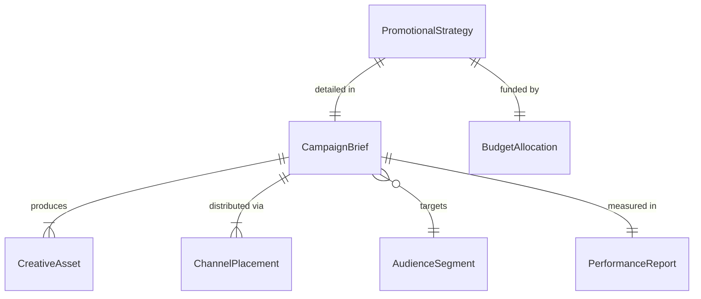
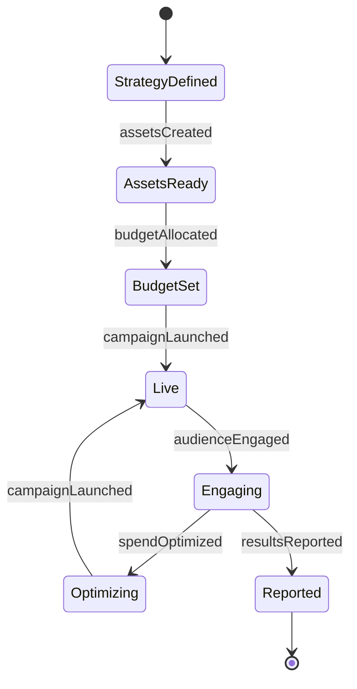
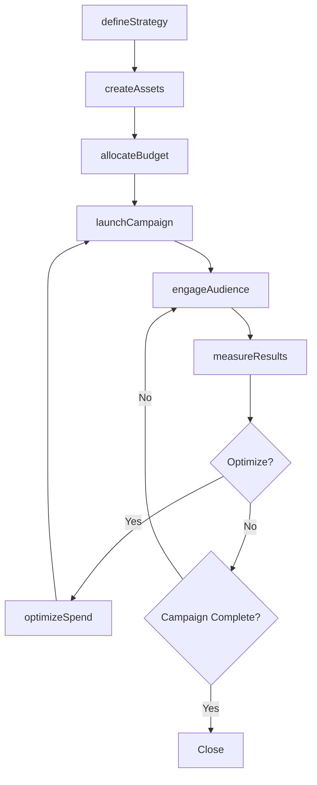
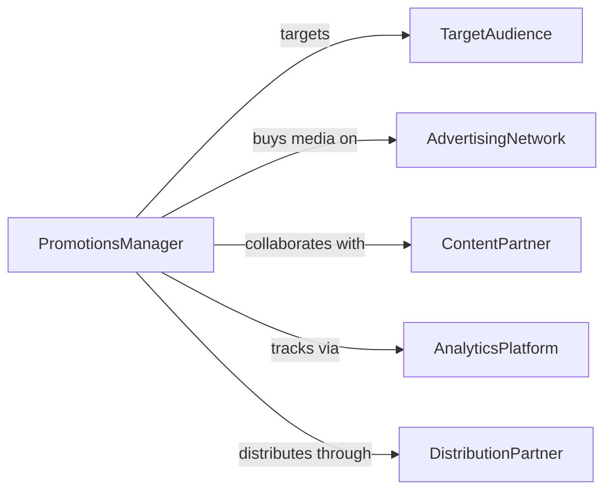

# Promote Products, Services, or Programs

> Business-as-Code definition for integrated product, service, and program promotion. Models the complete promotional lifecycle from strategy development through multi-channel execution, audience engagement, and performance measurement.

## Overview

Promoting products, services, or programs involves defining promotional objectives, creating compelling messaging, selecting and executing across marketing channels, engaging target audiences, and measuring campaign effectiveness and return on investment. This definition exposes actions for promotional strategy and execution management, event triggers for campaign milestones, and searches for audience analytics and campaign performance records.

## Actors

| Actor | Description |
|-------|-------------|
| TargetAudience | Prospective customers or participants for the promoted offering |
| AdvertisingNetwork | Platform distributing paid promotional content across channels |
| ContentPartner | Collaborator creating or co-producing promotional materials |
| AnalyticsPlatform | System tracking audience engagement and conversion metrics |
| DistributionPartner | Channel partner amplifying promotional reach |

## Roles

| Role | Description |
|------|-------------|
| PromotionsManager | Develops strategy and oversees promotional campaign execution |
| CopyWriter | Creates persuasive messaging and promotional copy |
| DigitalMarketer | Manages online advertising and social media promotion |
| PerformanceAnalyst | Measures campaign metrics and optimizes spending |

## Entities

| Entity | Description |
|--------|-------------|
| PromotionalStrategy | Plan defining objectives, audience, channels, and budget |
| CampaignBrief | Detailed specification for a promotional campaign execution |
| CreativeAsset | Visual, written, or multimedia content used in promotions |
| ChannelPlacement | Specific location and timing of promotional content delivery |
| AudienceSegment | Defined group targeted based on demographics or behavior |
| PerformanceReport | Summary of campaign reach, engagement, and conversion data |
| BudgetAllocation | Distribution of promotional spend across channels |

## Actions

| Action | Description |
|--------|-------------|
| defineStrategy | Establish promotional objectives, audience, and channel mix |
| createAssets | Produce copy, visuals, and multimedia for campaign channels |
| allocateBudget | Distribute promotional spending across channels and placements |
| launchCampaign | Activate promotional content across selected channels |
| engageAudience | Interact with and nurture target segments through campaign activities |
| optimizeSpend | Adjust channel allocation based on real-time performance data |
| measureResults | Evaluate campaign reach, engagement, and conversion outcomes |

## Events

| Event | Description |
|-------|-------------|
| strategyDefined | Promotional objectives and plans have been established |
| assetsCreated | Campaign copy, visuals, and multimedia have been produced |
| budgetAllocated | Promotional spending has been distributed across channels |
| campaignLaunched | Promotional content has been activated |
| audienceEngaged | Target segments have been reached and interacted with |
| spendOptimized | Channel allocation has been adjusted based on performance |
| resultsReported | Campaign outcomes have been evaluated |

## Searches

| Search | Description |
|--------|-------------|
| findCampaigns | List promotional campaigns by product, channel, or status |
| getAssets | Retrieve creative content by campaign, format, or channel |
| getPerformance | Query engagement and conversion metrics by campaign or period |
| getSegments | Search audience segments by demographics, behavior, or campaign |
| getBudgets | Find budget allocations by campaign, channel, or spend level |

## Entity Relationships



## State Diagram



## Workflow



## Actor Relationships



## Usage

### Calling Actions

```typescript
import { promoteProductsServicesPrograms } from '@headlessly/promote-products-services-programs'

const promo = promoteProductsServicesPrograms()

// Define a promotional strategy
const strategy = await promo.defineStrategy({
  offering: 'professional-certification-program',
  objectives: ['increase-enrollment-30-percent', 'build-brand-awareness'],
  audience: 'mid-career-professionals',
  channels: ['linkedin', 'email', 'webinar'],
  budget: 25000
})

// Create and launch promotional assets
const assets = await promo.createAssets({
  strategyId: strategy.id,
  formats: [
    { type: 'linkedin-sponsored-post', count: 5 },
    { type: 'email-sequence', count: 4 },
    { type: 'webinar-landing-page', count: 1 }
  ]
})

await promo.launchCampaign({
  strategyId: strategy.id,
  startDate: '2026-03-01',
  endDate: '2026-04-30'
})
```

### Event-Driven Automation

```typescript
// Auto-optimize when performance data is available
promo.resultsReported(async ({ campaignId, channels }) => {
  const underperforming = channels.filter(c => c.cpa > c.targetCPA)
  if (underperforming.length > 0) {
    await promo.optimizeSpend({
      campaignId,
      reduce: underperforming.map(c => c.name),
      increase: channels.filter(c => c.cpa <= c.targetCPA * 0.8).map(c => c.name)
    })
  }
})

// Notify team when campaign launches
promo.campaignLaunched(async ({ campaignId, offering, channels }) => {
  await notify({
    to: 'marketing-team',
    message: `Campaign for ${offering} is live on ${channels.join(', ')}`
  })
})
```
