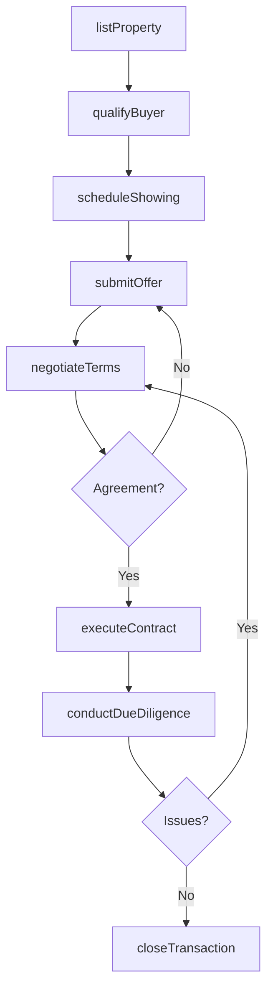
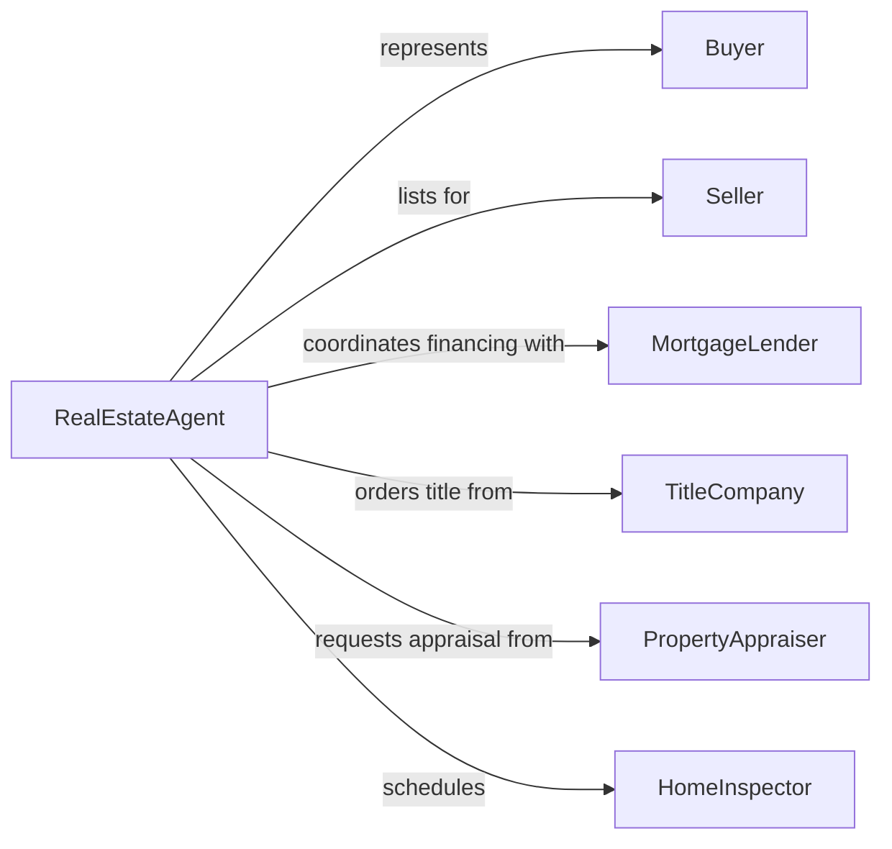

# Contract Real Estate to Clients

> Business-as-Code definition for real estate contracting. Models the process of listing properties, qualifying buyers, negotiating terms, executing purchase or lease agreements, and closing real estate transactions.

## Overview

Real estate contracting involves listing properties for sale or lease, matching properties to qualified buyers or tenants, conducting showings, negotiating offer terms, managing due diligence, and executing closing transactions. This definition exposes actions for real estate transaction management, event triggers for deal milestones, and searches for property listings and transaction history records.

## Actors

| Actor | Description |
|-------|-------------|
| Buyer | Individual or entity purchasing or leasing real property |
| Seller | Property owner listing real estate for sale or lease |
| MortgageLender | Financial institution providing purchase financing |
| TitleCompany | Verifies ownership history and issues title insurance |
| PropertyAppraiser | Determines fair market value of the property |
| HomeInspector | Evaluates the physical condition of the property |

## Roles

| Role | Description |
|------|-------------|
| RealEstateAgent | Manages listings, showings, and client relationships |
| TransactionCoordinator | Oversees paperwork and deadlines through closing |
| BrokerOfRecord | Supervises agent activities and ensures regulatory compliance |
| EscrowOfficer | Manages funds and document exchange during closing |

## Entities

| Entity | Description |
|--------|-------------|
| PropertyListing | Marketed property with details, pricing, and availability |
| BuyerProfile | Qualified buyer preferences, budget, and financing status |
| PurchaseOffer | Formal bid with proposed price and contingencies |
| CounterOffer | Seller response modifying the terms of an offer |
| PurchaseAgreement | Executed contract binding buyer and seller to transaction terms |
| InspectionReport | Documented findings from property condition evaluation |
| AppraisalReport | Professional assessment of property market value |
| ClosingStatement | Final accounting of all transaction costs and disbursements |

## Actions

| Action | Description |
|--------|-------------|
| listProperty | Publish a property for sale or lease with marketing materials |
| qualifyBuyer | Verify buyer financial capacity and preferences |
| scheduleShowing | Arrange a property viewing for a prospective buyer |
| submitOffer | Present a purchase or lease offer from a buyer |
| negotiateTerms | Exchange counteroffers and reach agreement on price and conditions |
| executeContract | Finalize and sign the purchase or lease agreement |
| conductDueDiligence | Coordinate inspections, appraisals, and title searches |
| closeTransaction | Complete the transfer of ownership and disburse funds |

## Events

| Event | Description |
|-------|-------------|
| propertyListed | A property has been published for sale or lease |
| buyerQualified | A buyer has been verified as financially capable |
| showingScheduled | A property viewing has been arranged |
| offerSubmitted | A purchase or lease offer has been presented |
| termsNegotiated | Price and conditions have been agreed upon |
| contractExecuted | The purchase or lease agreement has been signed |
| dueDiligenceCompleted | Inspections, appraisals, and title checks are finished |
| transactionClosed | Ownership has been transferred and funds disbursed |

## Searches

| Search | Description |
|--------|-------------|
| findListings | Search properties by location, price, type, or features |
| getBuyers | List qualified buyers by budget, preferences, or status |
| getOffers | Retrieve offers by property, buyer, or status |
| getTransactions | Find closed deals by agent, date, or property type |
| getInspections | Search inspection reports by property or finding type |

## Workflow



## Actor Relationships



## Usage

### Calling Actions

```typescript
import { contractRealEstateClients } from '@headlessly/contract-real-estate-clients'

const realty = contractRealEstateClients()

// List a property for sale
const listing = await realty.listProperty({
  address: '742 Evergreen Terrace',
  type: 'single-family',
  listPrice: 485000,
  bedrooms: 4,
  bathrooms: 2.5,
  sqft: 2400
})

// Submit a buyer's offer
const offer = await realty.submitOffer({
  listingId: listing.id,
  buyerId: 'buyer-7291',
  offerPrice: 470000,
  contingencies: ['financing', 'inspection', 'appraisal'],
  closingDate: '2026-04-15'
})

// Close the transaction
await realty.closeTransaction({
  agreementId: 'agr-3045',
  escrowAmount: 470000,
  disbursements: { seller: 445000, agentCommission: 14100, titleFees: 3200 }
})
```

### Event-Driven Automation

```typescript
// Auto-schedule inspections when contract is executed
realty.contractExecuted(async ({ agreementId, propertyId }) => {
  await realty.conductDueDiligence({
    agreementId,
    propertyId,
    inspections: ['general', 'termite', 'radon']
  })
})

// Notify agent when offer is submitted
realty.offerSubmitted(async ({ listingId, offerPrice, buyerId }) => {
  await notify({
    to: 'listing-agent',
    message: `New offer of $${offerPrice.toLocaleString()} on listing ${listingId} from buyer ${buyerId}`
  })
})
```
