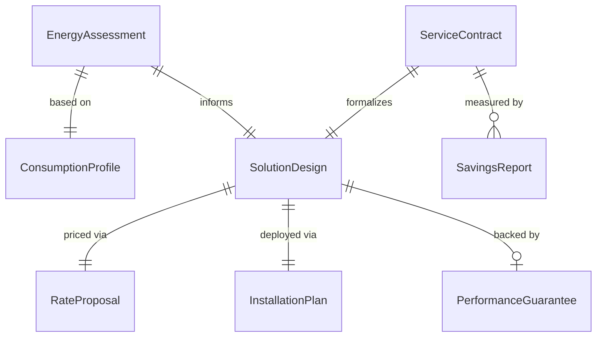
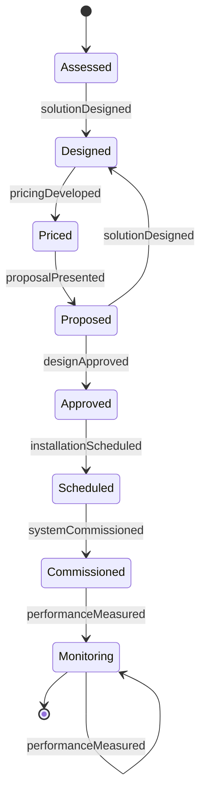
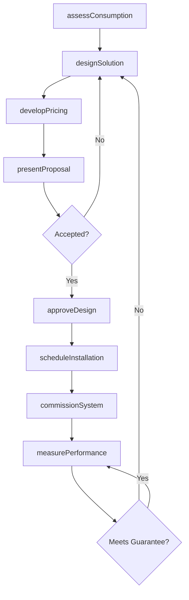
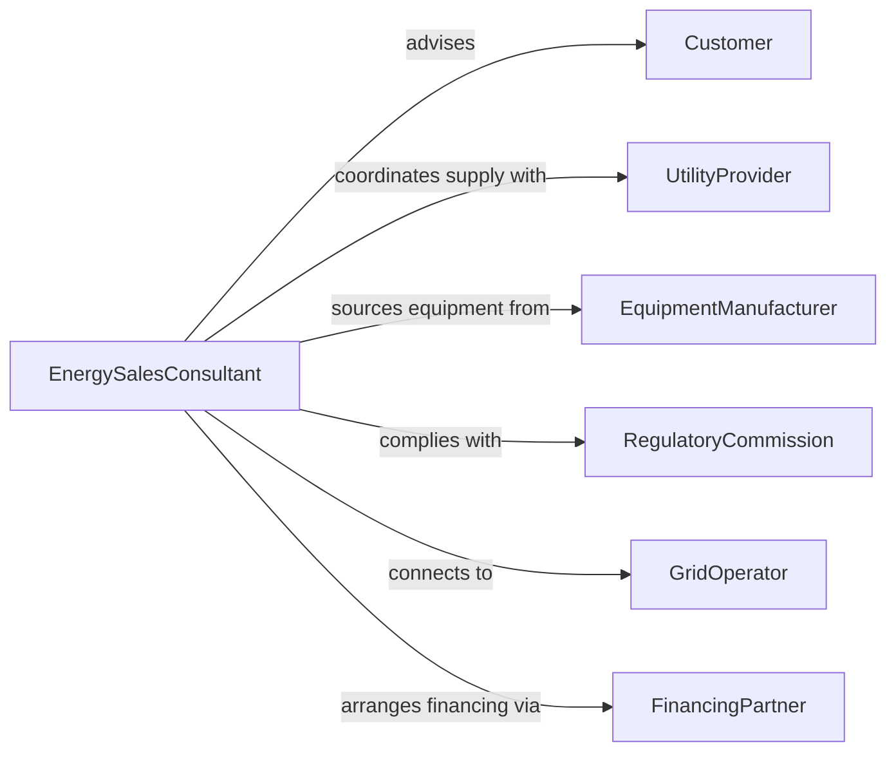

# Customize Energy Products or Services to Meet Customer Needs

> Business-as-Code definition for energy product and service customization. Models the process of assessing customer energy requirements, designing tailored energy solutions, and delivering customized utility, renewable, or efficiency products.

## Overview

Customizing energy products involves evaluating customer consumption patterns, infrastructure, and sustainability goals to configure tailored energy supply contracts, renewable installations, or efficiency programs. This definition exposes actions for energy solution design and delivery, event triggers for project milestones, and searches for consumption analytics and proposal records.

## Actors

| Actor | Description |
|-------|-------------|
| Customer | Residential, commercial, or industrial energy consumer |
| UtilityProvider | Regulated entity supplying electricity, gas, or other energy |
| EquipmentManufacturer | Produces solar panels, batteries, HVAC systems, or other energy hardware |
| RegulatoryCommission | Oversees energy pricing, safety standards, and grid compliance |
| GridOperator | Manages electricity transmission and distribution infrastructure |
| FinancingPartner | Provides loans or leasing arrangements for energy equipment |

## Roles

| Role | Description |
|------|-------------|
| EnergySalesConsultant | Assesses customer needs and recommends energy solutions |
| SolutionEngineer | Designs technical configurations for energy systems |
| PricingAnalyst | Develops custom rate structures and contract terms |
| ProjectCoordinator | Manages installation and commissioning of energy solutions |

## Entities

| Entity | Description |
|--------|-------------|
| EnergyAssessment | Evaluation of customer consumption, infrastructure, and goals |
| SolutionDesign | Technical configuration for a tailored energy product or system |
| RateProposal | Custom pricing structure for energy supply or services |
| InstallationPlan | Schedule and specifications for equipment deployment |
| PerformanceGuarantee | Contractual assurance of energy output or savings |
| ConsumptionProfile | Historical and projected energy usage data for a customer |
| ServiceContract | Agreement defining terms, pricing, and service levels |
| SavingsReport | Documented comparison of projected versus actual energy savings |

## Actions

| Action | Description |
|--------|-------------|
| assessConsumption | Analyze customer energy usage patterns and infrastructure |
| designSolution | Create a tailored energy system or service configuration |
| developPricing | Build a custom rate structure or financing arrangement |
| presentProposal | Deliver the energy solution recommendation to the customer |
| approveDesign | Obtain technical and regulatory sign-off on the solution |
| scheduleInstallation | Plan equipment deployment and commissioning timeline |
| commissionSystem | Activate and verify the installed energy solution |
| measurePerformance | Track energy output or savings against guarantees |

## Events

| Event | Description |
|-------|-------------|
| consumptionAssessed | Customer energy usage and needs have been analyzed |
| solutionDesigned | A tailored energy configuration has been created |
| pricingDeveloped | A custom rate structure or financing plan has been built |
| proposalPresented | The energy solution has been recommended to the customer |
| designApproved | Technical and regulatory approvals have been obtained |
| installationScheduled | Equipment deployment timeline has been planned |
| systemCommissioned | The energy solution has been activated and verified |
| performanceMeasured | Energy output or savings have been tracked against targets |

## Searches

| Search | Description |
|--------|-------------|
| findAssessments | List energy assessments by customer, type, or date |
| getDesigns | Retrieve solution configurations by technology, capacity, or customer |
| getProposals | Search proposals by customer, status, or solution type |
| getPerformance | Query energy savings or output data by system, period, or target |
| getContracts | Find service contracts by customer, term, or pricing structure |

## Entity Relationships



## State Diagram



## Workflow



## Actor Relationships



## Usage

### Calling Actions

```typescript
import { customizeEnergyProductsServicesMeet } from '@headlessly/customize-energy-products-services-meet'

const energy = customizeEnergyProductsServicesMeet()

// Assess customer energy consumption
const assessment = await energy.assessConsumption({
  customerId: 'cust-industrial-4420',
  facilityType: 'manufacturing-plant',
  annualConsumption: { amount: 850000, unit: 'kWh' },
  peakDemand: { amount: 350, unit: 'kW' },
  sustainabilityGoals: ['carbon-neutral-2030', 'reduce-peak-demand']
})

// Design a tailored solar and battery solution
const design = await energy.designSolution({
  assessmentId: assessment.id,
  components: [
    { type: 'solar-array', capacity: '200kW' },
    { type: 'battery-storage', capacity: '500kWh' },
    { type: 'demand-response', program: 'peak-shaving' }
  ]
})

// Present the proposal
await energy.presentProposal({
  designId: design.id,
  projectedSavings: 120000,
  paybackPeriod: 4.5,
  financingOption: 'power-purchase-agreement'
})
```

### Event-Driven Automation

```typescript
// Auto-schedule installation when design is approved
energy.designApproved(async ({ designId, customerId }) => {
  await energy.scheduleInstallation({
    designId,
    customerId,
    preferredWindow: 'next-available'
  })
})

// Alert on underperformance against guarantees
energy.performanceMeasured(async ({ systemId, actual, guaranteed }) => {
  if (actual < guaranteed * 0.9) {
    await notify({
      to: 'operations-team',
      message: `System ${systemId} performing at ${Math.round(actual / guaranteed * 100)}% of guarantee`
    })
  }
})
```
