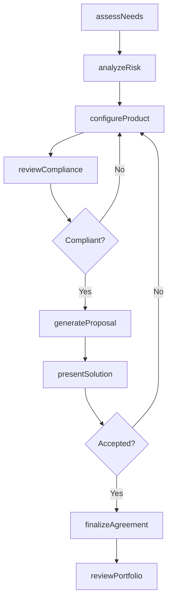
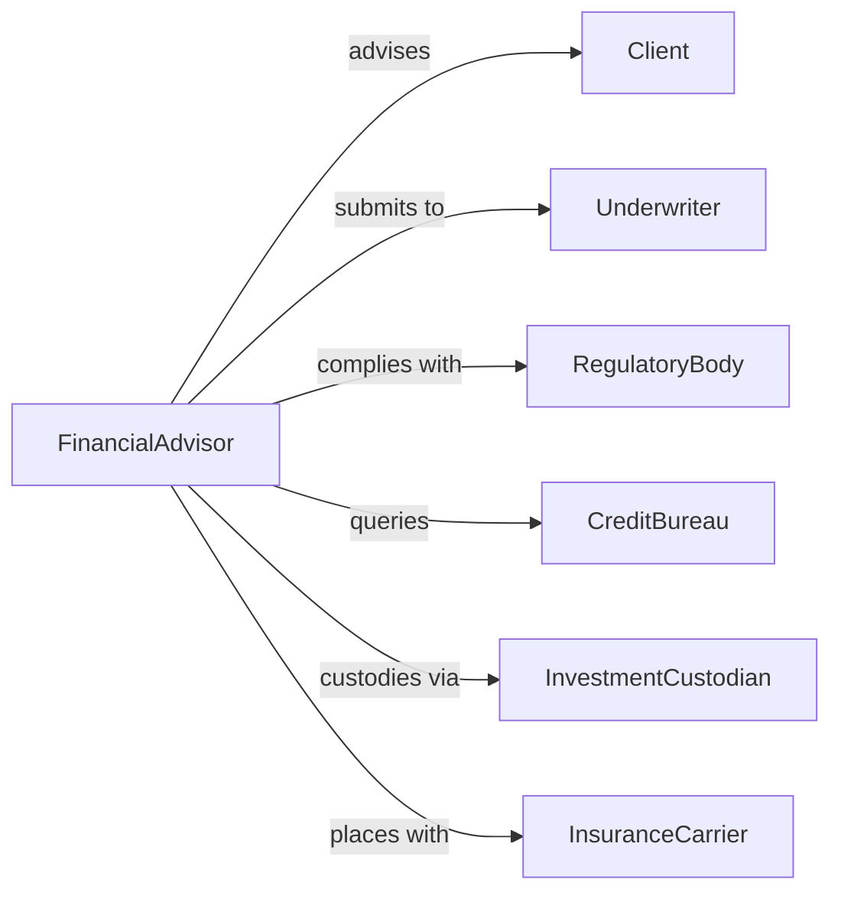

# Customize Financial Products or Services to Meet Customer Needs

> Business-as-Code definition for financial product customization. Models the process of assessing client financial profiles, tailoring investment, lending, or insurance products, and delivering personalized financial solutions.

## Overview

Customizing financial products involves analyzing client financial situations, risk tolerances, and goals to recommend and configure tailored banking, investment, insurance, or lending solutions. This definition exposes actions for needs assessment and product configuration, event triggers for client engagement milestones, and searches for portfolio analytics and product suitability records.

## Actors

| Actor | Description |
|-------|-------------|
| Client | Individual or business seeking customized financial solutions |
| Underwriter | Evaluates risk and approves custom product terms |
| RegulatoryBody | Enforces financial services compliance and consumer protections |
| CreditBureau | Provides credit history and scoring data |
| InvestmentCustodian | Holds and safeguards client investment assets |
| InsuranceCarrier | Provides underwriting capacity for insurance products |

## Roles

| Role | Description |
|------|-------------|
| FinancialAdvisor | Assesses client needs and recommends tailored products |
| ProductSpecialist | Configures financial product features and terms |
| ComplianceOfficer | Ensures customizations meet regulatory requirements |
| RelationshipManager | Maintains ongoing client engagement and service quality |

## Entities

| Entity | Description |
|--------|-------------|
| ClientProfile | Financial situation, goals, risk tolerance, and preferences |
| NeedsAssessment | Documented evaluation of client requirements |
| ProductConfiguration | Customized feature set, terms, and pricing for a financial product |
| RiskAssessment | Evaluation of client risk profile and product suitability |
| Proposal | Formal recommendation document presenting tailored solutions |
| ComplianceReview | Verification that customizations meet regulatory standards |
| ServiceAgreement | Contract formalizing the customized product terms |
| PortfolioAllocation | Distribution of investments across asset classes |

## Actions

| Action | Description |
|--------|-------------|
| assessNeeds | Evaluate client financial situation, goals, and constraints |
| analyzeRisk | Determine client risk tolerance and product suitability |
| configureProduct | Tailor product features, terms, and pricing to client needs |
| generateProposal | Create a formal recommendation for the customized solution |
| reviewCompliance | Verify that the configuration meets regulatory requirements |
| presentSolution | Deliver the tailored proposal to the client |
| finalizeAgreement | Execute the service agreement with approved terms |
| reviewPortfolio | Periodically assess product performance against client goals |

## Events

| Event | Description |
|-------|-------------|
| needsAssessed | Client financial requirements have been evaluated |
| riskAnalyzed | Client risk tolerance and suitability have been determined |
| productConfigured | Financial product has been tailored to client specifications |
| proposalGenerated | A formal recommendation has been created |
| complianceReviewed | Regulatory compliance has been verified |
| solutionPresented | The tailored proposal has been delivered to the client |
| agreementFinalized | The service agreement has been executed |
| portfolioReviewed | Product performance has been assessed against goals |

## Searches

| Search | Description |
|--------|-------------|
| findClients | List clients by product type, risk profile, or advisor |
| getAssessments | Retrieve needs assessments by client, date, or status |
| getConfigurations | Search product customizations by feature, term, or client |
| getProposals | Find proposals by client, product type, or status |
| getPortfolioPerformance | Query portfolio returns by client, allocation, or period |

## Workflow



## Actor Relationships



## Usage

### Calling Actions

```typescript
import { customizeFinancialProductsServicesMeet } from '@headlessly/customize-financial-products-services-meet'

const finance = customizeFinancialProductsServicesMeet()

// Assess a client's financial needs
const assessment = await finance.assessNeeds({
  clientId: 'client-8834',
  goals: ['retirement-savings', 'college-fund'],
  timeHorizon: 15,
  currentAssets: 250000,
  annualIncome: 180000
})

// Configure a tailored investment product
const config = await finance.configureProduct({
  assessmentId: assessment.id,
  productType: 'managed-portfolio',
  riskLevel: 'moderate-growth',
  allocation: { equities: 60, bonds: 30, alternatives: 10 }
})

// Generate and present the proposal
const proposal = await finance.generateProposal({
  configurationId: config.id,
  projectedReturns: { conservative: 5.2, moderate: 7.8, aggressive: 10.1 }
})
```

### Event-Driven Automation

```typescript
// Auto-trigger compliance review on product configuration
finance.productConfigured(async ({ configurationId, productType }) => {
  await finance.reviewCompliance({
    configurationId,
    regulations: ['reg-bi', 'fiduciary-standard']
  })
})

// Schedule periodic portfolio reviews
finance.agreementFinalized(async ({ clientId, agreementId }) => {
  await scheduleRecurring({
    action: 'reviewPortfolio',
    clientId,
    agreementId,
    frequency: 'quarterly'
  })
})
```
