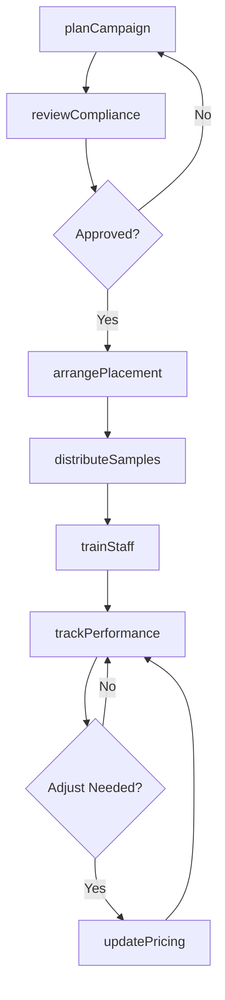
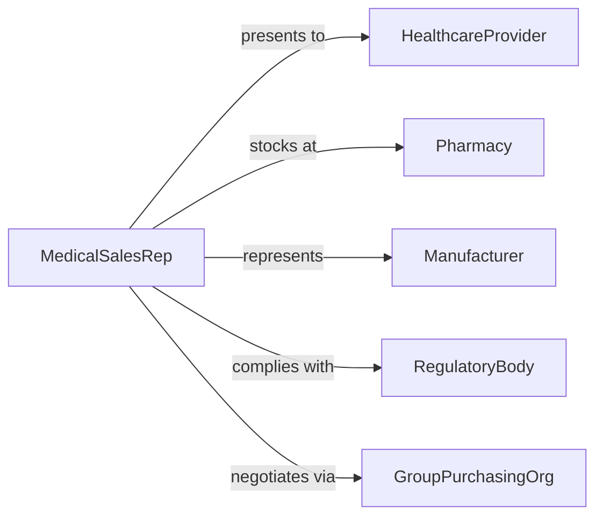

# Merchandise Healthcare Products or Services

> Business-as-Code definition for healthcare product and service merchandising. Models the presentation, promotion, and placement of medical devices, pharmaceuticals, and health services to drive adoption and sales.

## Overview

Healthcare merchandising involves positioning products within clinical and retail channels, managing product displays, coordinating promotional campaigns, training staff on product features, and ensuring compliance with healthcare marketing regulations. This definition exposes actions for merchandising execution, event triggers for campaign performance, and searches for product placement and sales data.

## Actors

| Actor | Description |
|-------|-------------|
| HealthcareProvider | Hospital, clinic, or practice evaluating products |
| Pharmacy | Retail or hospital pharmacy stocking healthcare products |
| Manufacturer | Produces the healthcare products being merchandised |
| RegulatoryBody | Enforces advertising and labeling compliance in healthcare |
| GroupPurchasingOrg | Negotiates volume pricing on behalf of healthcare buyers |
| Patient | End consumer of healthcare products or services |

## Roles

| Role | Description |
|------|-------------|
| MedicalSalesRep | Presents products to healthcare providers and buyers |
| MerchandisingManager | Plans product placement and promotional strategies |
| ClinicalEducator | Trains staff on product usage and clinical benefits |
| ComplianceOfficer | Ensures marketing activities meet regulatory standards |

## Entities

| Entity | Description |
|--------|-------------|
| Product | Healthcare item with clinical specifications and pricing |
| Campaign | Coordinated merchandising initiative with target audience and timeline |
| Placement | Physical or digital product display location |
| SampleAllocation | Distribution plan for product samples to providers |
| ComplianceReview | Regulatory check on marketing materials and claims |
| SalesReport | Performance data for a product across channels |
| TrainingSession | Educational event on product features and clinical use |

## Actions

| Action | Description |
|--------|-------------|
| planCampaign | Design a merchandising initiative with targets and timeline |
| arrangePlacement | Set up product displays in clinical or retail locations |
| distributeSamples | Allocate product samples to healthcare providers |
| trainStaff | Conduct educational sessions on product features |
| reviewCompliance | Verify marketing materials against regulatory requirements |
| trackPerformance | Monitor sales and adoption metrics for a campaign |
| updatePricing | Adjust product pricing based on market or contract changes |

## Events

| Event | Description |
|-------|-------------|
| campaignPlanned | A merchandising initiative has been designed |
| placementArranged | A product display has been set up |
| samplesDistributed | Product samples have been allocated to providers |
| staffTrained | A product education session has been completed |
| complianceReviewed | Marketing materials have passed regulatory review |
| performanceTracked | Campaign metrics have been updated |
| pricingUpdated | Product pricing has been adjusted |

## Searches

| Search | Description |
|--------|-------------|
| findCampaigns | List merchandising campaigns by product, status, or date |
| getPlacements | Retrieve product display locations and status |
| getSalesData | Query sales performance by product, channel, or period |
| findSamples | Track sample distribution by provider or territory |
| getComplianceStatus | Check regulatory review status for marketing materials |

## Workflow



## Actor Relationships



## Usage

### Calling Actions

```typescript
import { merchandiseHealthcareProductsServices } from '@headlessly/merchandise-healthcare-products-services'

const merch = merchandiseHealthcareProductsServices()

// Plan a product launch campaign
const campaign = await merch.planCampaign({
  product: 'CardioMonitor Pro',
  targetAudience: 'cardiologists',
  territory: 'northeast',
  startDate: '2026-03-01',
  duration: 90
})

// Distribute samples to key accounts
await merch.distributeSamples({
  campaignId: campaign.id,
  providers: ['clinic-A', 'hospital-B', 'practice-C'],
  quantity: 50
})

// Track campaign performance
const metrics = await merch.trackPerformance({
  campaignId: campaign.id,
  metrics: ['units-sold', 'provider-adoption', 'sample-conversion']
})
```

### Event-Driven Automation

```typescript
// Alert compliance team on new campaign plans
merch.campaignPlanned(async ({ campaignId, product }) => {
  await notify({
    to: 'compliance-team',
    message: `New campaign for ${product} requires regulatory review`
  })
})

// Auto-restock samples when inventory is low
merch.samplesDistributed(async ({ product, remainingStock }) => {
  if (remainingStock < 20) {
    await requestRestock({ product, quantity: 100 })
  }
})
```
