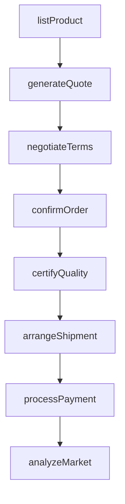
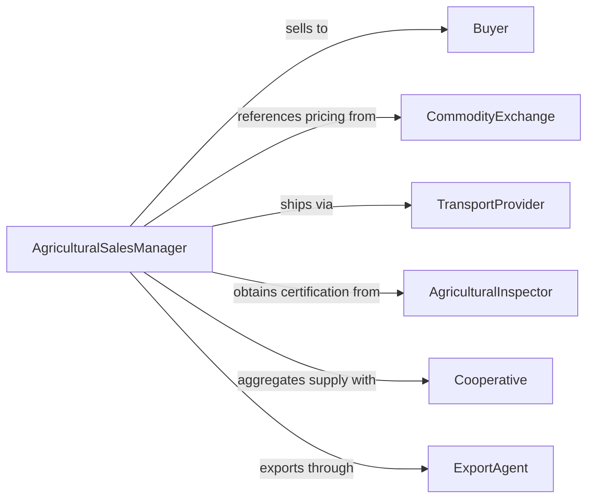

# Sell Agricultural Products

> Business-as-Code definition for agricultural product sales. Models the process of sourcing, pricing, marketing, and closing sales of crops, livestock, and farm-derived commodities to buyers across wholesale, retail, and export channels.

## Overview

Selling agricultural products involves managing inventories of crops, livestock, and processed farm goods, establishing pricing based on market conditions and commodity indices, negotiating with buyers and distributors, and fulfilling orders through appropriate logistics channels. This definition exposes actions for agricultural sales management, event triggers for transaction milestones, and searches for market intelligence and order history records.

## Actors

| Actor | Description |
|-------|-------------|
| Buyer | Wholesale purchaser, retailer, or end consumer acquiring agricultural goods |
| CommodityExchange | Market platform setting benchmark prices for agricultural commodities |
| TransportProvider | Logistics company handling shipment of perishable and bulk goods |
| AgriculturalInspector | Government or third-party authority certifying product quality and safety |
| Cooperative | Farmer-owned organization aggregating supply for collective sale |
| ExportAgent | Facilitates international trade and customs clearance |

## Roles

| Role | Description |
|------|-------------|
| AgriculturalSalesManager | Oversees sales strategy and buyer relationships for farm products |
| CommodityTrader | Executes trades based on market pricing and futures contracts |
| QualityGrader | Evaluates and certifies product grade and condition |
| AccountManager | Maintains ongoing relationships with key wholesale accounts |

## Entities

| Entity | Description |
|--------|-------------|
| ProductListing | Catalog entry for an available agricultural product with grade and quantity |
| SalesOrder | Confirmed purchase agreement with pricing and delivery terms |
| PriceQuote | Offered price for a specific product, quantity, and delivery window |
| QualityCertificate | Documentation of product grade, origin, and safety compliance |
| HarvestReport | Summary of crop yield, quality, and availability by season |
| FuturesContract | Agreement to buy or sell a commodity at a predetermined future price |
| InvoiceRecord | Billing document for completed agricultural transactions |
| MarketAnalysis | Assessment of commodity pricing trends and demand forecasts |

## Actions

| Action | Description |
|--------|-------------|
| listProduct | Publish an agricultural product for sale with grade and quantity |
| generateQuote | Create a price quote for a buyer based on current market conditions |
| negotiateTerms | Discuss pricing, volume, and delivery terms with a buyer |
| confirmOrder | Finalize a sales agreement and lock in pricing |
| certifyQuality | Obtain or attach quality and safety certification to a shipment |
| arrangeShipment | Coordinate transportation and cold chain logistics for delivery |
| processPayment | Collect payment and issue invoicing for completed sales |
| analyzeMarket | Review commodity pricing trends and seasonal demand patterns |

## Events

| Event | Description |
|-------|-------------|
| productListed | An agricultural product has been published for sale |
| quoteGenerated | A price quote has been issued to a buyer |
| termsNegotiated | Pricing and delivery terms have been agreed upon |
| orderConfirmed | A sales agreement has been finalized |
| qualityCertified | Product quality and safety certification has been obtained |
| shipmentArranged | Transportation logistics have been coordinated |
| paymentProcessed | Payment has been collected and invoiced |
| marketAnalyzed | Commodity pricing and demand data have been reviewed |

## Searches

| Search | Description |
|--------|-------------|
| findListings | List available products by type, grade, region, or season |
| getOrders | Retrieve sales orders by buyer, product, status, or date |
| getQuotes | Find price quotes by buyer, product, or expiration date |
| getMarketPrices | Query current and historical commodity pricing data |
| getCertifications | Search quality certificates by product, grade, or certifier |

## Workflow



## Actor Relationships



## Usage

### Calling Actions

```typescript
import { sellAgriculturalProducts } from '@headlessly/sell-agricultural-products'

const sales = sellAgriculturalProducts()

// List a new crop for sale
const listing = await sales.listProduct({
  product: 'organic-winter-wheat',
  grade: 'USDA-1',
  quantity: { amount: 5000, unit: 'bushels' },
  origin: 'kansas-cooperative-12',
  harvestDate: '2026-01-15'
})

// Generate a quote for a wholesale buyer
const quote = await sales.generateQuote({
  listingId: listing.id,
  buyerId: 'buyer-midwest-grain-co',
  quantity: 2000,
  deliveryWindow: { start: '2026-02-01', end: '2026-02-15' }
})

// Confirm the order
await sales.confirmOrder({
  quoteId: quote.id,
  paymentTerms: 'net-30',
  shippingMethod: 'rail-freight'
})
```

### Event-Driven Automation

```typescript
// Auto-arrange shipment when order is confirmed
sales.orderConfirmed(async ({ orderId, product, quantity, deliveryWindow }) => {
  await sales.arrangeShipment({
    orderId,
    product,
    quantity,
    requiredBy: deliveryWindow.end,
    coldChain: false
  })
})

// Alert on significant market price changes
sales.marketAnalyzed(async ({ commodity, priceChange, trend }) => {
  if (Math.abs(priceChange) > 5) {
    await notify({
      to: 'sales-team',
      message: `${commodity} price moved ${priceChange}% - trend: ${trend}`
    })
  }
})
```
