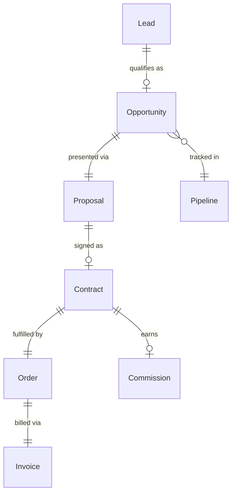
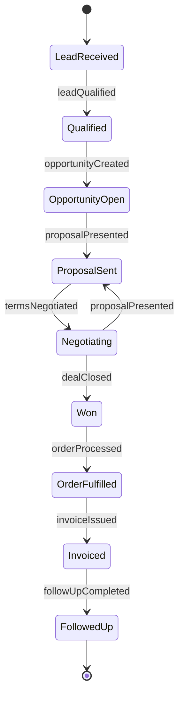
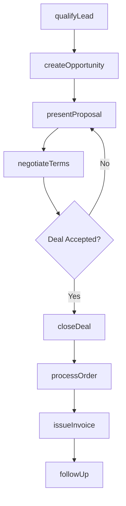
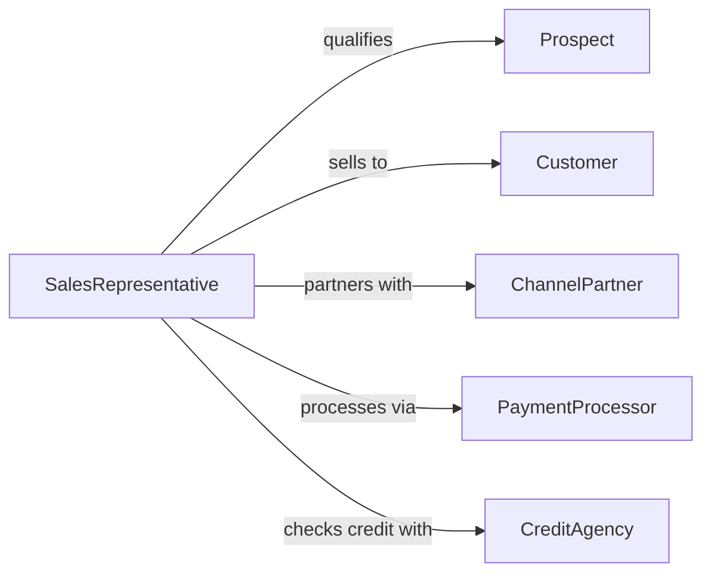

# Sell Products or Services

> Business-as-Code definition for general product and service sales operations. Models the complete sales cycle from lead qualification through proposal, negotiation, closing, and post-sale follow-up.

## Overview

Product and service selling involves identifying prospective buyers, qualifying their needs, presenting solutions, negotiating terms, closing transactions, and managing post-sale relationships. This definition exposes actions for each stage of the sales pipeline, event triggers for deal progression, and searches for leads, opportunities, and revenue data.

## Actors

| Actor | Description |
|-------|-------------|
| Prospect | Potential buyer who has not yet committed |
| Customer | Individual or organization purchasing products or services |
| ChannelPartner | Reseller or distributor selling on behalf of the organization |
| PaymentProcessor | Handles transaction authorization and settlement |
| CreditAgency | Provides buyer creditworthiness assessments |
| CompetitorIntel | External source of competitive market information |

## Roles

| Role | Description |
|------|-------------|
| SalesRepresentative | Manages individual accounts and closes deals |
| AccountExecutive | Oversees strategic or enterprise-level sales relationships |
| SalesManager | Directs the sales team and sets quota targets |
| SalesEngineer | Provides technical demonstrations and solution design |
| SalesOperationsAnalyst | Manages pipeline data, forecasts, and CRM configuration |

## Entities

| Entity | Description |
|--------|-------------|
| Lead | Unqualified potential buyer contact |
| Opportunity | Qualified sales prospect with estimated value |
| Proposal | Formal offer document with pricing and terms |
| Contract | Signed agreement between buyer and seller |
| Order | Confirmed purchase transaction |
| Invoice | Payment request issued to the customer |
| Pipeline | Aggregated view of active sales opportunities by stage |
| Commission | Compensation earned by the sales representative on a deal |

## Actions

| Action | Description |
|--------|-------------|
| qualifyLead | Assess a prospect for fit, budget, and timing |
| createOpportunity | Register a qualified deal in the sales pipeline |
| presentProposal | Deliver a formal offer to the prospect |
| negotiateTerms | Discuss pricing, scope, and contract conditions |
| closeDeal | Finalize and sign the purchase agreement |
| processOrder | Submit the confirmed order for fulfillment |
| issueInvoice | Generate and send the payment request |
| followUp | Contact the customer after purchase for satisfaction review |

## Events

| Event | Description |
|-------|-------------|
| leadQualified | A prospect has been assessed and accepted into the pipeline |
| opportunityCreated | A new deal has been registered |
| proposalPresented | A formal offer has been delivered to the prospect |
| termsNegotiated | Pricing and contract terms have been discussed |
| dealClosed | A purchase agreement has been signed |
| orderProcessed | An order has been submitted for fulfillment |
| invoiceIssued | A payment request has been sent |
| followUpCompleted | Post-sale outreach has been performed |

## Searches

| Search | Description |
|--------|-------------|
| findLeads | List prospects by source, industry, or qualification status |
| getOpportunities | Retrieve deals by stage, value, or close date |
| getPipeline | View aggregated pipeline data by team or period |
| getOrders | List completed orders by customer, date, or product |
| getCommissions | Calculate earned commissions by representative and period |

## Entity Relationships



## State Diagram



## Workflow



## Actor Relationships



## Usage

### Calling Actions

```typescript
import { sellProductsServices } from '@headlessly/sell-products-services'

const sales = sellProductsServices()

// Qualify a new lead
const lead = await sales.qualifyLead({
  contactName: 'Sarah Chen',
  company: 'TechStart Inc',
  budget: 50000,
  timeline: 'Q2-2026',
  need: 'enterprise-crm'
})

// Create an opportunity and present a proposal
const opportunity = await sales.createOpportunity({
  leadId: lead.id,
  estimatedValue: 48000,
  products: ['crm-platform', 'onboarding-services']
})

await sales.presentProposal({
  opportunityId: opportunity.id,
  pricing: { platform: 36000, services: 12000 },
  terms: { paymentSchedule: 'net-30', contractLength: 12 }
})
```

### Event-Driven Automation

```typescript
// Notify sales manager on high-value deal closure
sales.dealClosed(async ({ opportunityId, value, representative }) => {
  if (value > 100000) {
    await notify({
      to: 'sales-manager',
      message: `${representative} closed a $${value} deal`
    })
  }
})

// Auto-generate invoice after order processing
sales.orderProcessed(async ({ orderId, customerId, total }) => {
  await sales.issueInvoice({
    orderId,
    customerId,
    amount: total,
    dueDate: addDays(new Date(), 30)
  })
})
```
