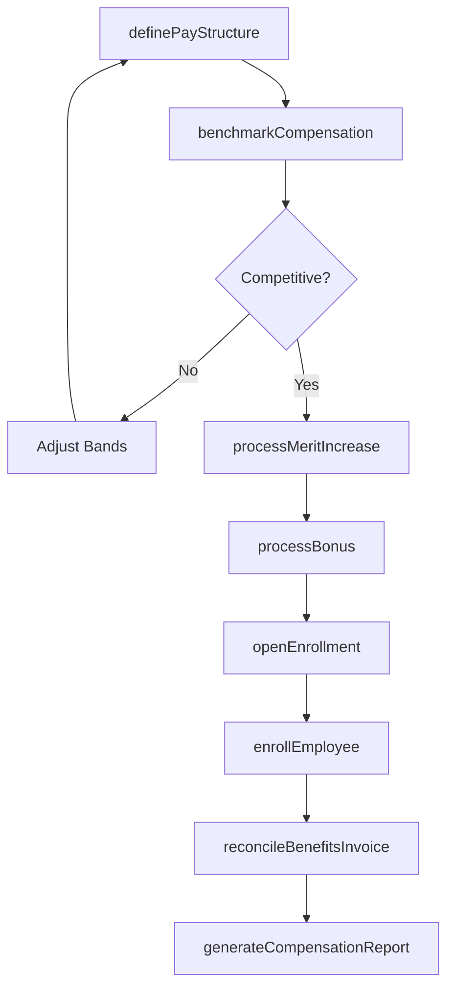
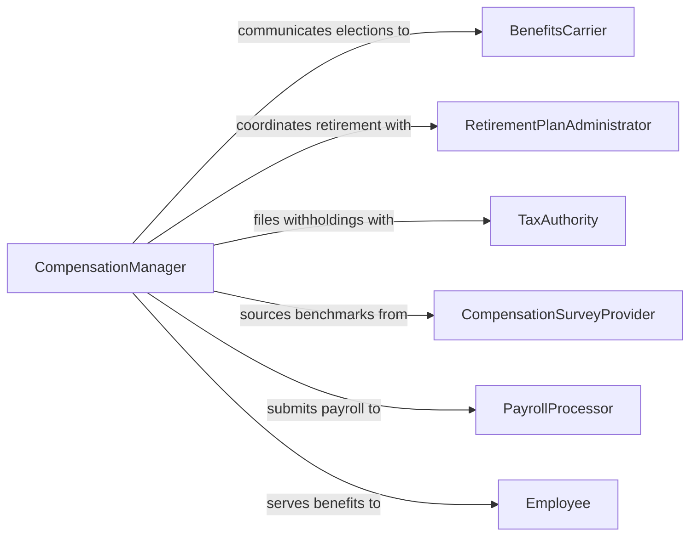

# Administer Compensation Benefits Programs

> Business-as-Code definition for administering compensation and benefits programs. Models the design, enrollment, management, and compliance of employee pay structures, incentive plans, health benefits, and retirement programs.

## Overview

Administering compensation and benefits programs involves designing pay structures, managing salary bands, processing merit increases and bonuses, enrolling employees in health and retirement plans, reconciling benefits invoices, and ensuring compliance with tax and labor regulations. This definition provides actions for compensation management and benefits administration, events for lifecycle automation, and searches for analytics and reporting.

## Actors

| Actor | Description |
|-------|-------------|
| Employee | Workforce member who receives compensation and elects benefits |
| BenefitsCarrier | Insurance company or provider administering health, dental, or vision plans |
| RetirementPlanAdministrator | 401(k) or pension plan custodian managing retirement accounts |
| TaxAuthority | Government agency collecting payroll taxes and enforcing compliance |
| CompensationSurveyProvider | External firm supplying market salary benchmarking data |
| PayrollProcessor | Third-party service executing payroll calculations and disbursements |

## Roles

| Role | Description |
|------|-------------|
| CompensationManager | Designs and maintains pay structures, salary bands, and incentive plans |
| BenefitsAdministrator | Manages benefits enrollment, changes, and carrier relationships |
| PayrollSpecialist | Processes payroll and ensures accurate tax withholdings |
| HRBusinessPartner | Advises managers on compensation decisions and benefits options |
| TotalRewardsDirector | Oversees the organization's complete compensation and benefits strategy |

## Entities

| Entity | Description |
|--------|-------------|
| PayStructure | Defined salary bands and grade levels for organizational roles |
| CompensationPackage | Total pay including base salary, bonuses, and equity for an employee |
| BenefitsPlan | A health, dental, vision, life, or disability insurance plan offering |
| RetirementPlan | A 401(k), pension, or deferred compensation program |
| OpenEnrollment | An annual period when employees can change benefits elections |
| MeritIncrease | A salary adjustment based on performance evaluation |
| BenefitsElection | An employee's selected coverage options during enrollment |

## Actions

| Action | Description |
|--------|-------------|
| definePayStructure | Create or update salary bands and grade levels |
| benchmarkCompensation | Compare organizational pay against market survey data |
| processMeritIncrease | Apply a performance-based salary adjustment |
| processBonus | Calculate and disburse incentive or bonus payments |
| openEnrollment | Initiate the annual benefits enrollment period |
| enrollEmployee | Process an employee's benefits elections |
| reconcileBenefitsInvoice | Verify carrier invoices against enrollment records |
| generateCompensationReport | Produce total compensation and benefits cost reports |

## Events

| Event | Description |
|-------|-------------|
| payStructureDefined | A pay structure has been created or updated |
| compensationBenchmarked | Market compensation analysis has been completed |
| meritIncreaseProcessed | A salary adjustment has been applied to an employee |
| bonusProcessed | An incentive payment has been calculated and disbursed |
| enrollmentOpened | The annual benefits open enrollment period has begun |
| employeeEnrolled | An employee's benefits elections have been processed |
| invoiceReconciled | A benefits carrier invoice has been verified and approved |

## Searches

| Search | Description |
|--------|-------------|
| findPayStructures | List pay structures by grade level, department, or effective date |
| getCompensationPackages | Retrieve total compensation details by employee or department |
| getBenefitsElections | Fetch employee benefits elections by plan type or enrollment period |
| findMeritIncreases | List merit increases by performance rating, department, or period |
| getBenefitsCosts | Retrieve benefits cost data by plan type, carrier, or period |

## Workflow



## Actor Relationships



## Usage

### Calling Actions

```typescript
import { administerCompensationBenefitsPrograms } from '@headlessly/administer-compensation-benefits-programs'

const comp = administerCompensationBenefitsPrograms()

// Define a pay structure
await comp.definePayStructure({
  name: 'Engineering Pay Bands FY2026',
  grades: [
    { level: 'IC1', min: 85000, mid: 100000, max: 115000 },
    { level: 'IC2', min: 110000, mid: 130000, max: 150000 },
    { level: 'IC3', min: 140000, mid: 165000, max: 190000 }
  ],
  currency: 'USD',
  effectiveDate: '2026-01-01'
})

// Process merit increases after performance reviews
await comp.processMeritIncrease({
  employeeId: 'emp-4821',
  currentSalary: 125000,
  increasePercentage: 5.5,
  performanceRating: 'exceeds-expectations',
  effectiveDate: '2026-04-01'
})

// Open annual enrollment
await comp.openEnrollment({
  year: 2026,
  startDate: '2026-11-01',
  endDate: '2026-11-30',
  plans: ['medical-ppo', 'medical-hdhp', 'dental', 'vision', '401k']
})
```

### Event-Driven Automation

```typescript
// Notify employees when enrollment opens
comp.enrollmentOpened(async ({ year, startDate, endDate }) => {
  await notify({
    to: 'all-employees',
    message: `${year} benefits open enrollment is live from ${startDate} to ${endDate}`
  })
})

// Flag invoices with discrepancies
comp.invoiceReconciled(async ({ carrierId, discrepancyAmount }) => {
  if (discrepancyAmount > 500) {
    await notify({
      to: 'benefits-team',
      message: `Carrier ${carrierId} invoice discrepancy: $${discrepancyAmount}`
    })
  }
})
```
