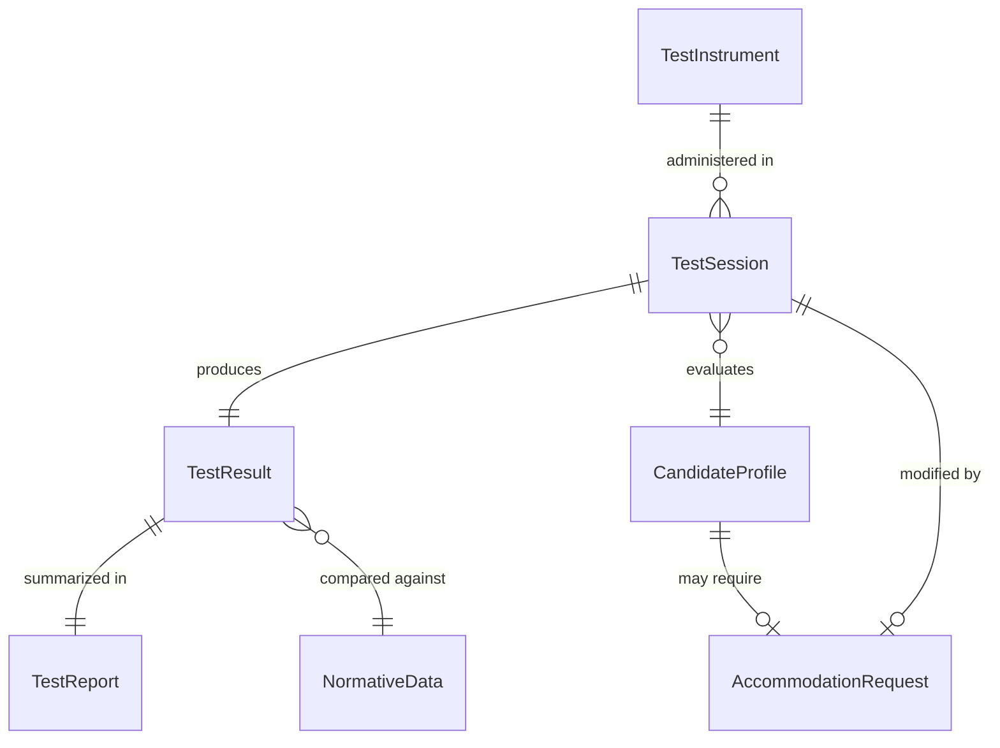
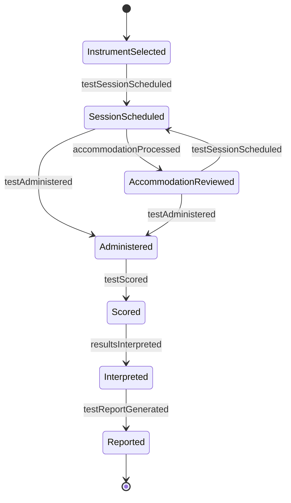
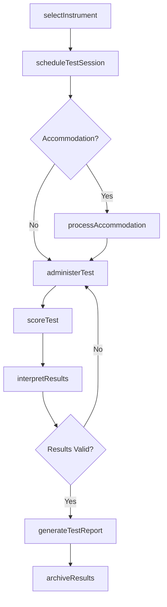
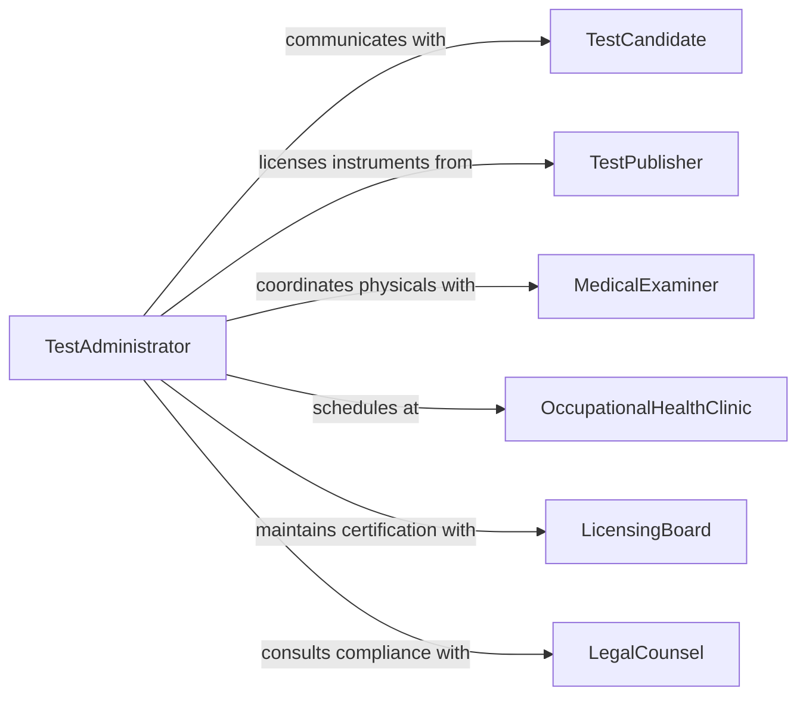

# Administer Standardized Physical Psychological Tests

> Business-as-Code definition for administering standardized physical and psychological tests. Models the scheduling, administration, scoring, and reporting of validated assessment instruments used in employment, fitness-for-duty, and organizational development contexts.

## Overview

Administering standardized physical and psychological tests involves selecting validated assessment instruments, scheduling test sessions, proctoring examinations, scoring results, interpreting outcomes, and maintaining confidential records. These tests are used for pre-employment screening, fitness-for-duty evaluations, skills assessments, and organizational development. This definition provides actions for test lifecycle management, events for result processing, and searches for assessment analytics.

## Actors

| Actor | Description |
|-------|-------------|
| TestCandidate | Individual being assessed through a physical or psychological test |
| TestPublisher | Organization that develops and licenses standardized test instruments |
| MedicalExaminer | Licensed physician conducting physical fitness evaluations |
| OccupationalHealthClinic | Facility where physical assessments are administered |
| LicensingBoard | Professional body certifying test administrators and interpreters |
| LegalCounsel | Attorney advising on ADA compliance and testing legality |

## Roles

| Role | Description |
|------|-------------|
| TestAdministrator | Schedules, proctors, and manages the testing process |
| IndustrialPsychologist | Selects psychological instruments and interprets results |
| OccupationalHealthSpecialist | Administers and evaluates physical fitness assessments |
| HRCompliance Officer | Ensures testing practices comply with employment law |
| AssessmentCoordinator | Manages logistics, scheduling, and candidate communications |

## Entities

| Entity | Description |
|--------|-------------|
| TestInstrument | A validated standardized assessment tool or battery |
| TestSession | A scheduled administration of one or more test instruments |
| TestResult | Scored outcome of a completed assessment |
| CandidateProfile | Demographic and role information for the test candidate |
| NormativeData | Population benchmarks used to interpret test scores |
| AccommodationRequest | A request for testing modifications under ADA or similar law |
| TestReport | A formal summary of results and interpretive findings |

## Actions

| Action | Description |
|--------|-------------|
| selectInstrument | Choose an appropriate validated test for the assessment purpose |
| scheduleTestSession | Book a test date, time, location, and proctor |
| processAccommodation | Review and approve testing accommodations for candidates |
| administerTest | Proctor and conduct the standardized assessment |
| scoreTest | Calculate raw and scaled scores from completed assessments |
| interpretResults | Apply normative data and professional judgment to scores |
| generateTestReport | Produce a formal assessment report with findings |
| archiveResults | Securely store test records per retention policy |

## Events

| Event | Description |
|-------|-------------|
| instrumentSelected | A test instrument has been chosen for an assessment purpose |
| testSessionScheduled | A test session has been booked for a candidate |
| accommodationProcessed | A testing accommodation request has been reviewed |
| testAdministered | A standardized test has been completed by a candidate |
| testScored | Test results have been calculated and recorded |
| resultsInterpreted | Professional interpretation of test scores is complete |
| testReportGenerated | A formal assessment report has been produced |

## Searches

| Search | Description |
|--------|-------------|
| findTestSessions | List test sessions by date, location, instrument, or status |
| getTestResults | Retrieve scored results by candidate, instrument, or date range |
| findInstruments | List available test instruments by type, publisher, or purpose |
| getAccommodations | Fetch accommodation requests by candidate or status |
| getAssessmentAnalytics | Retrieve aggregate test data by role, department, or period |

## Entity Relationships



## State Diagram



## Workflow



## Actor Relationships



## Usage

### Calling Actions

```typescript
import { administerStandardizedPhysicalPsychologicalTests } from '@headlessly/administer-standardized-physical-psychological-tests'

const testing = administerStandardizedPhysicalPsychologicalTests()

// Select an instrument for pre-employment screening
const instrument = await testing.selectInstrument({
  purpose: 'pre-employment',
  type: 'cognitive-ability',
  role: 'Air Traffic Controller',
  validatedFor: ['attention', 'spatial-reasoning', 'stress-tolerance']
})

// Schedule a test session
const session = await testing.scheduleTestSession({
  instrumentId: instrument.id,
  candidateId: 'cand-9172',
  date: '2026-04-10',
  location: 'Testing Center A',
  proctor: 'admin-psych-01'
})

// Score and generate report after administration
const results = await testing.scoreTest({
  sessionId: session.id,
  responses: session.completedResponses
})

await testing.generateTestReport({
  sessionId: session.id,
  resultId: results.id,
  includeNormativeComparison: true
})
```

### Event-Driven Automation

```typescript
// Notify HR when test report is ready
testing.testReportGenerated(async ({ candidateId, instrumentType, reportId }) => {
  await notify({
    to: 'hiring-team',
    message: `${instrumentType} assessment report ready for candidate ${candidateId}`
  })
})

// Flag candidates requiring accommodation follow-up
testing.accommodationProcessed(async ({ candidateId, status, accommodationType }) => {
  if (status === 'approved') {
    await testing.scheduleTestSession({
      candidateId,
      accommodations: [accommodationType]
    })
  }
})
```
