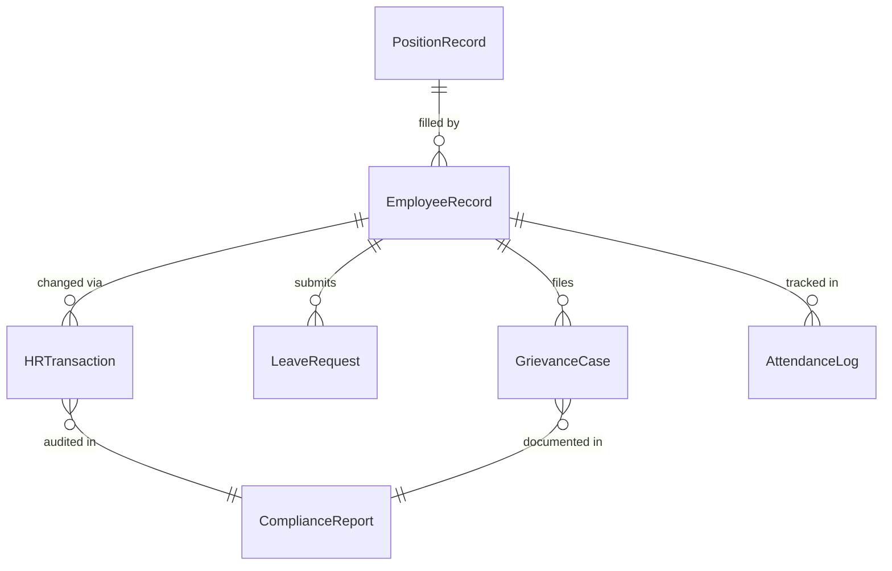
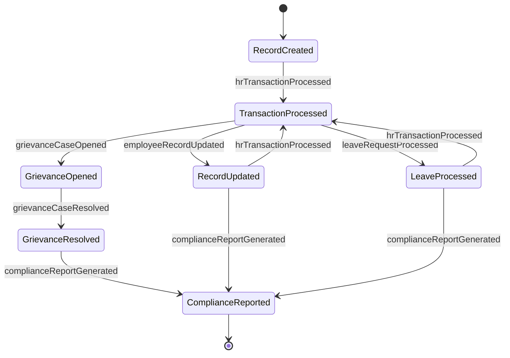
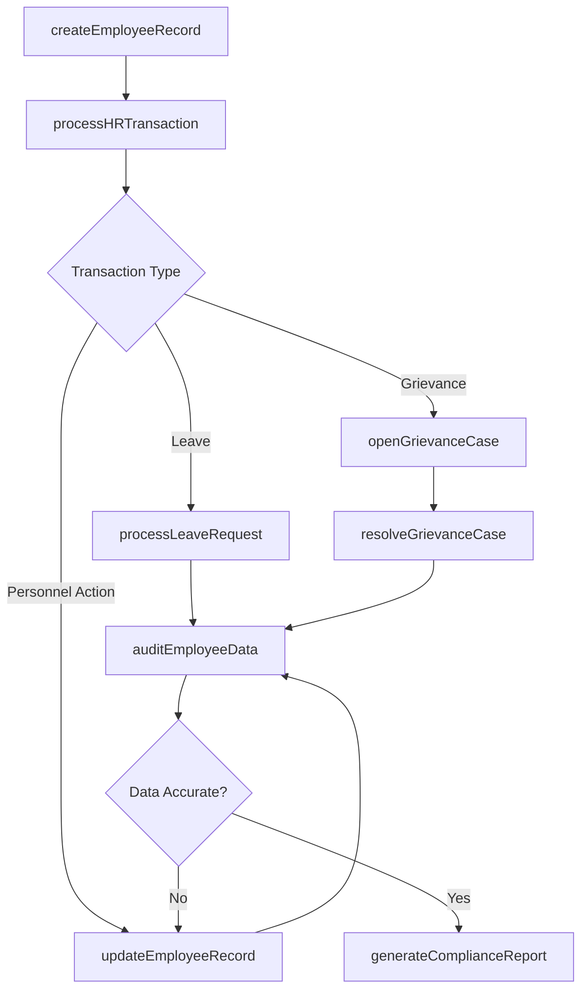
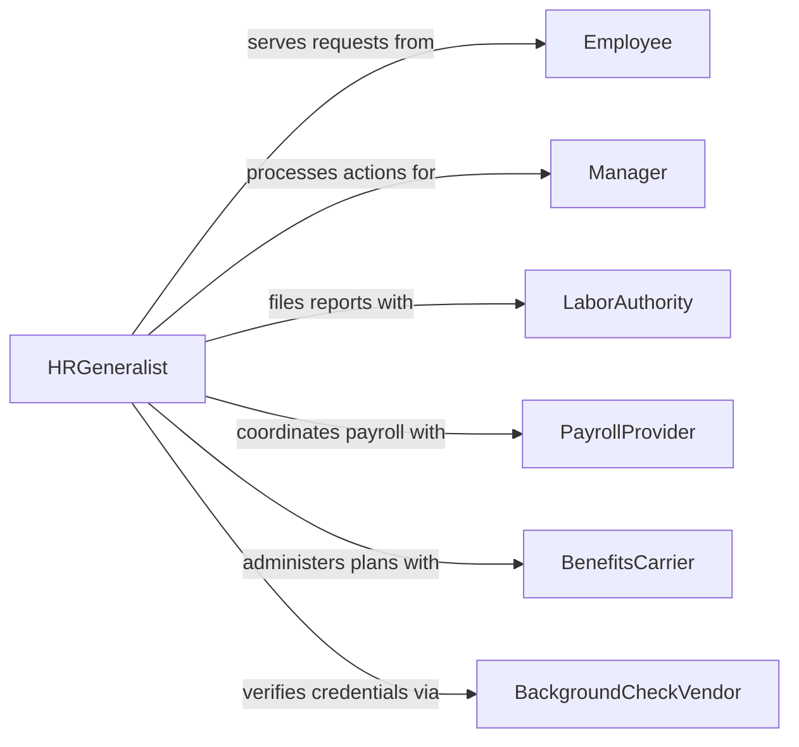

# Perform Human Resources Activities

> Business-as-Code definition for performing human resources activities. Models the broad HR function including employee records management, workforce planning, employee relations, compliance reporting, and HR service delivery.

## Overview

Performing human resources activities encompasses the day-to-day operations of an HR department, including maintaining employee records, managing workforce data, handling employee relations cases, ensuring labor law compliance, administering leave and attendance, and generating HR reports. This definition provides actions for core HR operations, events for workflow automation, and searches for workforce analytics.

## Actors

| Actor | Description |
|-------|-------------|
| Employee | Workforce member who interacts with HR for services and support |
| Manager | Supervisor who initiates HR requests on behalf of their team |
| LaborAuthority | Government agency enforcing employment laws and regulations |
| PayrollProvider | External service processing payroll and tax withholdings |
| BenefitsCarrier | Insurance or benefits provider administering employee plans |
| BackgroundCheckVendor | Third-party service verifying employment and credential history |

## Roles

| Role | Description |
|------|-------------|
| HRDirector | Leads the HR function and sets workforce strategy |
| HRGeneralist | Handles day-to-day HR operations across multiple domains |
| HRISAdministrator | Manages the human resource information system and data integrity |
| EmployeeRelationsSpecialist | Investigates and resolves workplace issues and grievances |
| ComplianceCoordinator | Ensures adherence to labor laws and filing requirements |

## Entities

| Entity | Description |
|--------|-------------|
| EmployeeRecord | Comprehensive personnel file for a workforce member |
| LeaveRequest | A formal request for time off from work |
| GrievanceCase | A documented employee complaint or workplace issue |
| ComplianceReport | A regulatory filing or internal compliance audit report |
| PositionRecord | A defined role within the organizational structure |
| AttendanceLog | Record of employee work hours and attendance patterns |
| HRTransaction | Any change to an employee record such as promotion or transfer |

## Actions

| Action | Description |
|--------|-------------|
| createEmployeeRecord | Initialize a new employee personnel file |
| updateEmployeeRecord | Modify employee information such as address or role |
| processLeaveRequest | Review and approve or deny a time-off request |
| openGrievanceCase | Create a formal employee relations investigation |
| resolveGrievanceCase | Close a grievance with documented resolution and outcome |
| generateComplianceReport | Produce regulatory filings such as EEO-1 or OSHA logs |
| processHRTransaction | Execute a personnel action like promotion, transfer, or separation |
| auditEmployeeData | Verify accuracy and completeness of workforce records |

## Events

| Event | Description |
|-------|-------------|
| employeeRecordCreated | A new employee record has been initialized |
| employeeRecordUpdated | An employee record has been modified |
| leaveRequestProcessed | A leave request has been approved or denied |
| grievanceCaseOpened | An employee relations investigation has been initiated |
| grievanceCaseResolved | A grievance has been closed with resolution |
| complianceReportGenerated | A regulatory compliance report has been produced |
| hrTransactionProcessed | A personnel action has been completed |

## Searches

| Search | Description |
|--------|-------------|
| findEmployees | List employees by department, status, location, or hire date |
| getLeaveRequests | Retrieve leave requests by employee, type, or approval status |
| findGrievanceCases | List open or resolved grievances by department or severity |
| getComplianceReports | Fetch compliance reports by type, period, or filing status |
| getHeadcountAnalytics | Retrieve workforce counts and trends by department or role |

## Entity Relationships



## State Diagram



## Workflow



## Actor Relationships



## Usage

### Calling Actions

```typescript
import { performHumanResourcesActivities } from '@headlessly/perform-human-resources-activities'

const hr = performHumanResourcesActivities()

// Create a new employee record
const employee = await hr.createEmployeeRecord({
  firstName: 'Sarah',
  lastName: 'Chen',
  department: 'Engineering',
  position: 'Senior Software Engineer',
  startDate: '2026-03-15',
  employmentType: 'full-time'
})

// Process a leave request
await hr.processLeaveRequest({
  employeeId: employee.id,
  type: 'vacation',
  startDate: '2026-06-01',
  endDate: '2026-06-10',
  decision: 'approved'
})

// Generate quarterly compliance report
await hr.generateComplianceReport({
  type: 'EEO-1',
  period: 'Q1-2026',
  filingDeadline: '2026-04-30'
})
```

### Event-Driven Automation

```typescript
// Trigger onboarding workflow when employee record is created
hr.employeeRecordCreated(async ({ employeeId, department, startDate }) => {
  await notify({
    to: `${department}-manager`,
    message: `New hire starting ${startDate}. Please prepare onboarding tasks.`
  })
})

// Escalate unresolved grievances
hr.grievanceCaseOpened(async ({ caseId, severity, employeeId }) => {
  if (severity === 'high') {
    await notify({
      to: 'hr-director',
      message: `High-severity grievance case ${caseId} requires immediate attention`
    })
  }
})
```
