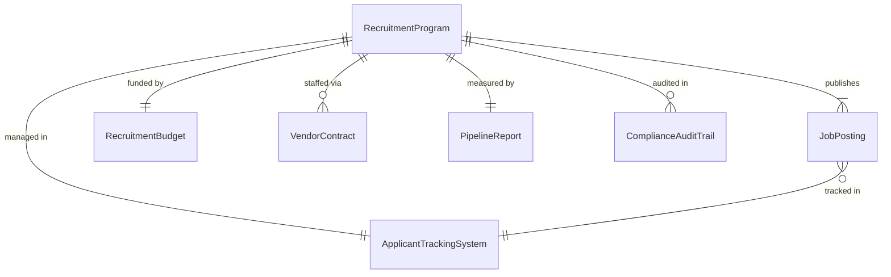
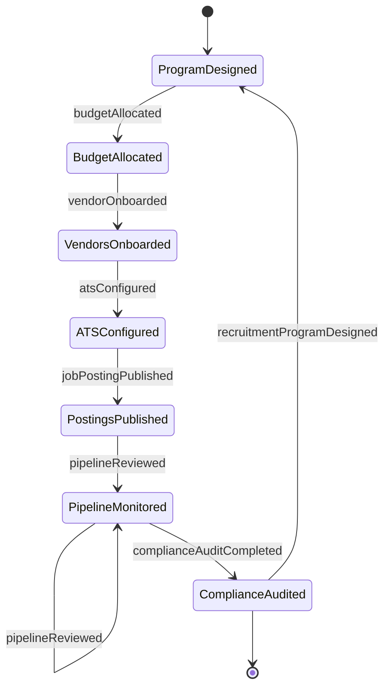
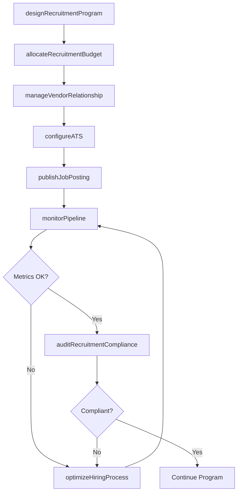
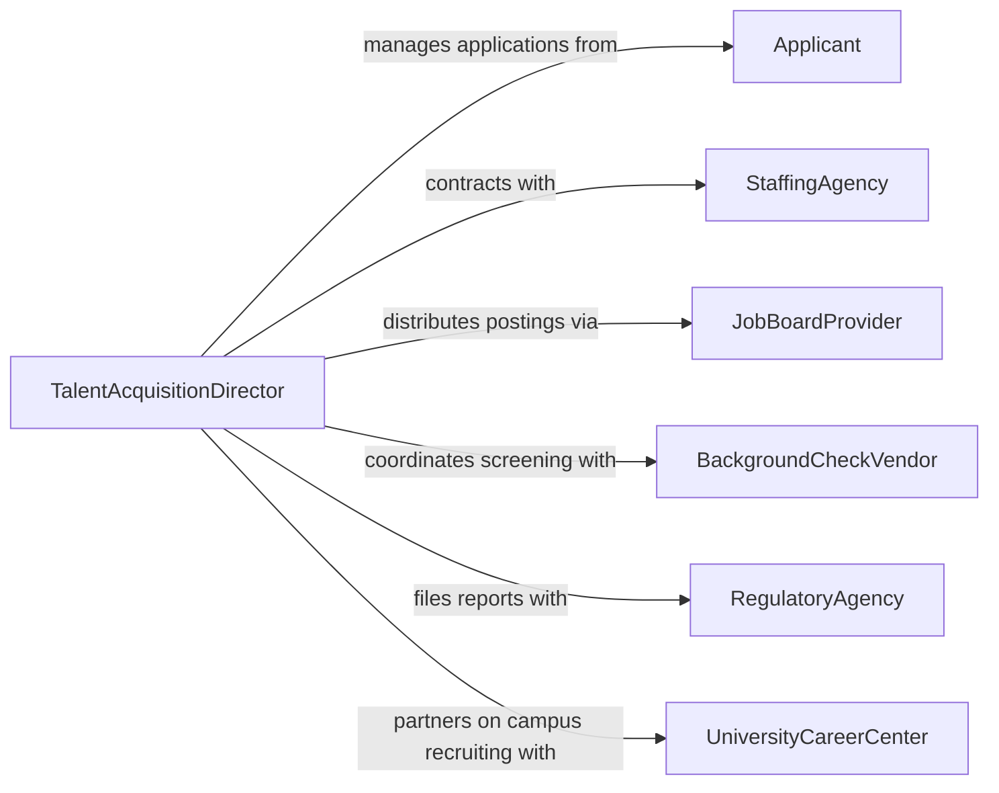

# Administer Personnel Recruitment Hiring Activities

> Business-as-Code definition for administering personnel recruitment and hiring activities. Models the end-to-end governance of recruitment operations including program design, vendor management, compliance oversight, and hiring process optimization.

## Overview

Administering personnel recruitment and hiring activities involves overseeing the operational infrastructure of talent acquisition -- managing recruitment programs, coordinating with staffing vendors, ensuring EEOC and OFCCP compliance, maintaining applicant tracking systems, analyzing recruitment metrics, and optimizing the hiring pipeline. This definition provides actions for recruitment program administration, events for process automation, and searches for pipeline analytics.

## Actors

| Actor | Description |
|-------|-------------|
| Applicant | Job seeker who submits applications through recruitment channels |
| StaffingAgency | External recruitment firm contracted to source candidates |
| JobBoardProvider | Platform hosting job postings and collecting applications |
| BackgroundCheckVendor | Service provider conducting pre-employment screening |
| RegulatoryAgency | Government body enforcing equal employment and labor laws |
| UniversityCareerCenter | Academic institution partnering on campus recruitment programs |

## Roles

| Role | Description |
|------|-------------|
| TalentAcquisitionDirector | Oversees the recruitment program strategy and budget |
| RecruitmentOperationsManager | Manages day-to-day recruitment processes and vendor relationships |
| ATSAdministrator | Configures and maintains the applicant tracking system |
| ComplianceSpecialist | Ensures recruitment activities comply with employment regulations |
| RecruitmentAnalyst | Tracks pipeline metrics and identifies process improvements |

## Entities

| Entity | Description |
|--------|-------------|
| RecruitmentProgram | An organized initiative for sourcing and hiring talent |
| ApplicantTrackingSystem | Software platform managing the recruitment pipeline |
| JobPosting | A published position advertisement across recruitment channels |
| RecruitmentBudget | Financial allocation for recruitment activities and vendor spend |
| ComplianceAuditTrail | A record of EEOC/OFCCP compliance actions and dispositions |
| VendorContract | An agreement with a staffing agency or recruitment service provider |
| PipelineReport | Analytics on candidate flow, conversion rates, and time-to-fill |

## Actions

| Action | Description |
|--------|-------------|
| designRecruitmentProgram | Create a structured recruitment initiative with goals and channels |
| manageVendorRelationship | Onboard, evaluate, and manage staffing agency partnerships |
| configureATS | Set up applicant tracking workflows, stages, and automations |
| publishJobPosting | Distribute a position advertisement across recruitment channels |
| monitorPipeline | Track candidate flow metrics and identify bottlenecks |
| auditRecruitmentCompliance | Review hiring activities for regulatory adherence |
| allocateRecruitmentBudget | Assign funding to recruitment channels and vendor contracts |
| optimizeHiringProcess | Analyze metrics and implement process improvements |

## Events

| Event | Description |
|-------|-------------|
| recruitmentProgramDesigned | A new recruitment program has been created |
| vendorOnboarded | A staffing agency or vendor has been contracted and activated |
| atsConfigured | Applicant tracking system workflows have been updated |
| jobPostingPublished | A job advertisement has been distributed to channels |
| pipelineReviewed | Recruitment pipeline metrics have been analyzed |
| complianceAuditCompleted | A recruitment compliance audit has been finished |
| budgetAllocated | Recruitment budget has been assigned to programs or vendors |

## Searches

| Search | Description |
|--------|-------------|
| findRecruitmentPrograms | List recruitment programs by type, status, or business unit |
| getPipelineMetrics | Retrieve candidate flow data by position, source, or stage |
| getVendorPerformance | Fetch staffing agency metrics by fill rate, quality, or spend |
| findJobPostings | List active postings by position, channel, or date range |
| getComplianceRecords | Retrieve EEOC/OFCCP audit trails by period or disposition |

## Entity Relationships



## State Diagram



## Workflow



## Actor Relationships



## Usage

### Calling Actions

```typescript
import { administerPersonnelRecruitmentHiringActivities } from '@headlessly/administer-personnel-recruitment-hiring-activities'

const recruitment = administerPersonnelRecruitmentHiringActivities()

// Design a recruitment program
const program = await recruitment.designRecruitmentProgram({
  name: 'Q2 2026 Engineering Hiring',
  targetHires: 15,
  channels: ['linkedin', 'indeed', 'campus-recruiting', 'referrals'],
  timeline: { start: '2026-04-01', end: '2026-06-30' }
})

// Allocate budget
await recruitment.allocateRecruitmentBudget({
  programId: program.id,
  totalBudget: 150000,
  allocations: [
    { channel: 'linkedin', amount: 50000 },
    { channel: 'staffing-agencies', amount: 60000 },
    { channel: 'campus-recruiting', amount: 25000 },
    { channel: 'referral-bonuses', amount: 15000 }
  ]
})

// Monitor pipeline health
const metrics = await recruitment.monitorPipeline({
  programId: program.id,
  metrics: ['applicationsReceived', 'screenToInterview', 'interviewToOffer', 'timeToFill']
})
```

### Event-Driven Automation

```typescript
// Alert when pipeline bottleneck detected
recruitment.pipelineReviewed(async ({ programId, bottleneck, conversionRate }) => {
  if (conversionRate < 0.15) {
    await notify({
      to: 'recruitment-ops',
      message: `Pipeline bottleneck at ${bottleneck} stage: ${conversionRate * 100}% conversion`
    })
  }
})

// Schedule compliance audit after program completion
recruitment.recruitmentProgramDesigned(async ({ programId, timeline }) => {
  await recruitment.auditRecruitmentCompliance({
    programId,
    scheduledDate: timeline.end,
    scope: ['EEOC', 'OFCCP', 'adverse-impact']
  })
})
```
